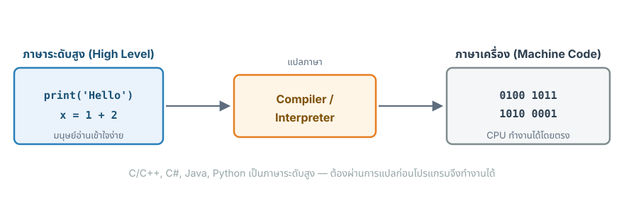
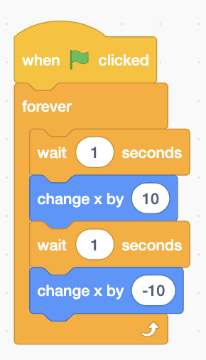
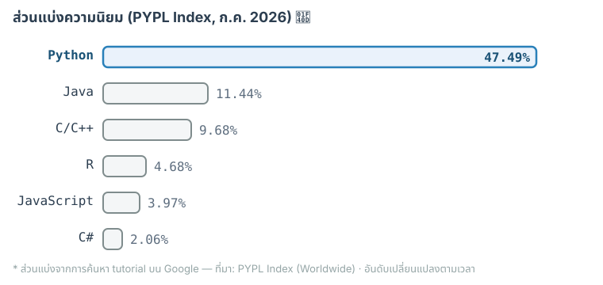

## {#topics-slide .center}

:::: {.columns}
::: {.column width="55%"}

### วันนี้เราจะเรียนรู้ 🎓

::: {.incremental}
1. **แนะนำเกี่ยวกับวิชา** — E-Learning, แผนการเรียน, การวัดผล
2. **ภาษาคอมพิวเตอร์** — ชนิดและเครื่องมือพัฒนาโปรแกรม
3. **เริ่มเขียน Python** — สร้างและสั่งโปรแกรมทำงาน
4. **การทำ Lab** ที่ [exam.cmu.ac.th](https://exam.cmu.ac.th)
5. **ใช้ AI ช่วยเรียน**อย่างไรให้ได้ผล
:::

:::
::: {.column width="45%"}

```python
print('Hello World')
print(f'9x9 = {9*9}')
```

```{.python .code-output}
Hello World
9x9 = 81
```

::: {.callout-tip}
วิชานี้ใช้ภาษา **Python** 🐍
:::

:::
::::

# แนะนำเกี่ยวกับวิชา 📋 {background-color="#2c3e50" .white-text}

Course Orientation

## Objectives {#m1-objectives}

:::: {.columns}
::: {.column width="50%"}
**แนะนำเกี่ยวกับวิชา**

- ระบบ E-Learning, ช่องทางติดต่อ
- แผนการเรียน, เอกสารประกอบการสอน

**แนะนำเกี่ยวกับภาษาคอมพิวเตอร์**

- ชนิดของภาษาคอมพิวเตอร์
- เครื่องมือในการพัฒนาโปรแกรม
:::
::: {.column width="50%"}
**เริ่มต้นเขียนโปรแกรมด้วย Python**

- การสร้างโปรแกรม
- การสั่งโปรแกรมทำงาน (run)

**การทำ Lab ของวิชานี้**

- **ทำและส่ง Lab** ที่ [exam.cmu.ac.th](https://exam.cmu.ac.th)
:::
::::

## E-learning Enrollment Code {#m1-enrollment}

::: {.callout-important}
**นศ. ที่ยังเข้าวิชานี้ใน [exam.cmu.ac.th](https://exam.cmu.ac.th) ไม่ได้** ให้ใช้ Enrollment Code ต่อไปนี้
:::

::: {style="text-align:center; margin-top:0.5em"}
[`XXXXXX`]{style="font-size:3.2em; letter-spacing:0.15em; font-weight:bold; color:#c0392b"}
:::

## มาโหวตกันหน่อย 📱 {#m1-poll .center}

**คุณเคยเขียนโปรแกรมมาก่อนหรือไม่?** — สแกน QR เพื่อโหวต ผลขึ้นสด ๆ 👉

:::: {.columns}
::: {.column width="34%"}
{width="220px"}

[👆 สแกนเพื่อโหวต]{style="font-size:0.6em"}
:::
::: {.column width="66%"}

```{=html}
<iframe src="poll/results.html?poll=intro" style="width:100%; height:350px; border:0; background:#fff; border-radius:10px;"></iframe>
```

:::
::::

# ภาษาคอมพิวเตอร์ 💬 {background-color="#2c3e50" .white-text}

Programming Language Overview

## ภาษาระดับสูง vs ระดับล่าง {#m1-language-levels}

เราใช้**ภาษาคอมพิวเตอร์ (Programming Languages)** อธิบายสิ่งที่ต้องการให้เครื่องคอมพิวเตอร์ทำงาน

{width="820px" fig-align="center"}

## ภาษาระดับสูง (High Level) {#m1-high-level}

::: {.incremental}
- **ใกล้เคียงภาษามนุษย์** ทำความเข้าใจได้ไม่ยาก
- ต้องผ่านการ**แปลภาษา (compile/interpret)** ให้เป็นภาษาเครื่อง (Machine Code) ที่คอมพิวเตอร์เข้าใจเสียก่อน โปรแกรมจึงจะทำงานได้
- ภาษาที่นิยมทั่วไป ได้แก่ **C, C++, C#, Java, Python, JavaScript**
:::

. . .

::: {.callout-tip}
โปรแกรมเดียวกันเขียนได้หลายภาษา — **แนวคิดเหมือนกัน ต่างแค่ syntax** (ดูตัวอย่างหน้าถัดไป 👉)
:::

## "Hello World" เดียวกัน — เขียนได้หลายภาษา {#m1-hello-languages}

**แนวคิดเหมือนกัน ต่างแค่ syntax** — สังเกตว่า **Python** สั้นและอ่านง่ายที่สุด 🐍

::: {.panel-tabset}

### Python 🐍
```python
print('Hello World')
print(f'9x9 = {9*9}')
```

### C
```c
#include <stdio.h>

int main() {
  printf("Hello World\n");
  printf("9x9 = %d\n", 9*9);
}
```

### C++
```cpp
#include <iostream>

int main() {
  std::cout << "Hello World\n";
  std::cout << "9x9 = " << 9*9;
}
```

### C#
```csharp
using System;

class Program {
  static void Main() {
    Console.WriteLine("Hello World");
    Console.WriteLine($"9x9 = {9*9}");
  }
}
```

### Java
```java
public class Program {
  public static void main(String[] args) {
    System.out.println("Hello World");
    System.out.println("9x9 = " + (9*9));
  }
}
```

### JavaScript
```javascript
console.log("Hello World");
console.log(`9x9 = ${9*9}`);
```

### Go
```go
package main

import "fmt"

func main() {
  fmt.Println("Hello World")
  fmt.Printf("9x9 = %d\n", 9*9)
}
```

### Rust
```rust
fn main() {
  println!("Hello World");
  println!("9x9 = {}", 9*9);
}
```

### MATLAB
```matlab
disp('Hello World')
fprintf('9x9 = %d\n', 9*9)
```

:::

## ภาษาระดับล่าง (Low Level) {#m1-low-level .smaller}

::: {.incremental}
- รูปแบบภาษา**ต่างจากภาษามนุษย์ค่อนข้างมาก** ได้แก่ภาษา **Assembly** และ **ภาษาเครื่อง (Machine Code)**
- เป็นภาษาที่ทำงานได้กับ **Processor** ของคอมพิวเตอร์แบบเจาะจง
  - ผูกกับชนิดของ **CPU** และ **Hardware** อื่น ๆ ที่ประกอบกันเป็นเครื่องคอมพิวเตอร์
:::

. . .

คำนวณ `9 * 9` เดียวกัน เขียนด้วยภาษาระดับล่างบน CPU x86-64

:::: {.columns}
::: {.column width="50%"}
**Assembly** — x86-64 (Intel syntax)
```asm
mov  eax, 9     ; eax = 9
imul eax, 9     ; eax = eax * 9
                ; → 81
```
:::
::: {.column width="50%"}
**Machine Code** (ฐานสิบหก)
```text
B8 09 00 00 00
6B C0 09
```
:::
::::

::: {style="font-size:0.72em"}
**ถอดรหัสทีละไบต์** (แต่ละไบต์ = ตัวเลขฐานสิบหก 1 ค่า)

- `B8` = คำสั่ง "โหลดค่าคงที่ลงรีจิสเตอร์ `eax`" · `09 00 00 00` = เลข **9** เก็บแบบ 32 บิต (ไบต์ต่ำมาก่อน — *little-endian*)
- `6B` = คำสั่ง `imul` (คูณจำนวนเต็มด้วยค่าคงที่) · `C0` = ระบุให้ใช้ `eax` · `09` = ตัวคูณ **9** → ได้ `eax = 81`
:::

::: {.callout-note}
สังเกตว่าแค่คูณเลข 2 ตัว ก็ต้องสั่งงาน CPU ทีละขั้น — ยิ่งใกล้ภาษาเครื่อง ยิ่ง**อ่านยาก**สำหรับมนุษย์
:::

## Block coding คืออะไร — แล้วทำไมเราใช้ text-based {#m1-block-vs-text}

:::: {.columns}
::: {.column width="40%"}

:::: {.figbox}
{height="300px"}

::: {.figcap}
ภาพ: ["Scratch 3.0 screenshot"](https://commons.wikimedia.org/wiki/File:Scratch_3.0_Screenshot_Green_Flag_Clicked_Example.png) โดย Blink456 (Scratch by MIT) · [CC BY-SA 4.0](https://creativecommons.org/licenses/by-sa/4.0/)
:::
::::

:::
::: {.column width="60%"}

**Block coding** = ต่อ "บล็อก" คำสั่งเข้าด้วยกันเหมือน**ต่อจิ๊กซอว์** (เช่น [**Scratch**](https://scratch.mit.edu/))

::: {.callout-tip icon=false}
#### ✅ จุดเด่น
**ไม่ต้องจำหรือพิมพ์ syntax** — ลากวางบล็อกได้เลย เหมาะกับผู้เริ่มต้นมาก
:::

::: {.callout-important icon=false}
#### ❌ ทำไมวิชานี้ไม่ใช้
- **ยืดหยุ่นน้อย** — โปรแกรมใหญ่/ซับซ้อนขึ้นจะอืดและเทอะทะ
- **ไม่ใช่แบบที่ใช้จริง**ในงานวิศวกรรมและอุตสาหกรรม
:::

:::
::::

::: {.callout-tip .fragment}
เราจึงใช้ **text-based coding** ด้วย **Python** (แบบที่เห็นในสไลด์ก่อนหน้า) — พิมพ์เป็นข้อความตาม syntax แต่**ทรงพลังและใช้ได้จริง** 🐍
:::

## ทำไมต้อง Python? 🐍 {#m1-why-python .smaller}

**Python เป็นภาษาที่ได้รับความนิยมสูงที่สุดในโลก** จากหลายดัชนีชี้วัด

:::: {.columns}
::: {.column width="55%"}

{fig-align="center"}

:::
::: {.column width="45%"}

::: {.incremental}
- **PYPL Index** — Python ~**47%** นำ Java (อันดับ 2) **กว่า 4 เท่า** (ก.ค. 2026)
- **GitHub Octoverse 2024** — Python แซง JavaScript ขึ้นเป็นภาษาที่**ถูกใช้มากที่สุด**บน GitHub (ครั้งแรกในรอบ 10 ปี)
- **TIOBE Index** — Python ครอง**อันดับ 1** ต่อเนื่องหลายปี
- **Stack Overflow Survey** — Python ติดกลุ่มภาษาที่นักพัฒนา**อยากใช้มากที่สุด**
:::

:::
::::

::: {style="font-size:0.55em; text-align:center; margin-top:0.3em"}
ที่มา: [TIOBE](https://www.tiobe.com/tiobe-index/) · [PYPL](https://pypl.github.io/PYPL.html) · [GitHub Octoverse](https://github.blog/news-insights/octoverse/octoverse-2024/) · [Stack Overflow Survey](https://survey.stackoverflow.co/) · [IEEE Spectrum](https://spectrum.ieee.org/top-programming-languages) — อันดับเปลี่ยนแปลงตามเวลา
:::

## ทักษะที่สำคัญสำหรับการเขียนโปรแกรม {#m1-skills}

:::: {.columns}
::: {.column width="33%" .fragment}
::: {.callout-note icon=false}
#### Computational Thinking
- แบ่งปัญหาซับซ้อนเป็นส่วนย่อยที่จัดการง่ายขึ้น
- สร้างขั้นตอนแก้ปัญหาอย่างเป็นลำดับ
:::
:::
::: {.column width="33%" .fragment}
::: {.callout-tip icon=false}
#### Coding
- รู้จัก syntax และโครงสร้างภาษา
- ใช้ลูป เงื่อนไข ฟังก์ชัน คุมการทำงาน
- ระบุและแก้บั๊ก (debug) ได้
:::
:::
::: {.column width="33%" .fragment}
::: {.callout-important icon=false}
#### Mathematics
- เข้าใจการดำเนินการทางคณิตศาสตร์พื้นฐาน
- ใช้ตัวแปรและนิพจน์แก้ปัญหา
- ใช้แนวคิดคณิตศาสตร์พัฒนาอัลกอริทึม
:::
:::
::::

::: {.callout-note}
เจาะลึก Computational Thinking ต่อได้ที่ [Module 2](module02.html) 👉
:::

# เครื่องมือพัฒนาโปรแกรม 🛠️ {background-color="#2c3e50" .white-text}

Tools for Software Development

## เครื่องมือพื้นฐาน 3 อย่าง {#m1-tools}

{width="640px" fig-align="center"}

:::: {.columns}
::: {.column width="33%"}
::: {.callout-note icon=false}
#### ✏️ Text Editor
สร้างไฟล์โค้ด (`.py`, `.c`, `.java`, …) เช่น **Notepad**, **gedit**, **TextEdit**
:::
:::
::: {.column width="33%"}
::: {.callout-tip icon=false}
#### ⚙️ Compiler / Interpreter
แปลโค้ดเป็น**ภาษาเครื่อง**

เช่น **gcc**, **g++**, **python**, **java**
:::
:::
::: {.column width="33%"}
::: {.callout-important icon=false}
#### 🐞 Debugger
รันทีละคำสั่ง ดูผลแต่ละขั้น เพื่อ**หาบั๊ก**
:::
:::
::::

## Integrated Development Environment (IDE) {#m1-ide}

รวมเครื่องมือที่จำเป็นทั้งหมดไว้ใน**โปรแกรมเดียว**

{width="880px" fig-align="center"}

::: {.incremental}
- รวม **Editor + Compiler/Interpreter + Debugger + GUI** ไว้ด้วยกัน — สะดวก และใช้ได้หลายภาษา
- มีทั้งแบบเสียค่าใช้จ่าย (Commercial) และฟรี (Freeware, Open Source)
- เช่น **Visual Studio Code, PyCharm, Jupyter Notebook, Spyder**
:::

## IDE ยอดนิยม {#m1-ide-examples .smaller}

:::: {.columns}
::: {.column width="50%"}
**ติดตั้งบนเครื่อง**

::: {.logos}
   
:::

- [**Visual Studio Code**](https://code.visualstudio.com/download) — Editor ยอดนิยม เบา ยืดหยุ่น
- [**Spyder**](https://www.spyder-ide.org/) — Python IDE พร้อม Variable Explorer
- [**PyCharm**](https://www.jetbrains.com/pycharm/), [**Jupyter Notebook**](https://jupyter.org/)
:::
::: {.column width="50%"}
**ออนไลน์ (ไม่ต้องติดตั้ง)**

::: {.logos}
 
:::

- [**Replit**](https://replit.com/languages/python3) — เขียน + รัน Python บนเว็บ
- [**Google Colab**](https://colab.research.google.com/) — Jupyter Notebook บนคลาวด์ ฟรี
:::
::::

::: {.callout-tip}
วิชานี้ **ทำและส่ง Lab** ที่ [exam.cmu.ac.th](https://exam.cmu.ac.th) ส่วน [**Google Colab**](https://colab.research.google.com/) ใช้สำหรับ**ฝึก/ทดลอง**เขียนโปรแกรม — ทั้งคู่ใช้บนเว็บ ไม่ต้องติดตั้งอะไร (แต่ติดตั้ง Python ไว้ฝึกเองก็ช่วยได้มาก)
:::

## `.py` vs `.ipynb` — สคริปต์ vs โน้ตบุ๊ก {#m1-py-vs-ipynb}

ทั้งคู่เขียน **Python** เหมือนกัน — ต่างกันที่**รูปแบบไฟล์และวิธีรัน**

:::: {.columns}
::: {.column width="50%"}
::: {.callout-note icon=false}
#### 📄 `.py` — Python Script
- ไฟล์**ข้อความล้วน** มีแต่โค้ด
- รัน**ทั้งไฟล์รวดเดียว** (`python hello.py`)
- เหมาะกับ**โปรแกรมจริง** ที่นำไปใช้/ส่งงาน
- ใช้กับ Editor/IDE เช่น VS Code
:::
:::
::: {.column width="50%"}
::: {.callout-tip icon=false}
#### 📓 `.ipynb` — Notebook (Google Colab)
- แบ่งเป็น **"เซลล์ (cell)"** สั่งรัน**ทีละเซลล์**ได้
- แสดง**ผลลัพธ์/กราฟ**ใต้เซลล์ทันที
- ผสม**โค้ด + ข้อความ (Markdown) + ผลลัพธ์** ไว้ในไฟล์เดียว
- เหมาะกับ**ทดลอง เรียนรู้ และวิเคราะห์ข้อมูล**
:::
:::
::::

::: {.callout-note}
โค้ด Python ในเซลล์ Colab กับในไฟล์ `.py` **เหมือนกัน** — ย้ายไปมาได้ · Colab ยังสั่งรันไฟล์ `.py` และดาวน์โหลด notebook เป็น `.py` ได้ด้วย 🐍
:::

# เริ่มต้นกับ Python 🐍 {background-color="#2c3e50" .white-text}

การติดตั้ง Python (ทำเองที่บ้าน — Optional)

## Python Setup #1: ติดตั้งจาก python.org {#m1-setup-python}

ดาวน์โหลด Installer ที่ [python.org/downloads](https://www.python.org/downloads/) แล้วทำตามระบบปฏิบัติการของคุณ

::: {.panel-tabset}

### 🪟 Windows
1. รัน **Python Installer** (`.exe`)
2. ✅ ติ๊ก **Add Python to PATH** (สำคัญมาก!)
3. คลิก **Install Now**
4. เปิด **Command Prompt** → พิมพ์ `python` เพื่อเข้า REPL

### 🍎 macOS
1. รัน **Python Installer** (`.pkg`) → ติดตั้งตามขั้นตอน (PATH ตั้งให้อัตโนมัติ)
2. เปิด **Terminal** → พิมพ์ `python3` เพื่อเข้า REPL
3. *(macOS มักมี `python3` ติดมาอยู่แล้ว — ติดตั้งจาก python.org เพื่อให้ได้เวอร์ชันใหม่)*

:::

. . .

**ทดสอบในโหมด REPL** (Read-Eval-Print Loop) — พิมพ์ทีละบรรทัด เห็นผลทันที

```text
>>> print('Hello World')
Hello World
>>> (1+10+100)*2
222
```

## Python Setup #2: ติดตั้งด้วย Anaconda {#m1-setup-anaconda}

**ติดตั้ง Python ด้วย Anaconda (วิธีที่ 2)**

::: {.incremental}
1. ดาวน์โหลด [Anaconda](https://www.anaconda.com/products/distribution)
2. รัน Anaconda Installer
3. ถ้ายังไม่เคยติดตั้ง Python มาก่อน เลือก **Register Anaconda as my default Python**
4. คลิก **Install**
:::

. . .

::: {.callout-note}
ทดสอบด้วย **Anaconda Prompt** (Windows) หรือ **Terminal** (macOS) แล้วพิมพ์ `python` เพื่อเข้าโหมด REPL เช่นเดียวกับวิธีที่ 1
:::

## การเขียนโปรแกรมใน VSCode {#m1-run-script}

สร้างไฟล์ `helloworld.py` ใน [**Visual Studio Code**](https://code.visualstudio.com/download)

```python
print('Hello World')
print(f'9x9={9*9}')
```

::: {.callout-note}
ครั้งแรก: ติดตั้ง **Python Extension** (โดย Microsoft) ใน VS Code ก่อน — จะได้ปุ่ม **▶ Run**, ตัวช่วยเติมโค้ด (IntelliSense) และดีบัก
:::

. . .

**สั่งรัน** — กดปุ่ม **▶** มุมขวาบนใน VS Code หรือพิมพ์ในเทอร์มินัล:

```bash
$ python helloworld.py      # macOS: python3 helloworld.py
Hello World
9x9=81
```

::: {.callout-tip}
นี่คือวิธี "สร้างโปรแกรม → สั่งให้ทำงาน (run)" แบบมาตรฐานที่ใช้ได้กับทุกภาษา
:::

## พักสมอง 😄 {#m1-xkcd .center}

ข้ออ้างยอดฮิตของโปรแกรมเมอร์เวลาแอบพัก — **"โค้ดกำลัง compile อยู่!"** ⚔️

{height="440px" fig-align="center"}

::: {style="font-size:0.5em"}
ที่มา: [xkcd #303 — "Compiling"](https://xkcd.com/303/) (CC BY-NC 2.5)
:::

# เขียนโค้ด Python เบื้องต้น ⌨️ {background-color="#2c3e50" .white-text}

พื้นฐานพอให้เขียนโปรแกรมแรกได้ — `print` · `input` · แปลงชนิดข้อมูล · `split`

## แสดงผลด้วย `print()` {#m1-print}

**`print()`** = แสดงข้อความออกทางจอ · ข้อความ (string) ต้องอยู่ในเครื่องหมาย `'...'` หรือ `"..."`

```{pyodide}
#| autorun: false
print('Python สนุกมาก!')
```

::: {.callout-tip}
กด **Run** ดูผล 🎉 — ลอง 2 อย่าง: **(1)** เปลี่ยนข้อความในเครื่องหมายคำพูด · **(2)** ลอง**ลบเครื่องหมาย `'...'` ออก** แล้ว Run ดูว่าเกิดอะไรขึ้น
:::

::: {.callout-important .fragment}
ลบเครื่องหมายคำพูดแล้วจะ **error** ❗ เพราะ Python ไม่รู้ว่าเป็น**ข้อความ** — **ข้อความต้องอยู่ในเครื่องหมายคำพูดเสมอ**
:::

## รับข้อมูลจากผู้ใช้ด้วย `input()` {#m1-input}

**`input()`** = โปรแกรม**หยุดรอ**ให้ผู้ใช้พิมพ์ แล้วส่งค่าที่พิมพ์กลับมาเก็บในตัวแปร

```python
name = input()            # รับข้อความจากผู้ใช้ มาเก็บในตัวแปร name
print('สวัสดี', name)     # แสดงคำทักทายพร้อมชื่อ
```

:::: {.columns}
::: {.column width="55%"}
::: {.callout-note}
ผู้ใช้พิมพ์ `Somchai` แล้วกด Enter → โปรแกรมแสดง `สวัสดี Somchai`
:::
:::
::: {.column width="45%"}
::: {.callout-important}
⚠️ ค่าจาก `input()` เป็น **ข้อความ (str) เสมอ** แม้จะพิมพ์ตัวเลข
:::
:::
::::

## แปลงชนิดข้อมูลด้วย `int()` แล้วคำนวณ {#m1-int-convert}

จะเอาค่าจาก `input()` ไป**คำนวณ** ต้องแปลงเป็นจำนวนเต็มด้วย **`int()`** ก่อน

```python
n = input()            # n เป็นข้อความ เช่น '5'
result = int(n) * 2    # แปลง '5' → 5 แล้วคูณ 2
print(result)          # แสดงผล 10
```

:::: {.columns}
::: {.column width="50%"}
::: {.callout-note}
พิมพ์ `5` → ผล `10` · พิมพ์ `100` → ผล `200`
:::
:::
::: {.column width="50%"}
::: {.callout-important}
ถ้าลืม `int()` แล้วเขียน `n * 2` จะได้ผลแปลก ๆ (`'55'`) เพราะ `n` เป็น**ข้อความ**
:::
:::
::::

## รับหลายค่าในบรรทัดเดียวด้วย `split()` {#m1-split}

**`input().split()`** = ตัดข้อความตาม**ช่องว่าง**ออกเป็นหลายชิ้น · เก็บลงหลายตัวแปรพร้อมกันได้

```python
a, b = input().split()   # พิมพ์ "3 4" → a='3', b='4'
a = int(a)               # แปลงแต่ละค่าเป็นจำนวนเต็ม
b = int(b)
print(a * b)             # 3 × 4 = 12
```

::: {.callout-note}
ผู้ใช้พิมพ์ `3 4` (คั่นด้วยช่องว่าง 1 เคาะ) → ผลลัพธ์ `12`
:::

## ✅ ครบเครื่องมือสำหรับ Lab แรกแล้ว {#m1-basics-recap}

รู้ 4 อย่างนี้ ก็ประกอบเป็นโปรแกรมได้หลากหลาย 👇

| เครื่องมือ | ทำอะไร |
|:--|:--|
| **`print(...)`** | แสดงผลออกทางจอ |
| **`input()`** | รับข้อความจากผู้ใช้ — ได้ **str** เสมอ |
| **`int(...)`** | แปลงข้อความ → **จำนวนเต็ม** ก่อนคำนวณ |
| **`.split()`** | ตัดข้อความเป็นหลายค่าตามช่องว่าง |

::: {.callout-tip}
สูตรที่พบบ่อย: **รับข้อมูล (`input`) → แปลงชนิด (`int`) → คำนวณ → แสดงผล (`print`)** — เอาไป**ประกอบเอง**เพื่อตอบโจทย์ Lab แรกได้เลย 🚀
:::

# ใช้ AI ช่วยเรียนอย่างไร 🤖 {background-color="#2c3e50" .white-text}

ใช้ AI ช่วยทำ Lab อย่างไรให้ "สอบได้ A"

## AI ควรเป็น "Tutor" ไม่ใช่ "คนทำการบ้านแทน" {#m1-ai-tutor}

:::: {.columns}
::: {.column width="50%"}
::: {.callout-important icon=false}
#### ❌ วิธีที่เสี่ยงทำให้สอบตก
- *"เขียนโปรแกรมข้อนี้ให้หน่อย"*
- *"ตอบมาเลย ไม่ต้องอธิบาย"*

**ผลที่เกิดขึ้น:**

- ได้คะแนน Lab แต่ไม่เข้าใจโค้ด
- เจอโจทย์สอบที่เปลี่ยนนิดเดียว → ทำไม่ได้
:::
:::
::: {.column width="50%"}
::: {.callout-tip icon=false}
#### ✅ ใช้ AI แบบ "ติวเตอร์"
- ให้ AI **อธิบาย / ใบ้ทีละขั้น** แทนการเฉลย
- ให้ **ตรวจโค้ดของเรา** แล้วชี้ว่าผิดตรงไหน
- เข้าใจด้วยตัวเองก่อน ค่อยให้ AI ยืนยัน

**ผลที่เกิดขึ้น:**

- เข้าใจ logic, debug เองได้
- ปรับโค้ดกับโจทย์ใหม่ได้ → โอกาสสอบผ่านสูงกว่า
:::
:::
::::

::: {style="text-align:center; font-size:1.2em; margin-top:0.3em"}
**AI ควรเป็น "Tutor" ไม่ใช่ "คนทำการบ้านแทน"**
:::

## คุยกับ AI แบบ Tutor — ตัวอย่างจริง {#m1-ai-prompts}

:::: {.columns}
::: {.column width="52%"}
**บทสนทนาที่ดี** 💬

::: {.callout-note icon=false}
🧑 *"โจทย์ให้รับ 2 จำนวนมาบวกกัน หนูติดตรงไหน ช่วยใบ้ทีละขั้น **อย่าเพิ่งเฉลย**"*

🤖 *"ค่าที่ได้จาก `input()` เป็นชนิดไหน? แล้วต้องทำอะไรก่อนถึงจะบวกกันได้?"*

🧑 *"อ๋อ… มันเป็น `str` ต้อง `int()` ก่อน!"* ✅
:::
:::
::: {.column width="48%"}
**Prompt พร้อมใช้** 📋

::: {.callout-tip icon=false}
- *"สอนแบบติวเตอร์ ถามนำทีละขั้น อย่าเพิ่งเฉลย"*
- *"ดูโค้ดนี้แล้วบอกว่าผิดตรงไหน แต่**อย่าแก้ให้** ให้ผมแก้เอง"*
- *"อธิบายว่าโค้ดบรรทัดนี้ทำงานยังไง"*
- *"ออกโจทย์คล้าย ๆ กันให้ผมฝึกเพิ่ม"*
:::
:::
::::

::: {.callout-important}
📝 ในสอบ **Midterm/Final** ต้องอ่าน/เขียนโค้ดเองในระบบ (**ไม่มี AI ช่วย**) — เข้าใจจริงเท่านั้นที่ช่วยได้ · ใช้ AI เป็น**ติวเตอร์**ตอนฝึก แล้วไปสอบผ่านด้วยตัวเอง 💪
:::

# Summary 🎯 {background-color="#2c3e50" .white-text}

## สรุป Module 1 🎉 {.smaller}

:::: {.columns}
::: {.column width="50%"}

**ภาษาคอมพิวเตอร์**

- **ระดับสูง** ใกล้ภาษามนุษย์ (Python, Java, C…) ต้อง**แปล**เป็นภาษาเครื่อง
- **ระดับล่าง** (Assembly, Machine Code) ผูกกับ CPU

**เครื่องมือ**

- Text Editor + Compiler/Interpreter + Debugger
- **IDE** รวมทุกอย่างไว้ด้วยกัน (VSCode, Colab…)

:::
::: {.column width="50%"}

**การเรียน**

- Lab ทำที่ [exam.cmu.ac.th](https://exam.cmu.ac.th) 

::: {.callout-tip}
ใช้ **AI เป็น Tutor** ช่วยให้เข้าใจ ไม่ใช่ลอกคำตอบ 🤖
:::

:::
::::

::: {.callout-note}
ต่อ Module 2: [Computational Thinking](module02.html) 👉
:::
