## {#topics-slide .center}

:::: {.columns}
::: {.column width="52%"}

### วันนี้เราจะเรียนรู้ 🧠

::: {.incremental}
1. **แนวคิดเชิงคำนวณ** (Computational Thinking) คืออะไร
2. **การแยกส่วน** (Decomposition)
3. **การหารูปแบบ** (Pattern Recognition)
4. **นามธรรม** (Abstraction)
5. **อัลกอริทึม** (Algorithms)
6. เชื่อมโยงแนวคิดทั้งหมด**สู่ Python** 🐍
:::

:::
::: {.column width="48%"}

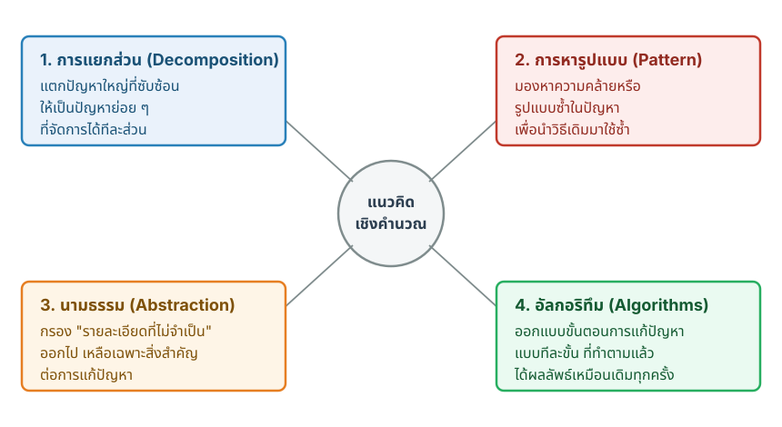{fig-align="center"}

:::
::::

# แนวคิดเชิงคำนวณคืออะไร 🧩 {background-color="#2c3e50" .white-text}

Computational Thinking

## แนวคิดเชิงคำนวณ (Computational Thinking) {#m2-what-is-ct}

> การนำ**ตรรกะแบบวิทยาการคอมพิวเตอร์**มาใช้แก้ปัญหา — ได้กับ**ทุกสาขาวิชา** ไม่ใช่แค่การเขียนโปรแกรม

. . .

เป็น**วิธีคิดอย่างเป็นระบบ** เพื่อ

::: {.incremental}
- แตกปัญหาที่ใหญ่และยุ่งเหยิง ให้เป็นส่วนย่อย ๆ ที่**จัดการได้**
- ออกแบบวิธีแก้ที่**นำกลับมาใช้ซ้ำ**ได้
:::

::: {.callout-note}
แนวคิดเชิงคำนวณคือ**ทักษะพื้นฐาน**ของวิศวกร — เราจะใช้มันตลอดทั้งวิชานี้ ทบทวน: [ทักษะที่สำคัญสำหรับการเขียนโปรแกรม (Module 1)](module01.html#m1-skills)
:::

## 4 เสาหลักของแนวคิดเชิงคำนวณ {#m2-four-pillars}

{width="760px" fig-align="center"}

::: {.incremental}
- **แยกส่วน** → **หารูปแบบ** → **นามธรรม** → **อัลกอริทึม**
- ในงานจริง ทั้งสี่อย่าง**ทำงานร่วมกัน** ไม่ได้แยกเป็นขั้นตอนตายตัว
:::

## Problem-Solving Loop — แล้ว CT อยู่ตรงไหน? {#m2-ps-loop}

**วงจร** = *ลำดับขั้น*การแก้ปัญหา · **CT (4 เสาหลัก)** = *วิธีคิด*ที่ใช้ในแต่ละขั้น — เห็นชัดตอน **วางแผน** 👇

:::: {.columns}
::: {.column width="50%"}

::: {.callout-note icon=false}
#### 1️⃣ เข้าใจปัญหา (Understand)
ปัญหาคืออะไร · มีข้อจำกัดและเป้าหมายแบบไหน
:::

::: {.callout-tip icon=false}
#### 2️⃣ วางแผน (Plan) — ใช้ CT
🪓 แยกปัญหา · 🔁 หารูปแบบ · 🎯 ตัดรายละเอียด · 📝 เรียงขั้นตอน
:::

:::
::: {.column width="50%"}

::: {.callout-warning icon=false}
#### 3️⃣ ลงมือทำ (Implement)
ทำตามแผน · ทดสอบ · แก้ไข
:::

::: {.callout-important icon=false}
#### 4️⃣ ประเมินผล (Evaluate)
วัดผล · หาจุดปรับปรุง · วนรอบใหม่
:::

:::
::::

::: {.callout-note}
เป็น**วงจร** 🔁 ประเมินผลแล้ว**วนกลับ**ไปปรับปรุงในรอบถัดไปได้เสมอ
:::

# 1. การแยกส่วน 🪓 {background-color="#2c3e50" .white-text}

Decomposition — แบ่งแล้วพิชิต (Divide and Conquer)

## การแยกส่วน (Decomposition) {#m2-decomposition}

เมื่อเจอปัญหาใหญ่จนน่าท้อ **การแยกส่วน**ทำหน้าที่เหมือน**ลิ่มทางความคิด**

:::: {.columns}
::: {.column width="55%"}

::: {.incremental}
- แยกปัญหายักษ์ให้เป็น**ปัญหาย่อย ๆ ที่เป็นอิสระต่อกัน**
- แต่ละส่วน**เข้าใจง่ายขึ้น** มอบหมายงานได้ และแก้ทีละส่วนได้
:::

:::
::: {.column width="45%"}

:::: {.figbox}
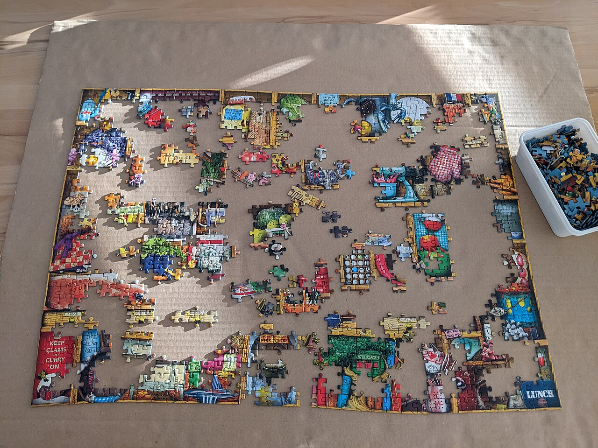{height="300px"}

::: {.figcap}
ภาพ: ["Jigsaw puzzle in progress"](https://commons.wikimedia.org/wiki/File:Jigsaw_puzzle_in_progress.jpg) โดย Balise42 · [CC BY-SA 4.0](https://creativecommons.org/licenses/by-sa/4.0/)
:::
::::

:::
::::

. . .

::: {.callout-tip}
วิธีคิดเดียวกันนี้**ขยายขนาดได้** ตั้งแต่งานบ้านเล็ก ๆ ไปจนถึงโครงสร้างพื้นฐานของเมือง
:::

## ตัวอย่าง: แยกส่วนโครงการใหญ่ {#m2-decomposition-example .smaller}

โครงการ **รถไฟฟ้าเชียงใหม่** (AI-generated image) — แตกออกเป็นงานย่อยที่ทีมต่าง ๆ รับผิดชอบได้

:::: {.figbox}
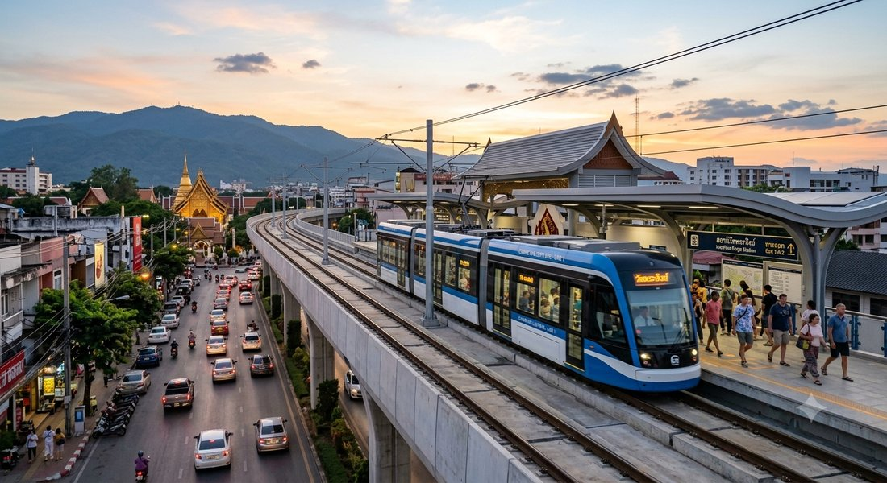{height="200px"}

::: {.figcap}
ภาพจำลอง (AI-generated)
:::

{height="380px"}
::::


## ชวนคิด: การจัดงานปีใหม่ 🎉 {.exercise-think}

**คิดก่อน:** ถ้าได้รับมอบหมายให้จัด**งานเลี้ยงปีใหม่**ของภาควิชา จะ**แยกส่วน**ปัญหานี้ออกเป็นงานย่อยอะไรบ้าง?

:::: {.columns}
::: {.column width="50%"}

:::: {.figbox}
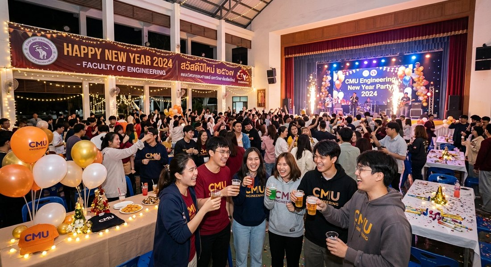{height="300px"}

::: {.figcap}
ภาพจำลอง (AI-generated)
:::
::::

:::
::: {.column width="50%"}

<details>
<summary>ดูตัวอย่างคำตอบ</summary>

- **สถานที่** — จองห้อง จัดโต๊ะ เครื่องเสียง
- **อาหาร** — เมนู จำนวนคน งบประมาณ
- **กิจกรรม** — เกม ของรางวัล พิธีกร
- **ประชาสัมพันธ์** — เชิญแขก ลงทะเบียน

แต่ละงานย่อยยัง**แยกส่วนต่อ**ได้อีก และมอบหมายให้คนละทีมทำพร้อมกันได้ 👍

</details>

:::
::::

# 2. การหารูปแบบ 🔁 {background-color="#2c3e50" .white-text}

Pattern Recognition — หากฎที่ซ่อนอยู่ในความยุ่งเหยิง

## การหารูปแบบ (Pattern Recognition) {#m2-pattern}

การมองเห็น**ความสม่ำเสมอ**ช่วยให้เรา**คาดการณ์**ผลลัพธ์และสร้างวิธีแก้ที่**นำมาใช้ซ้ำ**ได้

::: {.callout-important}
ถ้าเจอ**รูปแบบ** (pattern) เราแก้ปัญหานั้นแค่ **"ครั้งเดียว"** แล้วนำไปใช้กับกรณีอื่นได้อีกมากมาย
:::

. . .

:::: {.columns}
::: {.column width="50%" .fragment}
**รูปแบบ *ระหว่าง* ปัญหา (among)**

พออบเค้กเป็นชิ้นหนึ่งได้ ก็อบเค้กชิ้นไหนก็ได้ — ทุกสูตรมี**โครงเดียวกัน**: ตั้งอุณหภูมิเตา → ผสมส่วนผสม → อบตามเวลา
:::
::: {.column width="50%" .fragment}
**รูปแบบ *ภายใน* ปัญหา (within)**

เจาะลงในขั้นตอนเดียวก็เจอรูปแบบย่อย — ทุกส่วนผสมมีแบบเดียวกัน:

```text
[ระบุชื่อ] + [ระบุปริมาณ]
แป้ง 200 ก. · เนย 100 ก. · ไข่ 2 ฟอง
```
:::
::::

## รูปแบบ 2 แบบ: *ระหว่าง* & *ภายใน* {#m2-pattern-kinds}

::: {.panel-tabset}

### 🔁 ระหว่าง (among)

:::: {.figbox}
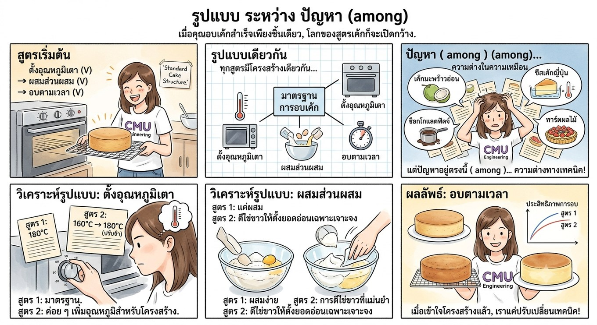{height="500px"}

::: {.figcap}
ภาพจำลอง (AI-generated)
:::
::::

### 🔎 ภายใน (within)

:::: {.figbox}
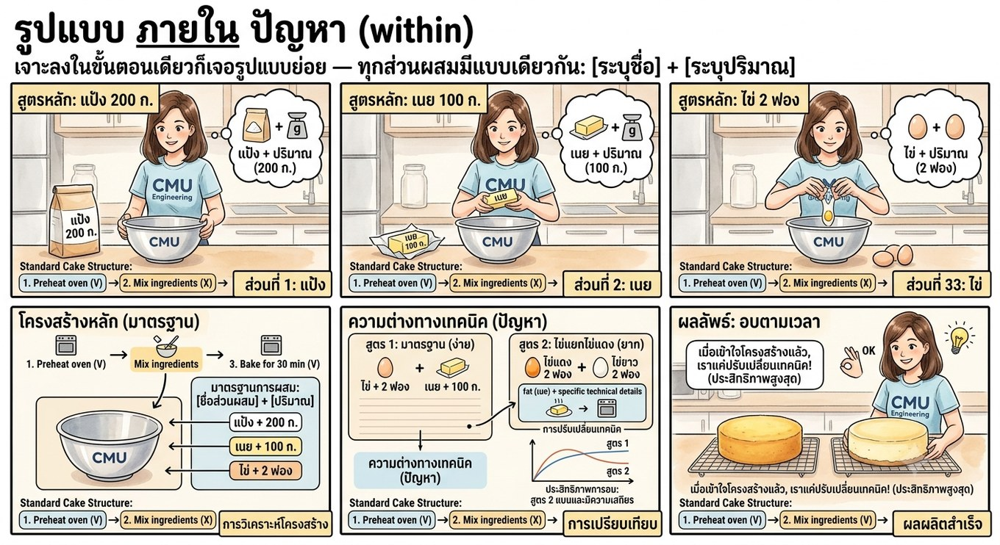{height="500px"}

::: {.figcap}
ภาพจำลอง (AI-generated)
:::
::::

:::

## ตัวอย่าง: รูปแบบช่วยพยากรณ์ {#m2-pattern-predict}

**ฝุ่น PM 2.5 เชียงใหม่** — วิศวกรหารูปแบบเพื่อสร้างแบบจำลองพยากรณ์

:::: {.columns}
::: {.column width="45%"}

:::: {.figbox}
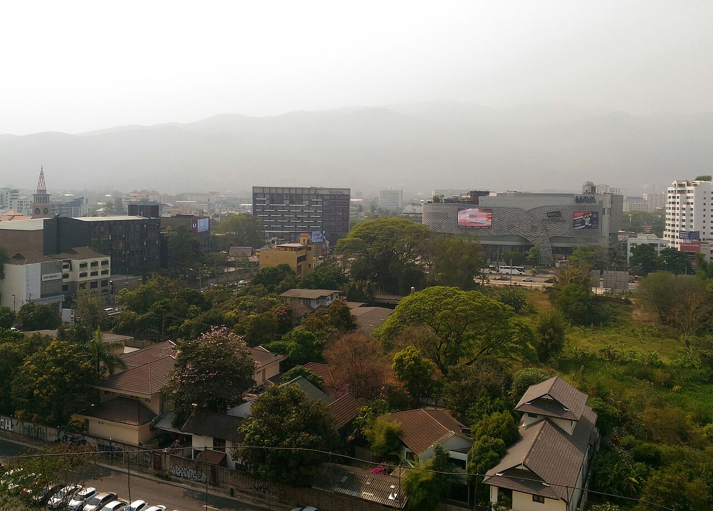{height="320px"}

::: {.figcap}
ภาพ: ["Chiang Mai Air Pollution"](https://commons.wikimedia.org/wiki/File:Chiang_Mai_Air_Pollution_P_20180306_144750_1_p.jpg) โดย FredTC · [CC BY-SA 4.0](https://creativecommons.org/licenses/by-sa/4.0/)
:::
::::

:::
::: {.column width="55%"}

::: {.incremental}
- **ช่วงเวลา:** พุ่งสูงช่วงเดือนกุมภาพันธ์–เมษายน และช่วงเช้าตรู่
- **ภูมิศาสตร์:** หุบเขากักฝุ่นไว้ พื้นที่เกษตรมีค่าพุ่งแรง
- **สภาพอากาศ:** ทิศทางลมกระจายฝุ่น ฝนช่วยชะล้าง อุณหภูมิผกผันกักมลพิษ
:::

:::
::::

. . .

::: {.callout-tip}
เหมือน**ฤดูกาล**ที่คาดเดาได้ — รู้รูปแบบแล้ว วางแผนล่วงหน้าได้
:::

# 3. นามธรรม 🎯 {background-color="#2c3e50" .white-text}

Abstraction — ตัดสิ่งที่ไม่เกี่ยวออก เหลือแต่แบบจำลองที่ใช้งานได้

## นามธรรม (Abstraction) {#m2-abstraction}

ทำระบบที่ซับซ้อนให้เรียบง่าย โดย**ซ่อนความซับซ้อนที่ไม่จำเป็น** — กรอง "สิ่งรบกวน (noise)" ออก เหลือเฉพาะสิ่งที่**จำเป็นต่อการแก้ปัญหาตรงหน้า**

. . .

::: {.callout-note}
**แบบจำลอง (Model)** คือแนวคิดกลาง ๆ เช่น "แมวต้นแบบ" แทน**แมวทุกตัว** ไม่ใช่แมวตัวใดตัวหนึ่ง — จากแบบจำลอง เราเรียนรู้กฎที่ใช้ได้กับทั้งหมวดหมู่
:::

## แบบจำลอง (Model): แมวต้นแบบ 🐱 {#m2-model .center}

:::: {.figbox}
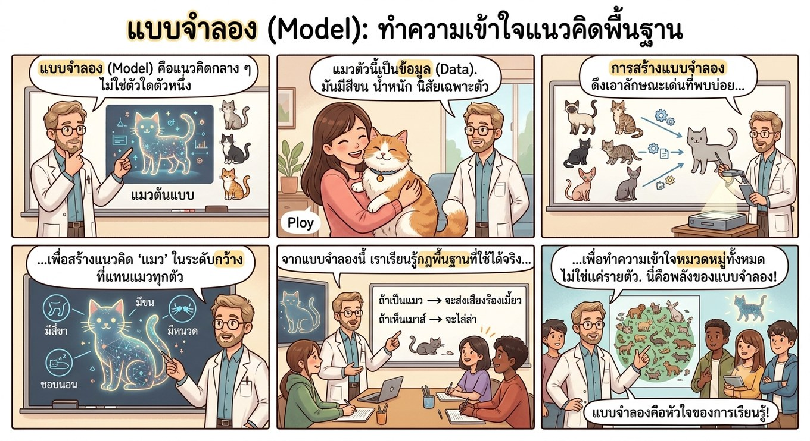{height="540px"}

::: {.figcap}
ภาพจำลอง (AI-generated)
:::
::::

## ตัวอย่าง: แผนที่รถไฟฟ้า {#m2-abstraction-map}

ออกแบบแผนที่รถไฟฟ้า ถ้าแสดง**ทุกตึกทุกต้นไม้**ตามจริง จะกลายเป็นเครื่องมือที่**ใช้ไม่ได้**

:::: {.columns}
::: {.column width="52%"}

:::: {.figbox}
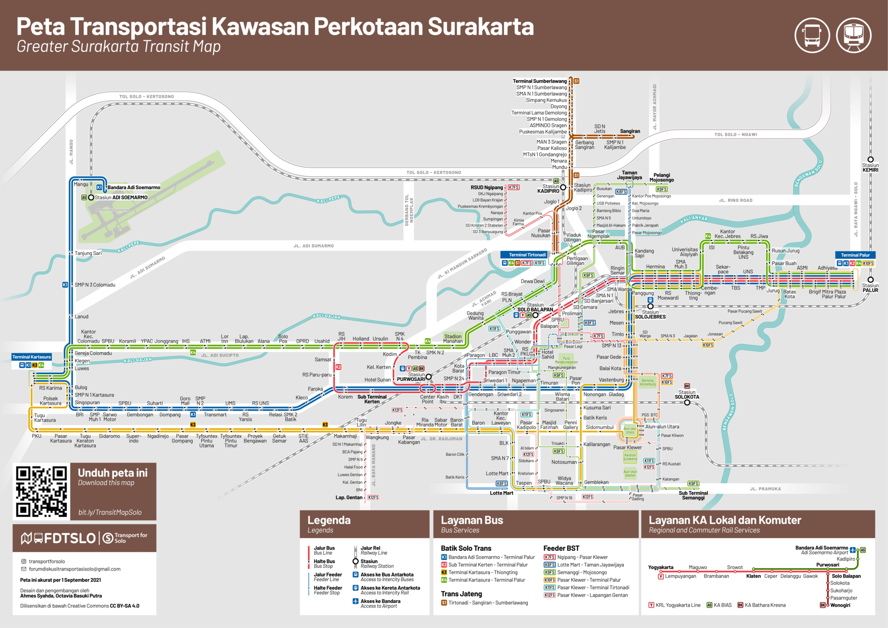{height="300px"}

::: {.figcap}
ภาพ: ["Greater Surakarta Transit Map"](https://commons.wikimedia.org/wiki/File:Transit_Map_Solo.png) โดย Forum Diskusi Transportasi Solo · [CC BY-SA 4.0](https://creativecommons.org/licenses/by-sa/4.0/)
:::
::::

:::
::: {.column width="48%"}

::: {.incremental}
- นามธรรม = **จงใจตัด**ความจริงทางกายภาพออก เพื่อเน้นสิ่งเดียวที่ผู้ใช้ต้องการ: **การเชื่อมต่อของเส้นทาง**
- **แผงหน้าปัดรถยนต์:** แสดงความเร็วและไฟเตือน ซ่อนกลไกเครื่องยนต์
- **การทำงบประมาณ:** ดูหมวดใหญ่ (ค่าเช่า, ค่าอาหาร) ไม่สนใจใบเสร็จทีละใบ
:::

:::
::::

## ตารางวินิจฉัยนามธรรม {#m2-abstraction-matrix}

จากตัวอย่างสูตรอาหาร — อะไรควร**เก็บไว้ในแบบจำลอง** อะไรคือ**รายละเอียดที่กรองทิ้ง**

| ✅ รูปแบบทั่วไป (เก็บไว้) | ❌ รายละเอียดเฉพาะ (กรองทิ้งก่อน) |
|:---|:---|
| แบบจำลองต้องมี**ส่วนผสม** | ยัง**ไม่ต้องรู้**ว่าส่วนผสมนั้นคืออะไร |
| ส่วนผสมแต่ละอย่างมี**ปริมาณ** | ยัง**ไม่ต้องรู้**ปริมาณที่แน่นอน |
| ระบบต้องใช้**เวลา**ในการทำ | ยัง**ไม่ต้องรู้**ว่ากี่นาทีพอดี |

::: {.callout-tip}
นามธรรมคือการรู้ว่า **"ตอนนี้ยังไม่ต้องรู้อะไรบ้าง"** เพื่อไม่ให้จมกับรายละเอียด
:::

# 4. อัลกอริทึม 📝 {background-color="#2c3e50" .white-text}

Algorithms — แผนแม่บทที่ทำตามได้ทีละขั้น

## อัลกอริทึม (Algorithms) {#m2-algorithm .smaller}

> อัลกอริทึมคือ**สูตรอาหารที่ละเอียด** ซึ่ง**รับประกัน**ผลเหมือนเดิมทุกครั้งที่ทำตาม — เช่น **ชงชา 1 ถ้วย** ทีละขั้น 1 → 6

. . .

:::: {.figbox}
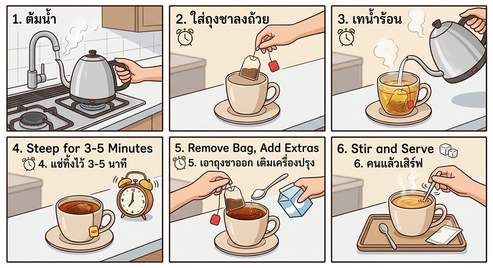{height="380px"}

::: {.figcap}
ภาพจำลอง (AI-generated)
:::
::::

::: {.callout-note}
สังเกตว่า**ลำดับสำคัญ** — สลับขั้นตอน ผลลัพธ์ก็เปลี่ยน (นี่คือหัวใจของการเขียนโปรแกรม)
:::

## อัลกอริทึมกับการตัดสินใจ {#m2-algorithm-flow}

อัลกอริทึมอาศัย**อินพุตที่ชัดเจน**และ**จุดตัดสินใจ (decision gate)** — เหมือนโปรแกรมที่เราจะเขียนต่อจากนี้

{width="1180px" fig-align="center"}

::: {.callout-note}
รูปแบบ input → process → **decision** → output นี้ คือสิ่งที่เราจะเขียนด้วย Python ใน [Module 5 (if-else)](module05.html) 👉
:::

## อัลกอริทึมนี้ เขียนเป็น Python ได้เลย 🐍 {#m2-algorithm-python .smaller}

flowchart ↔ โค้ด Python — นี่คือสิ่งที่เราจะเขียนได้จริงในอีกไม่กี่สัปดาห์

{width="1100px" fig-align="center"}

```{pyodide}
#| autorun: false
# สมมติค่าที่ผู้ใช้ป้อน (แทน input())
name = "Somchai"
age = 72

print("Hello", name)
if age >= 70:
    print("อายุมากประสบการณ์!")
else:
    print("ยังหนุ่มสาวอยู่!")
```

::: {.callout-tip}
กด **Run** ดูผล แล้วลองเปลี่ยน `age` เป็น `25` — เห็นไหมว่า**จุดตัดสินใจ**ทำงานยังไง 😃
:::

## พักสมอง 😄 {#m2-xkcd .center}

คู่มือ **"อ่าน flowchart"** ที่นำเสนอในรูปแบบ flowchart เสียเอง 🔁

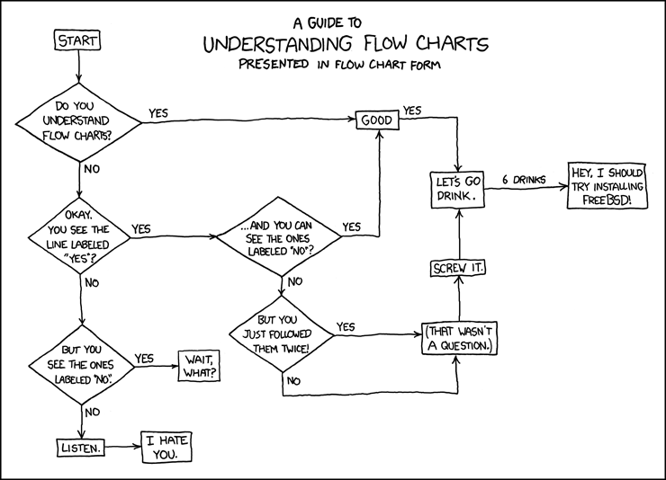{height="440px" fig-align="center"}

::: {style="font-size:0.5em"}
ที่มา: [xkcd #1195 — "Flow Charts"](https://xkcd.com/1195/) (CC BY-NC 2.5)
:::

# การประกอบร่าง 🚀 {background-color="#2c3e50" .white-text}

The Synthesis — เครื่องยนต์ความคิดที่ทำงานพร้อมกัน

## ทั้ง 4 อย่างทำงานพร้อมกัน {#m2-synthesis}

ในการออกแบบซอฟต์แวร์ (เช่น เกมแพลตฟอร์ม) เครื่องมือทั้งสี่**ไม่ได้ทำงานแยกกัน** แต่ทำงาน**พร้อมกัน**

:::: {.columns}
::: {.column width="50%"}
::: {.callout-note icon=false}
#### 🪓 แยกส่วน (Decomposition)
แบ่งเกมเป็นงาน — ระบบคะแนน, ฟิสิกส์การเคลื่อนที่, เงื่อนไขผ่านด่าน
:::
::: {.callout-tip icon=false}
#### 🔁 หารูปแบบ (Pattern recognition)
ใช้ความรู้ว่าแพลตฟอร์มทำงานยังไง เขียนลูปเดินของศัตรูจากพฤติกรรมซ้ำ ๆ
:::
:::
::: {.column width="50%"}
::: {.callout-warning icon=false}
#### 🎯 นามธรรม (Abstraction)
ลดโลกทั้งใบให้เหลือ**ตาราง**ของเส้นทาง ตำแหน่งผู้เล่น ไอเทม และทางออก
:::
::: {.callout-important icon=false}
#### 📝 อัลกอริทึม (Algorithm)
โค้ดทีละขั้นที่กำหนดว่าจะเกิดอะไรเมื่อผู้เล่นกดปุ่มหรือชนศัตรู
:::
:::
::::

## การประกอบร่าง: 4 อย่างในเกมเดียว 🎮 {#m2-synthesis-viz .center}

:::: {.figbox}
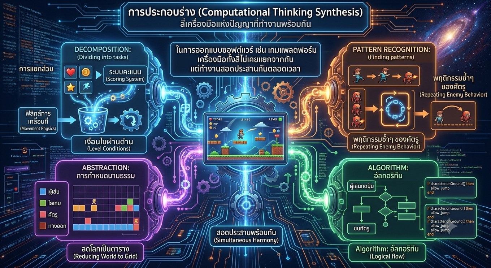{height="540px"}

::: {.figcap}
ภาพจำลอง (AI-generated)
:::
::::

# จาก Computational Thinking สู่ Python 🐍 {background-color="#2c3e50" .white-text}

แนวคิด → เครื่องมือจริงที่เราจะได้ใช้ตลอดวิชานี้

## 4 เสาหลัก กลายเป็นอะไรใน Python {#m2-to-python}

| เสาหลัก (แนวคิด) | ใน Python คือ | ได้เรียนที่ |
|:--|:--|:--|
| 🪓 **แยกส่วน** | แยกโปรแกรมใหญ่เป็น**ฟังก์ชัน**ย่อย ๆ | [Module 9](module09.html), [10](module10.html) |
| 🔁 **หารูปแบบ** | สั่งงานซ้ำด้วย **loop** (`for`, `while`) และ **list comprehension** | [Module 6](module06.html), [7](module07.html), [8](module08.html), [10](module10.html) |
| 🎯 **นามธรรม** | ซ่อนรายละเอียดด้วย**ตัวแปร**, **ฟังก์ชัน** และ**โครงสร้างข้อมูล** | [Module 3](module03a.html), [4](module04a.html), [9](module09.html) |
| 📝 **อัลกอริทึม** | เรียง**ลำดับคำสั่ง** + **เงื่อนไข** (`if-else`) + **การวนซ้ำ** | [Module 3](module03a.html), [5](module05.html), [6](module06.html), [7](module07.html) |

::: {.callout-tip}
**Computational Thinking = วิธีคิด · Python = เครื่องมือ** — เราคิดแบบ CT แล้วสั่งให้คอมพิวเตอร์ทำจริงด้วย Python
:::

## เห็น 4 เสาหลักในโค้ดจริง 🐍 {#m2-four-in-code}

โปรแกรมสั้น ๆ นี้ใช้**ทั้ง 4 เสาหลักพร้อมกัน** — กด **Run** ดูผล (ยังอ่านไม่ออกก็ไม่เป็นไร)

```{pyodide}
#| autorun: false
scores = [55, 82, 47, 90, 68]   # 🎯 Abstraction: เก็บข้อมูลไว้ในตัวแปร

# 🪓 Decomposition: แยกงาน "ตัดเกรด" ออกเป็นฟังก์ชัน
def grade(score):
    # 📝 Algorithm: ตัดสินใจด้วยเงื่อนไข if-else
    if score >= 50:
        return "ผ่าน"
    else:
        return "ตก"

# 🔁 Pattern recognition: ทำซ้ำกับทุกคนด้วย loop
for s in scores:
    print(s, "→", grade(s))
```

::: {.callout-tip}
🪓 **ฟังก์ชัน** · 🔁 **loop** · 🎯 **ตัวแปร** · 📝 **if-else** — นี่คือ Python ที่เราจะได้ฝึกจริงตลอดวิชานี้
:::

# Summary 🎯 {background-color="#2c3e50" .white-text}

## สรุป Module 2 🎉 {.smaller}

:::: {.columns}
::: {.column width="50%"}

**แนวคิดเชิงคำนวณ (Computational Thinking)**

- วิธีคิดอย่างเป็นระบบเพื่อ**นำความยุ่งเหยิงมาสู่ความเป็นระเบียบ**
- ใช้ได้กับทุกสาขา ไม่ใช่แค่การเขียนโปรแกรม

**4 เสาหลัก**

- 🪓 **แยกส่วน** — แตกปัญหาใหญ่เป็นส่วนย่อยที่จัดการได้
- 🔁 **หารูปแบบ** — หาความซ้ำเพื่อใช้วิธีเดิมซ้ำ

:::
::: {.column width="50%"}

<br>

- 🎯 **นามธรรม** — กรองรายละเอียดที่ไม่จำเป็น เหลือแบบจำลองที่ใช้งานได้
- 📝 **อัลกอริทึม** — ออกแบบขั้นตอนที่ทำตามแล้วได้ผลเหมือนเดิม

::: {.callout-tip}
ในงานจริงทั้งสี่**ทำงานพร้อมกัน** → เราจะได้ฝึกใช้ทั้งหมดนี้ผ่านการเขียน Python ตลอดวิชานี้
:::

:::
::::

::: {.callout-note}
ต่อ Module 3: [Variables and Types, Operators, Math](module03a.html) 👉
:::
