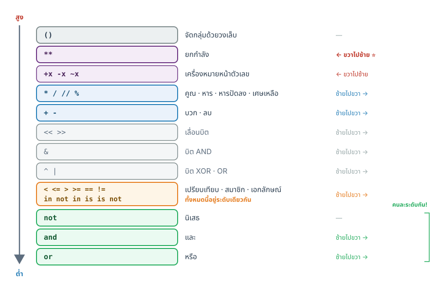
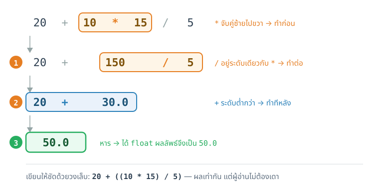
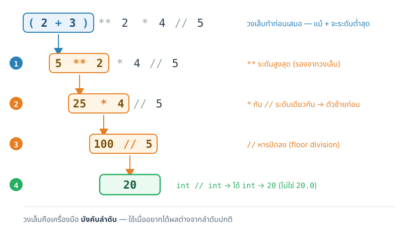
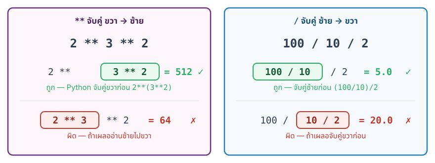

## {#topics-slide .center}

:::: {.columns}
::: {.column width="50%"}

### วันนี้เราจะเรียนรู้ 🚀

::: {.incremental}
1. โครงสร้างของโปรแกรม Python
2. **ตัวแปร** (Variables) และ **ชนิดข้อมูล** (Data Types)
3. **ตัวดำเนินการ** (Operators)
4. **Math Module**
:::

::: {.callout-note}
**Input / Output** และ **f-string** ต่อใน [Module 3b](module03b.html) 👉
:::

:::
::: {.column width="50%"}

```python
import math

x = 16
y = 4
print(x ** 2)          # operators
print(math.sqrt(x))    # math module
```

:::
::::

# Example of Python Script 🐍 {background-color="#2c3e50" .white-text}

โครงสร้างของโปรแกรม Python

## ตัวอย่างโปรแกรม Python

```python
# นำเข้าคำสั่งภายนอก (bring in external functions)
import datetime

print("----- Age Calculate Program -----")
# รับค่าอินพุตนำไปกำหนดค่าตัวแปร (get input, store in a variable)
yob = input("What's your year of birth? (e.g., 2004): ")

# ประมวลผล (process data using variables)
today = datetime.date.today()       # ดึงค่า วัน-เวลา ปัจจุบัน
year = today.year                   # สนใจเฉพาะ ปี ปัจจุบัน
age = year - int(yob)               # คำนวณอายุ

# แสดงผล (display output)
print("You are", age , "years old.")
print()
print("Congratulations on your first Python program.")
```


# Variables 📦 {background-color="#2c3e50" .white-text}

ตัวแปร — การกำหนดชื่อให้พื้นที่ในหน่วยความจำ

## ตัวแปร (Variables) คืออะไร? {#m3-variables}

::: {.incremental}
- **ตัวแปร** = ชื่อที่ใช้อ้างอิงพื้นที่ในหน่วยความจำ
- ใช้เก็บข้อมูลเพื่อนำไปใช้งานภายหลัง
- ควรตั้งชื่อให้ **สอดคล้องกับข้อมูล** ที่จัดเก็บ
:::

::: {.fragment}
```python
age = 20
name = "Somchai"
gpa = 3.75
is_student = True
```
:::


## กฎการตั้งชื่อ Python Identifier {#m3-identifier}

::: {.incremental}

- ใช้ตัวอักษร `a-z`, `A-Z` และ `_` (underscore)
- เช่น `var_1` `print_this_to_screen`
- **ห้ามขึ้นต้นด้วยตัวเลข** — `1variable` ใช้ไม่ได้
- **ห้ามใช้เครื่องหมายพิเศษ** — `!`, `@`, `#`, `$`, `%`
- **ห้ามตั้งชื่อตรงกับ Keyword** ของ Python
:::

::: {.callout-warning .fragment}

**Case-sensitive** — `var` กับ `Var` เป็นคนละตัว

:::


## Python Keywords

คำเหล่านี้ **ห้ามใช้เป็นชื่อตัวแปร**

```python
import keyword
print(keyword.kwlist)
```

. . .

```{.python .code-output}
['False', 'None', 'True', 'and', 'as', 'assert', 'async',
 'await', 'break', 'class', 'continue', 'def', 'del', 'elif',
 'else', 'except', 'finally', 'for', 'from', 'global', 'if',
 'import', 'in', 'is', 'lambda', 'nonlocal', 'not', 'or',
 'pass', 'raise', 'return', 'try', 'while', 'with', 'yield']
```

# Data Types 🏷️ {background-color="#2c3e50" .white-text}

ชนิดข้อมูลพื้นฐาน — `str`, `int`, `float`, `bool`

## ชนิดข้อมูลพื้นฐาน 4 ประเภท {#m3-data-types}

| ชนิด | คำอธิบาย | ตัวอย่าง |
|:----:|:---------|:---------|
| `str` | ข้อความ (string) | `'hello'`, `"2345"` |
| `int` | เลขจำนวนเต็ม | `50000`, `1_000_000` |
| `float` | เลขทศนิยม | `3.14`, `1.23e9` |
| `bool` | ค่าความจริง | `True`, `False` |

. . .

```python
str1 = 'hello' # ข้อความ (string)
str2 = "2345"  # ข้อความ (string)
var1 = 50000   # จำนวนเต็ม (int)
var2 = 10/2    # จำนวนจริง (float)
var3 = 1.23e9  # จำนวนจริง (float)
var4 = False   # ค่าความจริง (boolean)
```

## โจทย์ #1 {.exercise}

สร้างตัวแปรชื่อ `var1` เพื่อเก็บค่า **ผลคูณ** ของ `100` กับ `2` แล้ว **แสดงผล**


::: {.panel-tabset}

### Live Code

```{pyodide}
#| autorun: false
100 * 2
var1
```

### Solution

```python
var1 = 100 * 2
print(var1)
```


```{.python .code-output}
200
```

:::


::: {.callout-note}

**วิธีคิด**

1. สร้างตัวแปรชื่อ `var1` 
2. assign ค่า 100*2 ให้กับ `var1`
3. แสดงผล `var1` ด้วยคำสั่ง `print`

:::


## โจทย์ #2 {.exercise}

สร้างตัวแปรชื่อ `var2` เพื่อเก็บค่า **ผลบวก** ของ `1,000,000` กับ `1` แล้ว **แสดงผล**


::: {.panel-tabset}

### Live Code

```{pyodide}
#| autorun: false
var2 = ____
print(____)
```

### Solution

```python
var2 = 1_000_000 + 1
print(var2)
```


```{.python .code-output}
1000001
```

::: {.callout-tip}
Python ใช้ `_` คั่นหลักตัวเลขเพื่อให้อ่านง่ายขึ้นได้

:::


:::

## โจทย์ #3 {.exercise}

สร้างตัวแปรชื่อ `var3` เพื่อเก็บค่าของ `10` **หาร** ด้วย `2` แล้ว **แสดงผล**

**คิดก่อน:** `var3` จะเป็น `int` หรือ `float`?


::: {.panel-tabset}

### Live Code

```{pyodide}
#| autorun: false
var3 = ____
print(____)
```

### Solution

```python
var3 = 10 / 2
print(var3)
```


```{.python .code-output}
5.0
```

ได้ **`float`** ไม่ใช่ `int`! — การหาร `/` ใน Python ให้ผลเป็น float เสมอ

:::


::: {.callout-note}

**วิธีคิด**

1. สร้างตัวแปรชื่อ `var3`
2. assign ค่า 10/2 ให้กับ `var3`
3. แสดงผล `var3` ด้วยคำสั่ง `print`

:::


## โจทย์ #4 {.exercise}

สร้างตัวแปรชื่อ `s1` เพื่อเก็บข้อความ `"this is a string"` แล้ว **แสดงผล**

::: {.panel-tabset}

### Live Code

```{pyodide}
#| autorun: false
s1 = ____
print(____)
```

### Solution

```python
s1 = "this is a string"
print(s1)
```


```{.python .code-output}
this is a string
```

:::


## ข้อความ (String) — เครื่องหมาย Quote {#m3-string-quote}

ข้อความ (String) ต้องอยู่ภายใต้เครื่องหมาย **quote**

| Quote | ใช้เมื่อ | ตัวอย่าง |
|:-----:|:---------|:---------|
| `'...'` | ข้อความทั่วไป | `'hello'` |
| `"..."` | มี apostrophe ในข้อความ | `"isn't"` |
| `'''...'''` | ข้อความหลายบรรทัด | `'''line1\nline2'''` |

## โจทย์ #5 {.exercise}

แสดงผลข้อความ `this is a simple string.`

**คิดก่อน:** ใช้คำสั่งอะไรในการแสดงผล?


::: {.panel-tabset}

### Live Code

```{pyodide}
#| autorun: false
this is a simple string.
```

### Solution

```python
print('this is a simple string.')
```


```{.python .code-output}
this is a simple string.
```

:::


## โจทย์ #6 {.exercise}

แสดงผลข้อความ `this isn't a simple string.`

**คิดก่อน:** ใช้ `'   '` ได้ไหม?


::: {.panel-tabset}

### Live Code

```{pyodide}
#| autorun: false
# ใช้ quote แบบไหนดี?
print(____)
```

### Solution

ใช้ไม่ได้ เพราะจะเจอ `'` ตรงคำว่า `isn't` — ต้องใช้ `"..."`

```python
print("this isn't a simple string.")
```


```{.python .code-output}
this isn't a simple string.
```

:::


## โจทย์ #7 {.exercise}

แสดงผลข้อความ `this is how to print "double quote" in sentence.`


::: {.panel-tabset}

### Live Code

```{pyodide}
#| autorun: false
# ใช้ quote แบบไหนดี?
print(____)
```

### Solution

```python
print('this is how to print "double quote" in sentence.')
```


```{.python .code-output}
this is how to print "double quote" in sentence.
```


::: {.callout-note}
**วิธีคิด**

1. เขียนข้อความ this is how to print "double quote" in sentence.
2. ครอบประโยคด้วยเครื่องหมาย '...'
3. ใช้คำสั่ง `print` เพื่อแสดงผล

:::


:::


## โจทย์ #8 {.exercise}

แสดงผลข้อความ **3 บรรทัด** ดังนี้

```
this is another string
this is 2nd line
this is 3rd line
```


::: {.panel-tabset}

### Live Code

```{pyodide}
#| autorun: false
print(____)
```

### Solution

```python
print('''this is another string
this is 2nd line
this is 3rd line''')
```

:::


## Escape Code — อักขระพิเศษ {#m3-escape}

 - ในภาษาคอมพิวเตอร์ มักมีการใช้งานอักขระพิเศษร่วมกับข้อความ (string) เพื่อให้เกิดการแสดงผลแบบต่าง ๆ เช่น การขึ้นบรรทัดใหม่ การแท็บ การลบอักขระ
 - อักขระเหล่านี้ 
   - ขึ้นต้นด้วย **Escape Character** ( **`\`** )
   - ใช้ภายใน `"   "`, `'   '` หรือ `'''   '''`
 - ที่ใช้งานบ่อย ๆ ได้แก่ `\n`, `\t`
  
:::: {.columns}
::: {.column width="50%"}

Escape Code | Description
------------|-------------
`\n` | **newline (ขึ้นบรรทัดใหม่)**
`\r` | carriage return
`\t` | **tab (แท็บ)**
`\v` | vertical tab
`\b` | backspace


:::
::: {.column width="50%"}

Escape Code | Description
------------|-------------
`\f` | form feed (page feed)
`\a` | alert (beep)
`\'` | **single quote (\')**
`\"` | **double quote (\")**
`\\` | **backslash (\\)**

:::
::::

## ตัวอย่างการใช้ Escape Code

```python
print('This is the 1st line')
print('This is the 2nd line \nThis is the 3rd line')
print()
print('This is the 5th line \t\tand it \'is\' separated by 2 tabs')
print("This is the \"6th\" line ")
print("\\\\\\\\")    # There are 8 backslash here
```

. . .

```{.python .code-output}
This is the 1st line
This is the 2nd line 
This is the 3rd line

This is the 5th line 		and it 'is' separated by 2 tabs
This is the "6th" line 
\\\\
```

::: {.callout-warning}
ทำไมบรรทัดสุดท้ายถึงพิมพ์ backslash แค่ 4 ตัว แทนที่จะเป็น 8 ตัว
:::

## Dynamic Typing — ชนิดข้อมูลไม่ตายตัว {#m3-dynamic-typing}

Python **ไม่บังคับ** ชนิดข้อมูลตายตัว (ต่างจาก C/C++, Java) 
ตัวแปรสามารถเปลี่ยนไปเก็บข้อมูลชนิดอื่นได้อัตโนมัติ (dynamic typing)

. . .

```python
x = 42          # int
x = "hello"     # เปลี่ยนเป็น str ได้!
x = 3.14        # เปลี่ยนเป็น float ได้!
```

. . .

ตรวจสอบชนิดด้วย **`type()`**

```python
type('Hello')   # <class 'str'>
type(1)         # <class 'int'>
type(1.234)     # <class 'float'>
```

. . .

ถ้าเป็นภาษาอื่น เช่น C++ เราจะต้องระบุตั้งแต่ต้นว่าจะให้ตัวแปรเก็บอะไร 😱 (static typing)
```c++
#include <string>
int x = 0;
float y = 3.14
std::string z = "hello"
```

## พักสมอง 😄 {#m3-xkcd .center}

{height="520px" fig-align="center"}

::: {style="font-size:0.5em"}
ที่มา: [xkcd #353 — "Python"](https://xkcd.com/353/) (CC BY-NC 2.5)
:::

## โจทย์ #9 {.exercise}

`1.234` และ `1.23e11` เป็นข้อมูลประเภทใด?


::: {.panel-tabset}

### Live Code

```{pyodide}
#| autorun: false
print(type(____))
print(type(____))
```

### Solution

```python
print(type(1.234))
print(type(1.23e11))
```


```{.python .code-output}
<class 'float'>
<class 'float'>
```

ทั้งคู่เป็น **`float`** — `1.23e11` คือ $1.23 \times 10^{11}$ (scientific notation)

:::


## โจทย์ #10 {.exercise}

สร้างตัวแปร `s2` เก็บผลบวกของ `2500` กับ `1000` แล้วแสดงค่า `s2` และตรวจสอบ type 

**คิดก่อน:** `s2` จะเป็นชนิดใด?


::: {.panel-tabset}

### Live Code

```{pyodide}
#| autorun: false
s2 = ____ + ____
print(s2, type(s2))
```

### Solution

```python
s2 = 2500 + 1000
print(s2, type(s2))
```


```{.python .code-output}
3500 <class 'int'>
```

`int` + `int` → **`int`**

:::


## โจทย์ #11 {.exercise}

ต่อจากข้อก่อน — หาค่า `s2` หารด้วย `2` แล้วเก็บกลับใน `s2`

**คิดก่อน:** `s2` จะเป็นชนิดใด?


::: {.panel-tabset}

### Live Code

```{pyodide}
#| autorun: false
s2 = 2500 + 1000   # จากข้อก่อนหน้า
________
print(s2, type(s2))
```

### Solution

```python
s2 = s2 / 2
print(s2, type(s2))
```


```{.python .code-output}
1750.0 <class 'float'>
```

**การหาร `/` ได้ `float` เสมอ!** แม้หารลงตัว

:::


## โจทย์ #12 {.exercise}

สร้างตัวแปร `s3` เก็บผลบวกของข้อความ `'hello'` กับ `'there'` (เว้นวรรคด้วย)

**คิดก่อน:** `s3` จะเป็นชนิดใด?


::: {.panel-tabset}

### Live Code

```{pyodide}
#| autorun: false
s3 = ____ + ____ + ____
print(s3, type(s3))
```

### Solution

```python
s3 = 'hello' + ' ' + 'there'
print(s3, type(s3))
```


```{.python .code-output}
hello there <class 'str'>
```

**`string` + `string` = concatenation** (นำข้อความมาต่อกัน)

:::


## โจทย์ #13: ชวนคิด {.exercise-think}

ทดลองหาผลบวกของ `s3` (string) กับ `1` (int)

คิดว่าบวกกันได้ไหม?


::: {.panel-tabset}

### Live Code

```{pyodide}
#| autorun: false
s3 = 'hello there'
# ลองบวก s3 กับ 1

```

### Solution

```python
s3 + 1
```


```{.python .code-output}
TypeError: can only concatenate str (not "int") to str
```

::: {.callout-important}
**`string` + `number` ไม่ได้!** ต้องแปลงชนิดข้อมูลให้ตรงกันก่อน

:::


:::

# Type Conversions 🔄 {background-color="#2c3e50" .white-text}

การเปลี่ยนชนิดข้อมูล — `int()`, `float()`, `str()`

## ฟังก์ชันแปลงชนิดข้อมูล {#m3-type-conversion}

:::: {.columns}
::: {.column width="40%"}

| ฟังก์ชัน | แปลงเป็น |
|:-------:|:--------:|
| `int()` | จำนวนเต็ม |
| `float()` | ทศนิยม |
| `str()` | ข้อความ |
| `bool()` | `True`/`False` |

:::
::: {.column width="60%"}

```python
c = float('30.5')    # 30.5
d = int('100')       # 100
e = str(42)          # '42'
f = float(7)         # 7.0
g = int(9.99)        # 9 (ตัดทศนิยมทิ้ง)
```

:::
::::

. . .

::: {.callout-note}
**Automatic conversion**: `int` + `float` → Python แปลง `int` เป็น `float` ให้อัตโนมัติ
:::


## โจทย์ #14 {.exercise}

`99` (int) + `1.23` (float) → ผลลัพธ์เป็น type อะไร?


::: {.panel-tabset}

### Live Code

```{pyodide}
#| autorun: false
print(type(____), type(____))
print(type(____ + ____))
```

### Solution

```python
print(type(99), type(1.23))
print(type(99 + 1.23))
```


```{.python .code-output}
<class 'int'> <class 'float'>
<class 'float'>
```

`int` + `float` → **`float`** อัตโนมัติ

:::

. . .

::: {.callout-note}

แล้ว `4` กับ `4.00` เป็น type เดียวกันหรือไม่🤔

:::


## โจทย์ #15 {.exercise}

หาผลบวกของ `42` กับ `3.5` แล้วเก็บเป็น **integer** ในตัวแปร `i`


::: {.panel-tabset}

### Live Code

```{pyodide}
#| autorun: false
i = 42 + 3.5
print(i, type(i))
```

### Solution

```python
i = int(42 + 3.5)
print(i, type(i))
```


```{.python .code-output}
45 <class 'int'>
```

`int()` **ตัดทศนิยมทิ้ง** (ไม่ใช่ปัดเศษ) — `int(45.5)` → `45`

:::


## โจทย์ #16 {.exercise}

แปลงตัวแปร `i` จาก integer ให้เป็น **float**


::: {.panel-tabset}

### Live Code

```{pyodide}
#| autorun: false
i = 45
f = i
print(f, type(f))
```

### Solution

```python
f = float(i)
print(f, type(f))
```


```{.python .code-output}
45.0 <class 'float'>
```

:::


## โจทย์ #17 {.exercise}

กำหนด `s = '1234'` (string) — แปลงเป็น integer แล้วแสดงผล


::: {.panel-tabset}

### Live Code

```{pyodide}
#| autorun: false
s = '1234'
i = s
print(i, type(i))
```

### Solution

```python
s = '1234'
i = int(s)
print(int(i), type(i))
```


```{.python .code-output}
1234 <class 'int'>
```

:::


## โจทย์ #18 {.exercise}

กำหนด `str1 = '1234.50'` — หาผลบวกของ `str1` กับ `1000` เก็บในตัวแปร `x`

**ลองคิด:** จะแปลง `str1` เป็น `int` หรือ `float` ดี?


::: {.panel-tabset}

### Live Code

```{pyodide}
#| autorun: false
str1 = '1234.50'
x = ____(str1) + 1000
print(x, type(x))
```

### Solution

```python
str1 = '1234.50'
x = float(str1) + 1000
print(x, type(x))
```


```{.python .code-output}
2234.5 <class 'float'>
```

::: {.callout-warning}
`int('1234.50')` → **error!** เพราะมีจุดทศนิยม ต้องใช้ `float()`

:::


:::

## โจทย์ #19: ชวนคิด {.exercise-think}

แปลง string `'Hello'` เป็น integer ได้หรือไม่?


::: {.panel-tabset}

### Live Code

```{pyodide}
#| autorun: false
# แปลง 'Hello' เป็น integer ได้ไหม?
____('Hello')
```

### Solution

```python
int('Hello')
```


```{.python .code-output}
ValueError: invalid literal for int() with base 10: 'Hello'
```

::: {.callout-important}
ข้อความที่ **ไม่ใช่รูปแบบตัวเลข** แปลงเป็น number ไม่ได้ → **ValueError**

:::


:::

# Operators ➕ {background-color="#2c3e50" .white-text}

ตัวดำเนินการ — Arithmetic, Comparison, Logical, Assignment

## Operator คืออะไร?

- **Operator** คือสัญลักษณ์ที่แทนการคำนวณต่าง ๆ
- ข้อมูลที่ operator ใช้ในการคำนวณเรียกว่า **operand**

. . .

```python
2 + 3
```

. . .

```{.python .code-output}
5
```

- เครื่องหมาย `+` คือ **operator** สำหรับการบวก
- ตัวเลข `2` และ `3` คือ **operand** และ `5` คือ **ผลลัพธ์**

## เลือกใช้ Operator ให้สอดคล้องกับชนิดข้อมูล

- `number` + `number` → ได้ตามหลักคณิตศาสตร์
- `string` + `string` → นำข้อความมา **เรียงต่อกัน** (concatenation)
- `string` + `number` → **ไม่ได้!** จะเกิด `TypeError`

## Arithmetic Operators {#m3-arithmetic}

กำหนด `x = 16`, `y = 4`

| Operator | ความหมาย | ผลลัพธ์ |
|:--------:|:---------|:-------:|
| `x + y` | บวก | `20` |
| `x - y` | ลบ | `12` |
| `x * y` | คูณ | `64` |
| `x / y` | หาร (ได้ float เสมอ) | `4.0` |
| `x // y` | หารปัดเศษทิ้ง (floor division) | `4` |
| `x % y` | เศษของการหาร (modulus) | `0` |
| `x ** y` | ยกกำลัง | `65536` |

## โจทย์ #20 {.exercise}

แบ่งคนในห้อง **85 คน** ออกเป็น **7 กลุ่ม** — เหลือเศษกี่คน?


::: {.panel-tabset}

### Live Code

```{pyodide}
#| autorun: false
people = 85
group = 7
r = people ____ group
print('The number of remaining students =', r)
```

### Solution

```python
people = 85
group = 7
r = people % group
print('The number of remaining students =', r)
```


```{.python .code-output}
The number of remaining students = 1
```

:::


## โจทย์ #21 {.exercise}

แบ่งคนในห้อง **85 คน** เป็นกลุ่มละ **12 คน** — ได้กี่กลุ่มที่มีสมาชิกครบ?


::: {.panel-tabset}

### Live Code

```{pyodide}
#| autorun: false
people = 85
member = 12
g = people ____ member
print('The number of groups =', g)
```

### Solution

```python
people = 85
member = 12
g = people // member
print('The number of groups =', g)
```


```{.python .code-output}
The number of groups = 7
```

:::


## โจทย์ #22 {.exercise}

คำนวณ $x^y$ เมื่อ $x = 33$, $y = 1.5$


::: {.panel-tabset}

### Live Code

```{pyodide}
#| autorun: false
x = 33
y = 1.5
expo = x ____ y
print('x^y =', expo)
```

### Solution

```python
x = 33
y = 1.5
expo = x ** y
print('x^y =', expo)
```


```{.python .code-output}
x^y = 189.63109108996087
```

:::

. . .

::: {.callout-tip}

ทศนิยมเยอะไปไหม ถ้าต้องการทศนิยม 2 ตำแหน่งล่ะ🤔  ทำแบบนี้เลย...

```python
print(f'x^y = {expo:.2f}')
```

อยากรู้เพิ่ม 👉 ดูที่หัวข้อ [**f-string**](#m3-fstring)

:::


## Comparison Operators {#m3-comparison}

ให้ผลลัพธ์เป็น **`True`** หรือ **`False`** — กำหนด `x = 10`, `y = 12`

:::: {.columns}
::: {.column width="50%"}

| Expression | ผลลัพธ์ |
|:----------:|:------:|
| `x > y` | `False` |
| `x < y` | `True` |
| `x >= y` | `False` |
| `x <= y` | `True` |

:::
::: {.column width="50%"}

| Expression | ผลลัพธ์ |
|:----------:|:------:|
| `x == y` | `False` |
| `x != y` | `True` |

::: {.callout-warning}
`==` เปรียบเทียบ
`=` กำหนดค่า (assign)
อย่าสับสน!
:::

:::
::::

. . .

::: {.callout-note}

`True` กับ `False` เป็นข้อมูล type ไหน🤔

:::


## โจทย์ #23 {.exercise}

กำหนด `x=10`, `y=12` — ประโยค `x > y` และ `x < y` เป็นจริงหรือเท็จ? และเป็น type ไหน


::: {.panel-tabset}

### Live Code

```{pyodide}
#| autorun: false
x = 10
y = 12
print('x > y is', ____)
print('x < y is', ____)
print('x > y is of type', ______)
print('x < y is of type', ______)
```

### Solution

```python
x = 10
y = 12
print('x > y is', x > y)
print('x < y is', x < y)
print('x > y is of type', type(x > y))
print('x < y is of type', type(x < y))
```


```{.python .code-output}
x > y is False
x < y is True
x > y is of type <class 'bool'>
x < y is of type <class 'bool'>
```

:::


## โจทย์ #24 {.exercise}

จากข้อก่อน — จะตรวจสอบว่า 

- `x` เท่ากับ `y` หรือไม่? 
- `x` ไม่เท่ากับ `y` หรือไม่?


::: {.panel-tabset}

### Live Code

```{pyodide}
#| autorun: false
x = 10
y = 12
z = (x ____ y)
print('"x is equal to y" is', z)
```

### Solution

```python
z = (x == y)
print('"x is equal to y" is', z)

z = (x != y)
print('"x is not equal to y" is', z)
```


```{.python .code-output}
"x is equal to y" is False
"x is not equal to y" is True
```

:::

. . .


::: {.callout-note}

ผลของ comparison operator ได้ตรรกะ `True` หรือ `False` แสดงว่าต้องมี operator ที่ใช้กระทำทางตรรกะแน่ ๆ เลย (👉 ดูหน้าต่อไป)

:::


## Logical Operators {#m3-logical}

ใช้รวมเงื่อนไขหลายตัวเข้าด้วยกัน

- **`and`** — ทั้งคู่ต้อง `True`
- **`or`** — แค่ตัวใดตัวหนึ่ง `True`
- **`not`** — กลับค่า

. . .

::: {.callout-note}

👉 **ใน Module 3 เราเจอ Logical Operators แค่นิดเดียว** — แต่จะได้ใช้งานจริงจังมากใน [**Module 5 (if)**](module05.html#m5-logical) และ [**Module 6 (while loop)**](module06.html#m6-while) ตอนสร้าง **เงื่อนไข control flow** 🔀

:::

## โจทย์ #25 {.exercise}

กำหนด `x = True`, `y = False` — หาค่า `x and y`, `x or y`, `not y`


::: {.panel-tabset}

### Live Code

```{pyodide}
#| autorun: false
x = True
y = False
print('x and y is', x ____ y)
print('x or y is', x ____ y)
print('not y is', ____ y)
```

### Solution

```python
x = True
y = False
print('x and y is', x and y)
print('x or y is', x or y)
print('not y is', not y)
```


```{.python .code-output}
x and y is False
x or y is True
not y is True
```

:::


## Assignment Operators {#m3-assignment .smaller}

**แบบพื้นฐาน** — กำหนดค่า (`=`) 📌

```python
x = 10        # assign
```

. . .


**ตัวย่อ** — assign + คำนวณในตัวเดียว ⚡ 

| ตัวย่อ | เทียบเท่ากับ | ผลลัพธ์ (คิดจาก `x = 10`) |
|:------:|:------------:|:-------:|
| `x += 5` | `x = x + 5` | `x = 15` |
| `x -= 3` | `x = x - 3` | `x = 7` |
| `x *= 2` | `x = x * 2` | `x = 20` |
| `x /= 4` | `x = x / 4` | `x = 2.5` |
| `x **= 2` | `x = x ** 2` | `x = 100` |
| `x //= 4` | `x = x // 4` | `x = 2` |
| `x %= 3` | `x = x % 3` | `x = 1` |

. . .

::: {.callout}

**ตัวย่อช่วยให้เขียนสั้นลง** 👉 `x += 5` มีความหมายเหมือน `x = x + 5`

อ่านว่า: *"เอาค่า `x` เดิม มาบวก 5 แล้วเก็บกลับเข้า `x`"*

ดังนั้นต้องมี `x = 10` (กำหนดค่าเริ่มต้น) มาก่อนเสมอ ไม่งั้นจะไม่มีค่าเดิมให้บวกเพิ่ม

:::


## Operator Precedence (ลำดับความสำคัญ) {#m3-precedence .center}

{height="520px" fig-align="center"}

## Operator Precedence — ตาราง {#m3-precedence-table .smaller}

ลำดับจาก **สูงสุด → ต่ำสุด**

| Operators             | Description                           | Associativity (การจับคู่) |
| :-------------------- | :------------------------------------ | :----------------------: |
| `()`                  | Parentheses                           | —                        |
| `**`                  | Exponentiation (raise to the power)   | **ขวา → ซ้าย** ⭐         |
| `+x`, `-x`, `~x`      | Unary plus, Unary minus, Bitwise NOT  | ขวา → ซ้าย               |
| `*`, `/`, `//`, `%`   | Multiplication, Division, Floor division, Modulus | ซ้าย → ขวา   |
| `+`, `-`              | Addition, subtraction                 | ซ้าย → ขวา               |
| `<<`, `>>`            | Bitwise **`shift`** operators         | ซ้าย → ขวา               |
| `&`                   | Bitwise **`AND`**                     | ซ้าย → ขวา               |
| `^`, `\|`             | Bitwise **`XOR`** and **`OR`**        | ซ้าย → ขวา               |
| `<`, `<=`, `>`, `>=`, `==`, `!=`, `is`, `is not`, `in`, `not in` | Comparison, Identity, Membership — **ระดับเดียวกัน** | ซ้าย → ขวา |
| `not`                 | Logical NOT                           | —                        |
| `and`                 | Logical AND                           | ซ้าย → ขวา               |
| `or`                  | Logical OR                            | ซ้าย → ขวา               |
| `=`, `+=`, `-=`, `*=`, `**=`, `/=`, `//=` | Assignment operators      | **ขวา → ซ้าย** ⭐ |


## เห็นภาพ: `2 * 20 + 10 * 15 / 5` ทำงานทีละขั้น {#m3-precedence-trace .center}

{height="420px" fig-align="center"}

## เห็นภาพ: `(2 + 3) ** 2 * 4 // 5` ทำงานทีละขั้น {#m3-precedence-trace2 .center}

{height="420px" fig-align="center"}

## Associativity: จับคู่จากทางไหน {#m3-associativity .center}

เมื่อ operator **ระดับเดียวกัน** อยู่ติดกัน — ตัวไหนจับคู่ก่อน?

{height="360px" fig-align="center"}

::: {.callout-tip}
`**` เป็นตัวเดียวในหมู่คณิตศาสตร์ที่จับคู่ **ขวา → ซ้าย** — จำไว้ให้ดี
:::

## โจทย์ #26 {.exercise}

กำหนด $a=20, b=10, c=15, d=5$ — **คำนวณในใจก่อน**

1. `a + b * c / d` = ?
2. `(a + b) * c / d` = ?
3. `a + b * (c / d)` = ?
4. `a + (b * c) / d` = ?


::: {.panel-tabset}

### Live Code

```{pyodide}
#| autorun: false
a, b, c, d = 20, 10, 15, 5
print(a + b * c / d)
print(____)
print(____)
print(____)
```

### Solution

1. 20 + (10×15/5) = **`50.0`**
2. (30) × 15 / 5 = **`90.0`**
3. 20 + 10×(15/5) = **`50.0`**
4. 20 + (150/5) = **`50.0`**


::: {.callout-tip}
ใส่ `()` ให้ชัดเจน ดีกว่าท่องลำดับ! แต่ถ้าไม่มีวงเล็บ ก็ควรจะเข้าใจได้!

:::


:::

## โจทย์ #27 {.exercise}

กำหนด $y = -3x - \dfrac{2}{10^2}$ — จงหา $y$ เมื่อ $x = 5$

. . .

::: {.callout .smaller}

**วิธีคิด**

1. assign ค่าให้ตัวแปร `x`
2. assign ค่าให้ตัวแปร `y`
3. แสดงผลคำนวณด้วยคำสั่ง  ด้วย `print()`

จากวิธีคิดข้างบน ถ้าสลับขั้นที่ 1. กับ 2. จะมีผลกับการรันโค้ดยังไง?

:::


::: {.panel-tabset}

### Live Code

```{pyodide}
#| autorun: false
x = 5
y = ____
print(y)
```

### Solution

```python
x = 5
y = -3*x - 2/10**2
print(y)
```


```{.python .code-output}
-15.02
```

::: {.callout-warning}
ต้อง assign ค่า `x` **ก่อน** `y` เสมอ!

ถ้าสลับบรรทัด → `NameError: name 'x' is not defined`

:::


:::

# Math Module 🧮 {background-color="#2c3e50" .white-text}
ชุดคำสั่งคณิตศาสตร์ — `import math`

## `math` module — ภาพรวม {#m3-math}


- การคำนวณทางคณิตศาสตร์ที่ซับซ้อนทำได้ยากด้วย `operator` พื้นฐาน
- Python เตรียมชุดคำสั่ง (หรือฟังก์ชัน) ในการคำนวณที่จำเป็นทางคณิตศาสตร์เพิ่มเติมให้ผู้พัฒนาโปรแกรมได้เรียกใช้งาน
- คำสั่งเหล่านี้ถูกจัดเตรียมรวมกันไว้ในโมดูล (module) ที่ชื่อว่า `math`
- ก่อนจะใช้งานคำสั่งเหล่านี้เราต้อง `import` โมดูลเข้าสู่โปรแกรมเสียก่อน

```python
import math
```


::: {.callout-note}

ในการทำงานจริง เรา `import` module เข้ามาเพียงครั้งเดียวก็สามารถใช้งานต่อได้ ไม่จำเป็นต้อง `import` ทุกครั้ง

:::


## `math` — ฟังก์ชันและค่าคงที่ {#m3-math-ref}

:::: {.columns}
::: {.column width="50%"}

**ฟังก์ชัน**

- `math.sqrt(x)` — $\sqrt{x}$
- `math.sin(x)`, `cos(x)`, `tan(x)`
- `math.log(x)`, `log2(x)`, `log10(x)`
- `math.factorial(n)` — $n!$
- `math.ceil(x)` — ปัดขึ้น
- `math.floor(x)` — ปัดลง

:::
::: {.column width="50%"}

**ค่าคงที่**

- `math.pi` — $\pi = 3.14159...$
- `math.e` — $e = 2.71828...$

**แปลงมุม**

- `math.degrees(rad)` — rad → degree
- `math.radians(deg)` — degree → rad

:::
::::

## โจทย์ #28 {.exercise}

คำนวณ $\sqrt{25}$ — ทำได้กี่วิธี?


::: {.panel-tabset}

### Live Code

```{pyodide}
#| autorun: false
import math
# วิธีที่ 1
print(math.____)
# วิธีที่ 2
print(25 ____ 0.5)
# วิธีที่ 3
print(math.____)
```

### Solution

```python
import math
# วิธีที่ 1
print(math.sqrt(25))
# วิธีที่ 2
print(25 ** 0.5)
# วิธีที่ 3
print(math.pow(25, 0.5))
```


```{.python .code-output}
5.0
5.0
5.0
```

:::


## โจทย์ #29 {.exercise}

คำนวณพื้นที่วงกลมที่มีรัศมี **10 หน่วย**

$$area = \pi r^2$$


::: {.panel-tabset}

### Live Code

```{pyodide}
#| autorun: false
import math
r = 10
area = math.____ * r____
print('Area of the circle =', area)
```

### Solution

```python
import math
r = 10
area = math.pi * r**2
print('Area of the circle =', area)
```


```{.python .code-output}
Area of the circle = 314.1592653589793
```

:::


## โจทย์ #30 {.exercise}

แปลงมุม **2 radian** เป็นหน่วย **องศา** (degree)


::: {.panel-tabset}

### Live Code

```{pyodide}
#| autorun: false
import math
print(math.____(2))
```

### Solution

```python
import math
print(math.degrees(2))
```


```{.python .code-output}
114.59155902616465
```

:::


## โจทย์ #31 {.exercise}

แปลงมุม **60 องศา** เป็นหน่วย **radian**


::: {.panel-tabset}

### Live Code

```{pyodide}
#| autorun: false
import math
print(math.____(60))
```

### Solution

```python
print(math.radians(60))
```


```{.python .code-output}
1.0471975511965976
```

:::


## โจทย์ #32 {.exercise}

ให้คำนวณค่าของ ① $\sin$ ของมุมขนาด 30 เรเดียน, ② $\cos$ ของมุมขนาด 60 องศา


::: {.panel-tabset}

### Live Code

```{pyodide}
#| autorun: false
import math
# (1) sin(30 rad)
print(math.____(30))
# (2) cos(60 degree) — แปลงเป็น radian ก่อน!
print(math.____(math.____(60)))
```

### Solution

```python
print(math.sin(30))
print(math.cos(math.radians(60)))
```

```{.python .code-output}
-0.9880316240928618
0.5000000000000001
```


$\cos(60°)$ — มุมเป็นองศา ต้องแปลงเป็น radian ก่อน!


:::

. . .

::: {.callout-warning}
`sin`, `cos`, `tan` รับค่าเป็น **radian** เสมอ!

:::

## ทำไม `cos(60°)` ได้ `0.5000000000000001`? {#m3-float-precision .smaller}

`cos(60°)` ควรได้ `0.5` พอดี แต่ได้ `0.5000000000000001` — นี่คือ **floating-point error** ไม่ใช่บั๊ก

::: {.incremental}
- คอมพิวเตอร์เก็บ **`float` เป็นเลขฐานสอง** — ทศนิยมบางค่า (เช่น `0.1`, `0.3`) **แทนแบบตรงเป๊ะไม่ได้** จึงมี**ค่าคลาดเคลื่อนจิ๋ว ๆ** ติดมา
- **หลักท้าย ๆ ไม่น่าเชื่อถือ** — อย่ายึดตัวเลขทุกหลักตามหน้าจอ
- **อย่าเทียบ `float` ด้วย `==`** — `0.1 + 0.2 == 0.3` ได้ `False`!
:::

. . .

```python
print(0.1 + 0.2)
print(0.1 + 0.2 == 0.3)
print(round(0.1 + 0.2, 2))   # ปัดตอนแสดงผล
```

```{.python .code-output}
0.30000000000000004
False
0.3
```

::: {.callout-warning}
เป็นเรื่องปกติของ **ทุกภาษา** (มาตรฐาน IEEE 754) — เวลาแสดงผลให้ปัดด้วย `round()` หรือจัดรูปด้วย f-string `f'{x:.2f}'` (เรียนใน [Module 3b](module03b.html))
:::

## ตัวอย่าง math เพิ่มเติม

**Factorial** — $4! = 1 \times 2 \times 3 \times 4$

```python
print(math.factorial(4))
```

. . .

```{.python .code-output}
24
```

. . .

**Rounding** — ปัดขึ้น / ปัดลง

```python
print(math.ceil(5.23))
print(math.floor(5.99))
```

. . .

```{.python .code-output}
6
5
```

# Summary 🎯 {background-color="#2c3e50" .white-text}

## สรุป Module 3a 🎉 {.smaller}

:::: {.columns}
::: {.column width="50%"}

**ตัวแปรและชนิดข้อมูล**

- `str`, `int`, `float`, `bool`
- ตรวจสอบด้วย `type()`
- แปลงด้วย `int()`, `float()`, `str()`

**Operators**

- Arithmetic: `+` `-` `*` `/` `//` `%` `**`
- Comparison: `>` `<` `==` `!=`
- Logical: `and` `or` `not`
- Assignment: `=` `+=` `-=`

:::
::: {.column width="50%"}

**Math Module**

- `import math`
- `sqrt`, `sin`, `cos`, `pi`, ...
- `ceil`, `floor`, `factorial`


::: {.callout-note}
ต่อ Module 3b: [Input / Output และ f-string](module03b.html) 👉
:::
:::


::::


