## {#topics-slide .center}

:::: {.columns}
::: {.column width="50%"}

### วันนี้เราจะเรียนรู้ 🚀

::: {.incremental}
1. **Flowchart** ผังงานในการเขียนโปรแกรม
2. การเขียนโปรแกรมแบบมี**ทางเลือก** และ**รูปแบบเงื่อนไข**
3. การใช้ **`in`** operator
4. **`if`**, **`if-else`**, **`if-elif-else`**
5. **Nested if**
:::

:::
::: {.column width="50%"}

```python
year = int(input("Enter student year: "))
if year == 1:
    print("Freshman")
elif year == 2:
    print("Sophomore")
elif year == 3:
    print("Junior")
elif year == 4:
    print("Senior")
else:
    print("Super")
```

:::
::::

# Flowchart 📊 {background-color="#2c3e50" .white-text}

ผังงาน — เครื่องมืออธิบายลำดับความคิดและตรรกะของโปรแกรม

## Flowchart คืออะไร? {#m5-flowchart .smaller}

- **Flowchart** คือเครื่องมือที่ช่วยอธิบายลำดับความคิดและแสดงตรรกะของผู้เขียนโปรแกรมต่อผู้อ่านโปรแกรม
- มีลักษณะเป็นแผนภาพแสดงการทำงานของโปรแกรม
  - แสดงลำดับ (Sequence)
  - แสดงทางเลือก (Selection)
  - แสดงการทำซ้ำ (Iteration)

. . .

- **Flowchart** เปรียบเสมือนการเขียนแบบแปลนของอาคาร ก่อนที่จะลงมือก่อสร้าง

::: {.callout-tip}
ในการพัฒนาโปรแกรมควรมี Flowchart ก่อนลงมือเขียนโปรแกรม โดยเฉพาะเมื่อโปรแกรมมีความซับซ้อน หรือมีผู้ร่วมพัฒนาหลายคน
:::

## Flowchart : Symbols {#m5-flowchart-symbols}


<style>
.symbol-table{border-collapse:collapse;margin:0.4em auto}
.symbol-table th,.symbol-table td{border:1px solid #ddd;padding:14px 22px;vertical-align:middle}
.symbol-table td.sym{width:200px;text-align:center}
.symbol-table td.sym img{height:70px;width:auto;vertical-align:middle}
</style>
<table class="symbol-table">
<tr><th>Symbol</th><th>Meaning</th></tr>
<tr><td class="sym">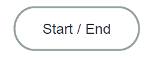</td><td><b>Terminal</b> — จุดเริ่มต้น หรือจุดสิ้นสุดของโปรแกรม</td></tr>
<tr><td class="sym">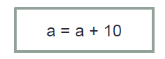</td><td><b>Process</b> — การประมวลผลทั่วไป เช่น การคำนวณ หรือการกำหนดค่า</td></tr>
<tr><td class="sym">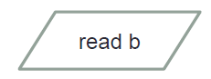</td><td><b>Input/Output</b> — การรับค่าเข้าสู่โปรแกรม หรือการแสดงผลลัพธ์</td></tr>
<tr><td class="sym">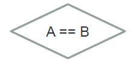</td><td><b>Decision</b> — คำสั่งที่ต้องตัดสินใจ มีทางเลือกสองทาง (True / False)</td></tr>
<tr><td class="sym">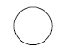</td><td><b>Connector</b> — แสดงจุดเชื่อมของโปรแกรม</td></tr>
</table>

## Flowchart : Symbols (ต่อ) {#m5-flowchart-symbols-2}

<table class="symbol-table">
<tr><th>Symbol</th><th>Meaning</th></tr>
<tr><td class="sym">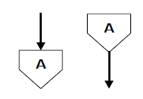</td><td><b>Link</b> — เชื่อมต่อระหว่างส่วนของโปรแกรม (เช่น ข้ามหน้ากระดาษ)</td></tr>
<tr><td class="sym">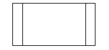</td><td><b>Function</b> — ส่วนของ Function ที่เรียกใช้ (รายละเอียดอยู่ที่อื่น)</td></tr>
<tr><td class="sym">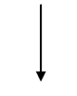</td><td><b>Flow line</b> — ทิศทางการทำงาน เรียงจากบนลงล่าง</td></tr>
<tr><td class="sym">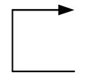</td><td><b>Loop arrow</b> — ลูกศรล่างขึ้นบน แสดงการทำซ้ำ/วนลูป</td></tr>
</table>

## Flowchart {#m5-example1}

การนำรถยนต์เข้าศูนย์บริการ

:::: {.columns}
::: {.column width="50%"}
::: {.incremental}
- ตรวจสอบข้อมูลอายุรถยนต์ (`Age`) และระยะทางที่รถวิ่งมาแล้ว (`Mileage`)
- **พิจารณาเงื่อนไข**ว่ารถมีอายุมากกว่า 2 ปี **หรือ** มีระยะทางมากกว่า 200,000 กม. หรือไม่
- หากเงื่อนไขอันใดอันหนึ่งจริง → นำรถเข้าศูนย์ฯ
- หากไม่จริงทั้ง 2 อย่าง → ไม่นำรถเข้าศูนย์ฯ
:::
:::
::: {.column width="50%"}
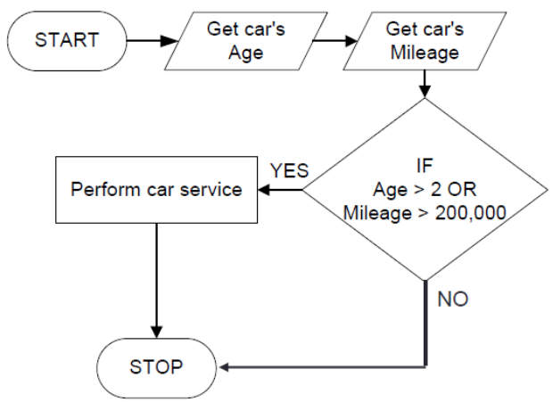{height="420px" fig-align="center" .fragment}
:::
::::

# การเลือกและการสร้างเงื่อนไข 🔀 {background-color="#2c3e50" .white-text}

Selection & Condition

## การเลือกและการสร้างเงื่อนไข {#m5-selection}

- โดยทั่วไปชุดคำสั่ง (Statement) จะทำงานเรียงตาม**ลำดับก่อนหลัง (Sequence)** จากบรรทัดบนลงล่าง
- แต่บางครั้งจำเป็นต้องมี **ทางเลือก (Selection)** โดยอาศัย **เงื่อนไข (Condition)** ในการพิจารณา

. . .

**เงื่อนไข** สร้างขึ้นจากคำสั่ง 2 ลักษณะประกอบกัน

::: {.incremental}
- **Relational Expression** — การเปรียบเทียบ
- **Logical Expression** — การคำนวณทางตรรกะ
:::

## Relational Expression {#m5-relational}

การประเมิน (Evaluate) ความสัมพันธ์เชิงเปรียบเทียบ (comparison) ว่าเป็นไปตามที่กำหนดหรือไม่

:::: {.columns}
::: {.column width="52%"}

| Relational Operator | ความหมาย |
|:-------------------:|:---------|
| `<`  | น้อยกว่า |
| `>`  | มากกว่า |
| `<=` | น้อยกว่าหรือเท่ากับ |
| `>=` | มากกว่าหรือเท่ากับ |
| `==` | เท่ากับ |
| `!=` | ไม่เท่ากับ |

:::
::: {.column width="48%"}

**ตัวอย่าง**

```python
age < 18
temp >= 38.3
Grade != 0
```

::: {.callout-note}
ทบทวน: [Comparison Operators (Module 3)](module03a.html#m3-comparison)
:::

:::
::::

## ตัวอย่าง Relational Expression {#m5-relational-ex}

ผลลัพธ์ของการเปรียบเทียบเป็นค่า `bool` (`True` / `False`)

```python
temp = 40
temp == 40
```

```{.python .code-output}
True
```

. . .

```python
grade = "A"
grade != "F"
```

```{.python .code-output}
True
```

## โจทย์ #1 {.exercise}

รับค่า `age` แล้วตรวจสอบว่าน้อยกว่า `18` หรือไม่ แสดงผลด้วย f-string

::: {.panel-tabset}

### Live Code

```{pyodide}
#| autorun: false
# input() ไม่ทำงานใน Pyodide — จำลองด้วยค่าตรง
age = int('15')
print(f'age < 18: {age ____ 18}')
```

### Solution

```python
age = int(input('Age: '))    # สมมติป้อน 15
print(f'age < 18: {age < 18}')
```

```{.python .code-output}
age < 18: True
```

:::

## การใช้งานที่ไม่ถูกต้อง {#m5-relational-wrong}

::: {.callout-warning}
ระวังการเขียน Relational Operator ผิดรูปแบบ
:::

```python
a =< b        # ลำดับสลับ (ต้องเป็น <=)
a < = b       # ห้ามมีช่องว่างคั่น
a >> b        # กลายเป็น shift expression
a = b         # นี่คือ assignment ไม่ใช่การเปรียบเทียบ
a = = b-1     # ห้ามมีช่องว่างคั่น (ต้องเป็น ==)
```

## การใช้ `in` และ `not in` Operator {#m5-in}

ใช้ **`in`** และ **`not in`** ตรวจสอบความเป็นสมาชิก (membership test) ว่าข้อมูลอยู่ภายใน collection หรือไม่

```python
>>> 5 in [2,3,4,5,9,7]
True
>>> "Ann" in ["John","James","Ken","Annie"]
False
>>> 10 in (5,10,15,20,25,30)
True
>>> "d" in "Dome Potikanond"
True
```

::: {.callout-note}
ทบทวน: [List และ collection (Module 4)](module04a.html#m4-list)
:::

## โจทย์ #2 {.exercise}

กำหนดลิสต์ `Blackpinks` แล้วตรวจสอบว่าชื่อที่รับเข้ามาเป็นสมาชิกหรือไม่

. . .

ลองใช้ `in` กับ string เพื่อตรวจสอบ substring ด้วย

::: {.panel-tabset}

### Live Code

```{pyodide}
#| autorun: false
Blackpinks = ["Jisoo","Rose","Jennie","Lisa"]
name = 'Lisa'   # จำลองค่าจาก input()
print(f'{name} is in Blackpink: {name ____ Blackpinks}')

greeting = "Hi, welcome to Real Python!"
print("Hello" ____ greeting)
print("welcome" ____ greeting)
```

### Solution

```python
Blackpinks = ["Jisoo","Rose","Jennie","Lisa"]
name = 'Lisa'
print(f'{name} is in Blackpink: {name in Blackpinks}')

greeting = "Hi, welcome to Real Python!"
print("Hello" in greeting)
print("welcome" in greeting)
```

```{.python .code-output}
Lisa is in Blackpink: True
False
True
```

:::

## Logical Expression {#m5-logical}

การประเมินความสัมพันธ์ทาง **ตรรกะ (Logic)** โดยอาศัย Logical Operators

| Logical Operator | ความหมาย |
|:----------------:|:---------|
| **`not`** | ค่าตรงกันข้าม |
| **`and`** | เป็นจริง ถ้าค่าทั้งสองเป็นจริง |
| **`or`**  | เป็นจริง ถ้าอย่างน้อยค่าใดค่าหนึ่งเป็นจริง |

::: {.callout-note}
ทบทวน: [Logical Operators (Module 3)](module03a.html#m3-logical)
:::

## ตารางค่าความจริง (Truth Table) {#m5-truth-table}

การประเมินค่าทางตรรกะของ **`and`**, **`or`**, **`not`**

<style>
.truth-table{border-collapse:collapse;margin:0.5em auto;font-size:0.95em}
.truth-table th,.truth-table td{border:1px solid #ccc;padding:10px 26px;text-align:center}
.truth-table thead th{background:#2c3e50;color:#fff}
.truth-table .t{color:#2e7d32;font-weight:700}
.truth-table .f{color:#c0392b;font-weight:700}
</style>
<table class="truth-table">
<thead><tr><th>A</th><th>B</th><th>A and B</th><th>A or B</th><th>not A</th></tr></thead>
<tbody>
<tr><td class="t">True</td><td class="t">True</td><td class="t">True</td><td class="t">True</td><td class="f">False</td></tr>
<tr><td class="t">True</td><td class="f">False</td><td class="f">False</td><td class="t">True</td><td class="f">False</td></tr>
<tr><td class="f">False</td><td class="t">True</td><td class="f">False</td><td class="t">True</td><td class="t">True</td></tr>
<tr><td class="f">False</td><td class="f">False</td><td class="f">False</td><td class="f">False</td><td class="t">True</td></tr>
</tbody>
</table>

## โจทย์ #3 {.exercise}

แต่ละนิพจน์จะได้ `True` หรือ `False`?

::: {.panel-tabset}

### Live Code

```{pyodide}
#| autorun: false
Blackpinks = ["Jisoo","Rose","Jennie","Lisa"]
greeting = "Hi, welcome to Real Python!"
x = 10
y = 2
print('1.', x > y)
print('2.', 5*x < y)
print('3.', x > y or ("Messie" in Blackpinks))
print('4.', x < y or ("Chanatip" in Blackpinks))
print('5.', y**2 == len(Blackpinks) and True)
print('6.', False and "Python" in greeting)
```

### Solution

```python
print('1.', x > y)                              # True
print('2.', 5*x < y)                            # False
print('3.', x > y or ("Messie" in Blackpinks))  # True
print('4.', x < y or ("Chanatip" in Blackpinks))# False
print('5.', y**2 == len(Blackpinks) and True)   # True
print('6.', False and "Python" in greeting)     # False
```

```{.python .code-output}
1. True
2. False
3. True
4. False
5. True
6. False
```

:::

## พักสมอง 😄 {#m5-fork .center}

การเขียน **เงื่อนไข** ก็เหมือนเลือกทางเดินให้โปรแกรม 🛣️

{height="420px" fig-align="center"}

::: {style="font-size:0.45em"}
ภาพ: [Fork in the road](https://www.flickr.com/photos/148598741@N02/52343393008) · Public Domain (CC0 1.0)
:::

# คำสั่ง if ❓ {background-color="#2c3e50" .white-text}

การสร้างทางเลือกด้วยเงื่อนไข

## Flowchart: if {.center}

:::: {.columns}
::: {.column width="30%"}
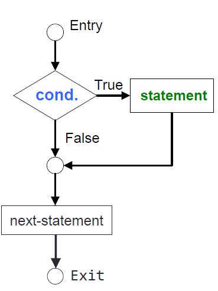{height="480px" fig-align="center" .fragment}
:::
::: {.column width="70%"}
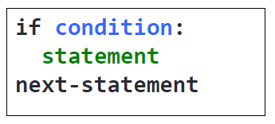{height="160px" fig-align="center" .fragment}

::: {.incremental}
- การใช้ **`if`** อย่างง่ายที่สุด จะประเมินชุดคำสั่งที่เป็น **`condition`**
- หากเงื่อนไขเป็น **`True`** จึงเข้าไปทำงานที่ `statement` แล้วทำงานต่อที่ `next-statement`
- หากเป็น **`False`** จะข้ามไปทำงานที่ `next-statement` ทันที
- `statement` ต้อง *ย่อหน้า*
:::

:::
::::


## โจทย์ #4: if {#m5-ex4 .exercise}

โปรแกรมคำนวณหา **ค่าสัมบูรณ์ (Absolute value)** ของจำนวนเต็ม (ห้ามใช้คำสั่ง `abs()`)

**คิดก่อน:** ต้องตรวจเงื่อนไขใด แล้วทำอะไรเมื่อเงื่อนไขเป็นจริง?

::: {.panel-tabset}

### Live Code

```{pyodide}
#| autorun: false
number = int('-7')   # จำลองค่าจาก input()
if ________:
    ________
print("The absolute value is", number)
```

### Solution

```python
number = int(input("Enter your number:"))   # สมมติป้อน -7
if number < 0:
    number = -number
print("The absolute value is", number)
```

```{.python .code-output}
The absolute value is 7
```

:::

## if กับ membership test {#m5-if-membership}

ใช้ `if` ร่วมกับ `in` เพื่อทำงานเมื่อข้อมูลเป็นสมาชิกของ collection

```python
Blackpinks = ["Jisoo","Rose","Jennie","Lisa"]
name = 'Lisa'
if name in Blackpinks:
    print(f'{name} is a Blackpink member.')
print('end-of-script')
```

```{.python .code-output}
Lisa is a Blackpink member.
end-of-script
```

## การใช้คำสั่ง if (Compound Statement) {#m5-if-compound}

:::: {.columns}
::: {.column width="30%"}
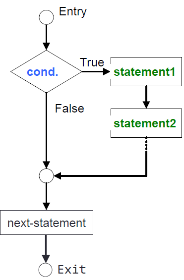{height="480px" fig-align="center" .fragment}
:::
::: {.column width="70%"}
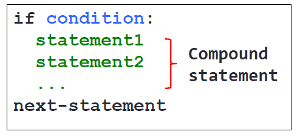{height="240px" fig-align="center" .fragment}

::: {.fragment}
- ถ้า `condition` เป็น **`True`** จะทำงานในทุก ๆ `statement` แล้วจึงไปทำงานที่ `next-statement`
- หากเป็น **`False`** จะข้ามไปทำงานที่ `next-statement`
- **อาศัยการย่อหน้า (Indent) ในการกำหนดขอบเขตของ Compound Statement**
:::

:::
::::

## โจทย์ 5: if (Compound Statement) {.exercise}

จาก[**โจทย์ 4**](#m5-ex4) — หากอินพุตน้อยกว่าศูนย์ ให้คำนวณค่าสัมบูรณ์ **และเพิ่มค่าขึ้นไปอีก 10**

$$\mathsf{number} = \begin{cases} \lvert \mathsf{number} \rvert + 10, & \text{if } \mathsf{number} < 0 \\ \mathsf{number}, & \text{if } \mathsf{number} \geq 0 \end{cases}$$

. . .

**คิดก่อน:** มีกี่ statement อยู่ภายใต้ `if` และต้องย่อหน้าอย่างไร?

::: {.panel-tabset}

### Live Code

```{pyodide}
#| autorun: false
number = int('-7')   # จำลองค่าจาก input()
if number < 0:
        
print("The absolute value is", number)  # next-statement
```

### Solution

```python
number = int(input("Enter your number:"))   # สมมติป้อน -7
if number < 0:
    number = -number
    number = number + 10
print("The absolute value is", number)  # next-statement
```

```{.python .code-output}
The absolute value is 17
```

:::

## if (Compound) กับ membership test {#m5-if-compound-membership}

```python
Blackpinks = ["Jisoo","Rose","Jennie","Lisa"]
name = 'Lisa'

if name in Blackpinks:
    print(f'{name} is a Blackpink member.')
    print(f'{name} is number {Blackpinks.index(name) + 1} in Blackpink.')

print('end-of-script')                  # next-statement
```

```{.python .code-output}
Lisa is a Blackpink member.
Lisa is number 4 in Blackpink.
end-of-script
```

# คำสั่ง if-else ⚖️ {background-color="#2c3e50" .white-text}

สองทางเลือก

## การใช้คำสั่ง if-else {#m5-if-else .smaller}


:::: {.columns}
::: {.column width="50%"}
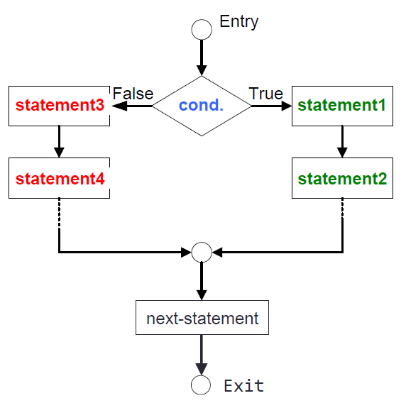{height="400px" fig-align="center" .fragment} 
:::
::: {.column width="50%"}
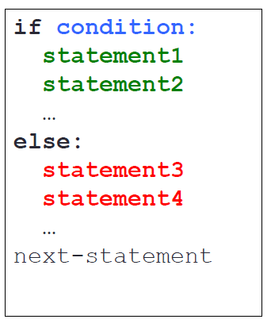{height="400px" fig-align="center" .fragment}
:::

::::

::: {.fragment}
- หาก `condition` เป็น **`True`** จะทำงาน `statement 1, 2, …`
- หาก `condition` เป็น **`False`** จะทำงาน `statement 3, 4, …`
- จากนั้นจึงทำงานใน `next-statement`
:::

## โจทย์ 6: if-else {.exercise}

โปรแกรมแปลงอุณหภูมิระหว่างเซลเซียสและฟาเรนไฮต์ ตามหน่วยที่ผู้ใช้เลือก

. . .

**คิดก่อน:** ถ้าผู้ใช้พิมพ์ `"f"` กับ `"F"` จะให้ผลเหมือนกันหรือไม่?

::: {.panel-tabset}

### Live Code

```{pyodide}
#| autorun: false
temp = float('100')        # จำลองค่าจาก input() จากผู้ใช้
temp_type = 'f'            # จำลองค่าจาก input() จากผู้ใช้

___ temp_type ____ "f":
    c = (5.0/9) * (temp - 32)
    print(f"The equivalent Celsius temp is {c:.2f}")
____:
    f = (9.0/5) * temp + 32
    print(f"The equivalent Fahrenheit temp is {f:.2f}")

print('end-of-script')
```

### Solution

```python
temp = float(input("Enter temperature: "))                # สมมติ 100
temp_type = input("Enter f (Fahrenheit) or c (Celsius): ") # สมมติ f

if temp_type == "f":
    c = (5.0/9) * (temp - 32)
    print(f"The equivalent Celsius temp is {c:.2f}")
else:
    f = (9.0/5) * temp + 32
    print(f"The equivalent Fahrenheit temp is {f:.2f}")

print('end-of-script')
```

```{.python .code-output}
The equivalent Celsius temp is 37.78
end-of-script
```

::: {.callout-note}
ทบทวน: [f-string format `{c:.2f}` (Module 3)](module03b.html#m3-fstring-format)
:::

:::

## if-else กับ membership test {#m5-if-else-membership}

```python
Blackpinks = ["Jisoo","Rose","Jennie","Lisa"]
name = 'Somchai'

if name in Blackpinks:
    print(f'{name} is a Blackpink member.')
    print(f'{name} is number {Blackpinks.index(name) + 1} in Blackpink.')
else:
    print(f'Sorry, {name} is NOT a Blackpink member.')

print('end-of-script')
```

```{.python .code-output}
Sorry, Somchai is NOT a Blackpink member.
end-of-script
```

# คำสั่ง if-elif-else 🪜 {background-color="#2c3e50" .white-text}

มากกว่าสองทางเลือก

## การใช้คำสั่ง if-elif-else {#m5-if-elif-else .smaller}

:::: {.columns}
::: {.column width="50%"}
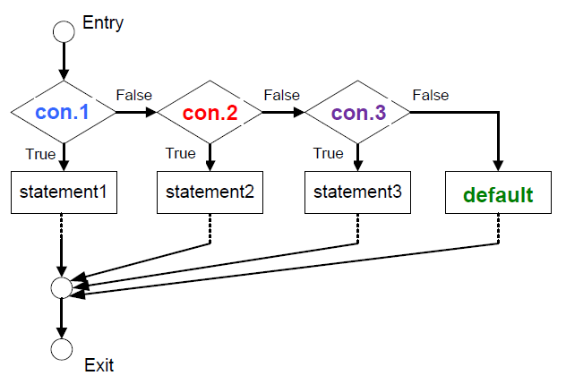{height="400px" fig-align="center" .fragment}
:::
::: {.column width="50%"}
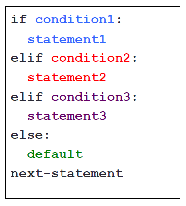{height="400px" fig-align="center" .fragment}
:::
::::


::: {.fragment}
- **ใช้ในกรณีที่ต้องการตรวจสอบเงื่อนไขมากกว่าหนึ่ง `condition`**
- ใช้ `elif` (ย่อจาก else if) ในการตรวจสอบ `condition` ต่อ ๆ มา ทำให้สร้างทางเลือกได้มากกว่า 2 ทาง
- `else` ต้องอยู่สุดท้ายเท่านั้น และสามารถละไม่มี `else` ก็ได้
:::


## โจทย์ 7: if-elif-else {.exercise}

จงเขียนโปรแกรมแสดงข้อความตามชั้นปีของนักศึกษา

::: {.incremental}
- ชั้นปี 1 → `Freshman`
- ชั้นปี 2 → `Sophomore`
- ชั้นปี 3 → `Junior`
- ชั้นปี 4 → `Senior`
- ชั้นปีอื่น ๆ → `Super`
:::

## โจทย์ 7: if-elif-else (ต่อ) {.exercise}

จงเขียนโปรแกรมแสดงข้อความตามชั้นปีของนักศึกษา

::: {.panel-tabset}

### Live Code

```{pyodide}
#| autorun: false
year = int('3')   # จำลองค่าจาก input()
____ year == 1:
    print("Freshman")
____ year == 2:
    print("Sophomore")
____ year == 3:
    print("Junior")
____ year == 4:
    print("Senior")
____:
    print("Super")
```

### Solution

```python
year = int(input("Enter student year: "))   # สมมติป้อน 3
if year == ___:
    print("Freshman")
elif year == ___:
    print("Sophomore")
elif year == ___:
    print("Junior")
elif year == ___:
    print("Senior")
else:
    print("Super")
```

```{.python .code-output}
Junior
```

:::

## ข้อสังเกต: ตัดสินใจเป็นชั้น ๆ {#m5-elif-layered .smaller

`if-elif-else` ทำงานเหมือน **การกรองเป็นชั้น ๆ** — ข้อมูลไหลผ่านลงมา ตรวจทีละชั้นจนกว่าจะถูก "ดัก" ไว้

:::: {.columns}
::: {.column width="56%"}

::: {.incremental}
- ตรวจเงื่อนไขเรียงจาก **บนลงล่าง** ตามลำดับ
- ชั้นไหน **จริงก่อน** → ทำงานชั้นนั้น แล้ว **ข้ามที่เหลือทั้งหมด**
- ทุกทางเลือกจึง **เลือกได้ทางเดียว** ไม่ทับซ้อนกัน
- `else` คือ **ตาข่ายชั้นล่างสุด** ที่รับทุกกรณีซึ่งไม่เข้าชั้นใดด้านบน
:::

:::
::: {.column width="44%"}

<style>
.filter-layers{display:flex;flex-direction:column;gap:6px;font-size:0.72em;margin-top:0.2em}
.filter-layers .layer{border:2px solid #3498db;border-radius:8px;padding:6px 14px;background:#eaf4fb;text-align:center}
.filter-layers .layer .lbl{color:#1565c0;font-weight:700}
.filter-layers .layer.else{border-color:#e67e22;background:#fdf0e3}
.filter-layers .layer.else .lbl{color:#c0660f}
.filter-layers .gap{text-align:center;color:#aaa;font-size:0.8em;margin:-3px 0}
</style>
<div class="filter-layers">
<div class="layer"><span class="lbl">year == 1 ?</span> → Freshman</div>
<div class="gap">↓ ไม่จริง</div>
<div class="layer"><span class="lbl">year == 2 ?</span> → Sophomore</div>
<div class="gap">↓ ไม่จริง</div>
<div class="layer"><span class="lbl">year == 3 ?</span> → Junior</div>
<div class="gap">↓ ไม่จริง</div>
<div class="layer"><span class="lbl">year == 4 ?</span> → Senior</div>
<div class="gap">↓ ไม่จริง</div>
<div class="layer else"><span class="lbl">else</span> → Super</div>
</div>

:::
::::

::: {.callout-tip}
ถ้าเขียน `if` แยกหลายอัน โปรแกรมจะตรวจ **ทุกเงื่อนไข**; แต่ `if-elif-else` จะ **หยุดทันที** ที่เจอเงื่อนไขจริง — สื่อความหมาย "เลือกทางเดียว" และทำงานน้อยขั้นกว่า
:::

## `if` แยกกัน vs `if-elif`: ต่างกันมาก! {#m5-if-vs-elif}

`score = 85` — เขียนต่างกันนิดเดียว แต่ผลลัพธ์ `grade` **ต่างกัน!**

:::: {.columns}
::: {.column width="50%"}

**`if` แยก 3 อัน — ตรวจครบทุกอัน**

```{=html}
<svg viewBox="0 0 300 250" width="100%" style="max-width:330px" xmlns="http://www.w3.org/2000/svg" font-family="monospace" font-size="13">
  <defs><marker id="ie1" markerWidth="9" markerHeight="9" refX="6" refY="3" orient="auto"><path d="M0,0 L6,3 L0,6 Z" fill="#2c3e50"/></marker></defs>
  <rect x="10" y="8" width="280" height="36" rx="6" fill="#d5f5e3" stroke="#27ae60" stroke-width="2"/><text x="150" y="31" text-anchor="middle">score≥80 ✓ → grade='A'</text>
  <line x1="150" y1="44" x2="150" y2="58" stroke="#2c3e50" stroke-width="2" marker-end="url(#ie1)"/>
  <rect x="10" y="60" width="280" height="36" rx="6" fill="#d5f5e3" stroke="#27ae60" stroke-width="2"/><text x="150" y="83" text-anchor="middle">score≥70 ✓ → grade='B'</text>
  <line x1="150" y1="96" x2="150" y2="110" stroke="#2c3e50" stroke-width="2" marker-end="url(#ie1)"/>
  <rect x="10" y="112" width="280" height="36" rx="6" fill="#d5f5e3" stroke="#27ae60" stroke-width="2"/><text x="150" y="135" text-anchor="middle">score≥50 ✓ → grade='C'</text>
  <line x1="150" y1="148" x2="150" y2="164" stroke="#e74c3c" stroke-width="2" marker-end="url(#ie1)"/>
  <rect x="10" y="166" width="280" height="40" rx="6" fill="#fdedec" stroke="#e74c3c" stroke-width="2.5"/><text x="150" y="191" text-anchor="middle" fill="#e74c3c" font-weight="bold">grade = 'C'  ❌</text>
</svg>
```

ตรวจครบ 3 อัน → **ทับค่าจนเหลือ `'C'`** (ผิด!)

:::
::: {.column width="50%"}

**`if-elif-else` — หยุดที่เจอตัวแรก**

```{=html}
<svg viewBox="0 0 300 250" width="100%" style="max-width:330px" xmlns="http://www.w3.org/2000/svg" font-family="monospace" font-size="13">
  <defs><marker id="ie2" markerWidth="9" markerHeight="9" refX="6" refY="3" orient="auto"><path d="M0,0 L6,3 L0,6 Z" fill="#27ae60"/></marker></defs>
  <rect x="10" y="8" width="280" height="36" rx="6" fill="#d5f5e3" stroke="#27ae60" stroke-width="2"/><text x="150" y="31" text-anchor="middle">if score≥80 ✓ → grade='A'</text>
  <rect x="10" y="60" width="280" height="36" rx="6" fill="#f4f6f7" stroke="#bdc3c7" stroke-width="2" stroke-dasharray="4 3"/><text x="150" y="83" text-anchor="middle" fill="#95a5a6">elif score≥70 (ข้าม)</text>
  <rect x="10" y="112" width="280" height="36" rx="6" fill="#f4f6f7" stroke="#bdc3c7" stroke-width="2" stroke-dasharray="4 3"/><text x="150" y="135" text-anchor="middle" fill="#95a5a6">elif score≥50 (ข้าม)</text>
  <path d="M150,44 C 40,80 40,140 145,164" fill="none" stroke="#27ae60" stroke-width="2.5" marker-end="url(#ie2)"/>
  <text x="45" y="112" fill="#27ae60" font-size="11" font-weight="bold">หยุด!</text>
  <rect x="10" y="166" width="280" height="40" rx="6" fill="#eafaf1" stroke="#27ae60" stroke-width="2.5"/><text x="150" y="191" text-anchor="middle" fill="#27ae60" font-weight="bold">grade = 'A'  ✅</text>
</svg>
```

เจอ `≥80` ก่อน → `'A'` แล้ว **ข้ามที่เหลือ** (ถูก!)

:::
::::

::: {.callout-important}
`if` แยกกัน = ตรวจ **ทุกเงื่อนไข** (อาจทำหลายอัน/ทับค่า) · `if-elif` = **หยุดทันที**ที่เจอจริง → เลือกทางเดียว
:::

# Nested if 🪆 {background-color="#2c3e50" .white-text}

เงื่อนไขซ้อนเงื่อนไข

## การใช้คำสั่ง Nested if {#m5-nested-if .smaller}

:::: {.columns}
::: {.column width="50%"}
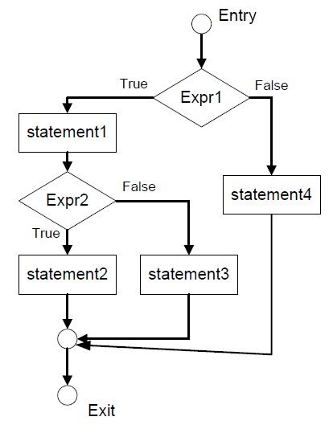{height="400px" fig-align="center"}
:::
::: {.column width="50%"}
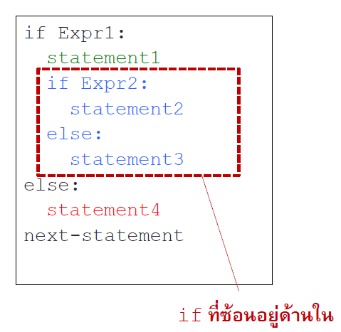{height="400px" fig-align="center"}
:::
::::

- **Nested if** เป็นการเขียนโปรแกรมที่มีการ**ใช้ `if` ซ้อนกันหลายชั้น**  เพื่อแสดงการกระทำแบบเงื่อนไขซ้อนเป็นชั้น ๆ
- ให้มองว่า `if`, `if-else`, หรือ `if-elif-else` ที่อยู่ภายใน เป็น 1 statement

## โจทย์ 8: Nested if {.exercise}

รับเลขจำนวนเต็ม 2 จำนวน (คั่นด้วยช่องว่าง) แล้วตรวจสอบว่า

- **เลขตัวแรก** อยู่ในช่วง `0-9`
- **เลขตัวที่สอง** อยู่ในช่วง `10-99`

. . .

**คิดก่อน:** ต้องใช้ `if` ซ้อนกันกี่ชั้น เพื่อครอบคลุมทุกกรณี?


::: {.callout-note .fragment}
ทบทวน: [input().split() (Module 3)](module03b.html#m3-split) · [Logical operators `and` (Module 3)](module03a.html#m3-logical)
:::


## โจทย์ 8: Nested if (ต่อ) {.exercise}

::: {.panel-tabset}

### Live Code

```{pyodide}
#| autorun: false
print("Check if num1 is in [0-9] and num2 is in [10-99].")
num1, num2 = '5 42'.split()    # จำลองค่าจาก input()
num1 = int(num1); num2 = int(num2)

if num1 >= 0 and num1 <= 9:
    if num2 >= 10 and num2 <= 99:
        print("Both numbers are entered correctly.")
    ____:
        print("Only num1 is entered correctly.")
else:
    if num2 >= 10 and num2 <= 99:
        print("Only num2 is entered correctly.")
    else:
        print("Both numbers are NOT entered correctly.")
```

### Solution

```python
print("Check if num1 is in [0-9] and num2 is in [10-99].")
num1, num2 = input("num1 and num2: ").split()   # สมมติป้อน 5 42
num1 = int(num1); num2 = int(num2)

if num1 >= 0 and num1 <= 9:
    if num2 >= 10 and num2 <= 99:
        print("Both numbers are entered correctly.")
    else:
        print("Only num1 is entered correctly.")
else:
    if num2 >= 10 and num2 <= 99:
        print("Only num2 is entered correctly.")
    else:
        print("Both numbers are NOT entered correctly.")
```

```{.python .code-output}
Check if num1 is in [0-9] and num2 is in [10-99].
Both numbers are entered correctly.
```

:::


## โจทย์ #9: ชวนคิด {.exercise-think}

วิเคราะห์รหัสนักศึกษา CMU: คำนวณชั้นปีจาก `630610xxx` (ปกติ) หรือ `630615xxx` (อินเตอร์)

. . .

**คิดก่อน:** ต้องใช้ `if` กี่ที่ดี ใช้ `elif` หรือ `else` ด้วยไหม?

**คิดก่อน:** การ slice string เช่น `id[0:2]`, `id[2:4]`, `id[4:6]` ดึงข้อมูลส่วนใดบ้าง?

## เห็นภาพ: slice รหัสนักศึกษา {#m5-id-slice-viz}

`id = '630610123'` — ใช้ **slice** แยกส่วนต่าง ๆ ของรหัสออกมา (แต่ละส่วนคือ substring)

```{=html}
<svg viewBox="0 0 600 220" width="100%" style="max-width:820px" xmlns="http://www.w3.org/2000/svg" font-family="monospace" font-size="20">
  <!-- index labels -->
  <g fill="#7f8c8d" font-size="12" text-anchor="middle"><text x="46" y="35">0</text><text x="106" y="35">1</text><text x="166" y="35">2</text><text x="226" y="35">3</text><text x="286" y="35">4</text><text x="346" y="35">5</text><text x="406" y="35">6</text><text x="466" y="35">7</text><text x="526" y="35">8</text></g>
  <!-- char boxes (grouped colors) -->
  <rect x="20" y="42" width="52" height="50" rx="6" fill="#eaf2f8" stroke="#2980b9" stroke-width="2"/><text x="46" y="76" text-anchor="middle">6</text>
  <rect x="80" y="42" width="52" height="50" rx="6" fill="#eaf2f8" stroke="#2980b9" stroke-width="2"/><text x="106" y="76" text-anchor="middle">3</text>
  <rect x="140" y="42" width="52" height="50" rx="6" fill="#eafaf1" stroke="#27ae60" stroke-width="2"/><text x="166" y="76" text-anchor="middle">0</text>
  <rect x="200" y="42" width="52" height="50" rx="6" fill="#eafaf1" stroke="#27ae60" stroke-width="2"/><text x="226" y="76" text-anchor="middle">6</text>
  <rect x="260" y="42" width="52" height="50" rx="6" fill="#f4ecf7" stroke="#8e44ad" stroke-width="2"/><text x="286" y="76" text-anchor="middle">1</text>
  <rect x="320" y="42" width="52" height="50" rx="6" fill="#f4ecf7" stroke="#8e44ad" stroke-width="2"/><text x="346" y="76" text-anchor="middle">0</text>
  <rect x="380" y="42" width="52" height="50" rx="6" fill="#f4f6f7" stroke="#95a5a6" stroke-width="2"/><text x="406" y="76" text-anchor="middle">1</text>
  <rect x="440" y="42" width="52" height="50" rx="6" fill="#f4f6f7" stroke="#95a5a6" stroke-width="2"/><text x="466" y="76" text-anchor="middle">2</text>
  <rect x="500" y="42" width="52" height="50" rx="6" fill="#f4f6f7" stroke="#95a5a6" stroke-width="2"/><text x="526" y="76" text-anchor="middle">3</text>
  <!-- group brackets + labels -->
  <line x1="20" y1="102" x2="132" y2="102" stroke="#2980b9" stroke-width="3"/><text x="76" y="124" text-anchor="middle" fill="#2980b9" font-size="14" font-weight="bold">id[0:2]='63'</text><text x="76" y="142" text-anchor="middle" fill="#2980b9" font-size="12">ปีที่เข้า</text>
  <line x1="140" y1="102" x2="252" y2="102" stroke="#27ae60" stroke-width="3"/><text x="196" y="124" text-anchor="middle" fill="#27ae60" font-size="14" font-weight="bold">id[2:4]='06'</text><text x="196" y="142" text-anchor="middle" fill="#27ae60" font-size="12">คณะ</text>
  <line x1="260" y1="102" x2="372" y2="102" stroke="#8e44ad" stroke-width="3"/><text x="316" y="124" text-anchor="middle" fill="#8e44ad" font-size="14" font-weight="bold">id[4:6]='10'</text><text x="316" y="142" text-anchor="middle" fill="#8e44ad" font-size="12">หลักสูตร</text>
  <line x1="380" y1="102" x2="552" y2="102" stroke="#95a5a6" stroke-width="3"/><text x="466" y="124" text-anchor="middle" fill="#7f8c8d" font-size="14" font-weight="bold">id[6:9]='123'</text><text x="466" y="142" text-anchor="middle" fill="#7f8c8d" font-size="12">เลขลำดับ</text>
  <!-- decode notes -->
  <text x="20" y="182" font-size="14">🟢 คณะ <tspan font-weight="bold">06</tspan> = วิศวกรรมศาสตร์ · 🟣 หลักสูตร <tspan font-weight="bold">10</tspan> = ปกติ, <tspan font-weight="bold">15</tspan> = อินเตอร์</text>
  <text x="20" y="206" font-size="14">🔵 ปี = 69 − int(id[0:2]) = 69 − 63 = <tspan font-weight="bold">6</tspan></text>
</svg>
```

## โจทย์ #9: ชวนคิด (ต่อ) {.exercise-think}

::: {.panel-tabset}

### Live Code

```{pyodide}
#| autorun: false
id = '630610123'        # จำลองค่าจาก input()
invalid_id = False
year = _________        # คำนวณชั้นปีที่เรียน

if year > 0 and year <= 8:
    if _________ == "06":
        if _________ == "10":
            program = "Engineering"
        elif _________ == "15":
            program = "international Engineering"
        else:
            invalid_id = ____
else:
    invalid_id = ____

if invalid_id:
    print('Your student ID is NOT valid.')
else:
    print(f'You are a {year}-year student of {program} program.')
```

### Solution

```python
id = input('Enter CMU student id: ')   # สมมติป้อน 630610123
invalid_id = False

year = 69 - int(id[0:2])

if year > 0 and year <= 8:
    if id[2:4] == "06":
        if id[4:6] == "10":
            program = "Engineering"
        elif id[4:6] == "15":
            program = "international Engineering"
        else:
            invalid_id = True
else:
    invalid_id = True

if invalid_id:
    print('Your student ID is NOT valid.')
else:
    print(f'You are a {year}-year student of {program} program.')
```

```{.python .code-output}
You are a 6-year student of Engineering program.
```

:::

# Summary 🎯 {background-color="#2c3e50" .white-text}

## สรุป Module 5 🎉

:::: {.columns}
::: {.column width="50%"}

**Flowchart**

- ผังภาพแสดงการทำงานของโปรแกรมแบบ**ลำดับ** / **ทางเลือก** / **ทำซ้ำ**
- ช่วยเข้าใจโปรแกรมที่ซับซ้อนก่อนลงมือเขียน

**เงื่อนไข (Condition)**

- **Relational** — `< > <= >= == !=`
- **Logical** — `and` `or` `not`
- **`in` / `not in`** — membership test

:::
::: {.column width="50%"}

**คำสั่งสร้างทางเลือก**

- **`if`** — ทำเมื่อเงื่อนไขจริง
- **`if-else`** — สองทางเลือก
- **`if-elif-else`** — มากกว่าสองทางเลือก
- **Nested if** — เงื่อนไขซ้อนกัน

::: {.callout-tip}
อาศัย**การย่อหน้า (Indent)** กำหนดขอบเขตของ Compound Statement
:::

:::
::::

## โจทย์ #10: ชวนคิดอีก {.exercise-think .smaller}

จงหาค่าความจริงของนิพจน์ต่อไปนี้ (True / False) เมื่อ

```python
i = 3; k = 5; j = 0; m = -2
```

. . .

**คิดก่อน:** ลองคำนวณในใจก่อน แล้วตรวจคำตอบใน Live Code

::: {.panel-tabset}

### Live Code

```{pyodide}
#| autorun: false
i = 3; k = 5; j = 0; m = -2
print('1.', j >= 0)
print('2.', (i>0) and (not i>0))
print('3.', (i>0) or (not i>0))
print('4.', not ((k<=1) or (k>=10)))
print('5.', (j>k) or (not m<i))
print('6.', 3*i - 4%2/k < 2+m)
```

### Solution

```python
i = 3; k = 5; j = 0; m = -2
print('1.', j >= 0)                      # True
print('2.', (i>0) and (not i>0))         # False
print('3.', (i>0) or (not i>0))          # True
print('4.', not ((k<=1) or (k>=10)))     # True
print('5.', (j>k) or (not m<i))          # False
print('6.', 3*i - 4%2/k < 2+m)           # False
```

```{.python .code-output}
1. True
2. False
3. True
4. True
5. False
6. False
```

:::

::: {.callout-note}
ทบทวน: [Operator precedence (Module 3)](module03a.html#m3-precedence) · [Arithmetic `%` `/` (Module 3)](module03a.html#m3-arithmetic)
:::
