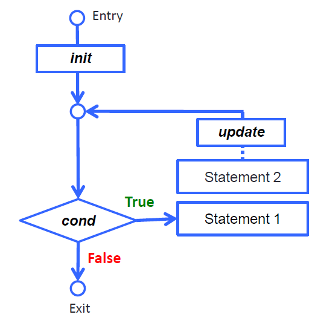

## {#topics-slide .center}

:::: {.columns}
::: {.column width="50%"}

### วันนี้เราจะเรียนรู้ 🚀

::: {.incremental}
1. **การทำซ้ำ (Iteration)**
2. การทำซ้ำด้วย **`while`** loop
3. ส่วนประกอบของการวนลูป (Init / Condition / Update)
4. คำสั่ง **`break`**
5. คำสั่ง **`continue`**
:::

:::
::: {.column width="50%"}

```python
n = int(input("Enter n: "))   # สมมติ 10
i = 1
while i <= n:
    print(i, end=" ")
    i += 1
```

```{.python .code-output}
1 2 3 4 5 6 7 8 9 10
```

:::
::::

# 1. การทำซ้ำ (Iteration) 🔁 {background-color="#2c3e50" .white-text}

การประมวลผลคำสั่งซ้ำ ๆ หลายรอบ

## การทำซ้ำ (Iteration) {#m6-iteration}

การทำซ้ำ หรือ การประมวลผลซ้ำ

::: {.incremental}
- หลายครั้งในการเขียนโปรแกรม ที่เราต้องให้คำสั่ง (Statement) หรือกลุ่มคำสั่ง (Compound Statement) ประมวลผลซ้ำ ๆ มากกว่าหนึ่งครั้ง
- **Iteration** ช่วยให้เราประมวลผลคำสั่งที่ต้องการหลาย ๆ ครั้งได้ โดยไม่ต้องเขียนคำสั่งซ้ำหลายรอบ
- การทำซ้ำ เรียกอีกอย่างว่า **การวนลูป (Loop)** ซึ่งอาศัย **เงื่อนไข (Condition)** เป็นตัวกำหนดจำนวนรอบในการทำงาน
:::

. . .

::: {.callout-note}
- **`True`** — โปรแกรมจะวนทำคำสั่งหรือชุดคำสั่งที่อยู่ภายในลูปซ้ำอีก
- **`False`** — โปรแกรมจะออกจากลูป แล้วทำงานคำสั่งถัดไป (next-statement)
:::

## Type of Iterations {#m6-iteration-types}

คำสั่งในการทำซ้ำ ที่นิยมใช้อย่างแพร่หลาย มี 2 แบบ ได้แก่

::: {.incremental}
1. **`while`** statement
2. **`for`** statement
:::

. . .

โดยทั้งสองแบบ ยังสามารถใช้ควบคู่กับคำสั่ง **`break`** และ **`continue`** เพื่อเสริมการกำหนดรอบการทำซ้ำได้อีกด้วย

## พักสมอง 😄 {#m6-xkcd-worth .center}

คุ้มไหมที่จะเขียนลูป **automate** งานซ้ำ ๆ?

{height="440px" fig-align="center"}

::: {style="font-size:0.5em"}
ที่มา: [xkcd #1205 — "Is It Worth the Time?"](https://xkcd.com/1205/) (CC BY-NC 2.5)
:::

# 2. while statement 🔄 {background-color="#2c3e50" .white-text}

วนลูปตราบเท่าที่เงื่อนไขยังเป็นจริง

## `if` → `while`: ต่างกันแค่ "วนกลับ" {#m6-if-vs-while}

โค้ด **หน้าตาเหมือนกันเป๊ะ** ต่างแค่ keyword — แต่ผลลัพธ์ต่างกันมาก!

:::: {.columns}
::: {.column width="50%"}

**`if` — ทำครั้งเดียวแล้วไปต่อ**

```python
i = 1
if i <= 3:
    print(i)
    i += 1
```

```{.python .code-output}
1
```

:::
::: {.column width="50%" .fragment}

**`while` — วนกลับมาทำซ้ำ** 🔁

```python
i = 1
while i <= 3:
    print(i)
    i += 1
```

```{.python .code-output}
1 2 3
```

:::
::::

. . .

::: {.callout-important}
`if` เช็คเงื่อนไข **ครั้งเดียว** · `while` พอจบบล็อกจะ **กระโดดกลับไปเช็คเงื่อนไขใหม่** — วนซ้ำจนเงื่อนไขเป็นเท็จ
:::

## เห็นภาพ: `if` ไปทางเดียว · `while` วนกลับ {#m6-if-vs-while-flow}

:::: {.columns}
::: {.column width="50%"}

**`if` — ไหลลงทางเดียว** ⬇️

```{=html}
<svg viewBox="0 0 250 320" width="220" xmlns="http://www.w3.org/2000/svg" font-family="monospace" font-size="13">
  <defs>
    <marker id="ah6" markerWidth="9" markerHeight="9" refX="6" refY="3" orient="auto">
      <path d="M0,0 L6,3 L0,6 Z" fill="#2c3e50"/>
    </marker>
  </defs>
  <polygon points="120,12 190,45 120,78 50,45" fill="#fdebd0" stroke="#7f8c8d" stroke-width="2"/>
  <text x="120" y="49" text-anchor="middle">i &lt;= 3 ?</text>
  <line x1="120" y1="78" x2="120" y2="107" stroke="#2c3e50" stroke-width="2" marker-end="url(#ah6)"/>
  <text x="128" y="97" fill="#27ae60">True</text>
  <rect x="55" y="110" width="130" height="52" rx="6" fill="#d5f5e3" stroke="#7f8c8d" stroke-width="2"/>
  <text x="120" y="131" text-anchor="middle">print(i)</text>
  <text x="120" y="150" text-anchor="middle">i += 1</text>
  <line x1="120" y1="162" x2="120" y2="255" stroke="#2c3e50" stroke-width="2" marker-end="url(#ah6)"/>
  <rect x="55" y="258" width="130" height="44" rx="6" fill="#eaf2f8" stroke="#7f8c8d" stroke-width="2"/>
  <text x="120" y="285" text-anchor="middle">next-statement</text>
  <path d="M190,45 H222 V280 H188" fill="none" stroke="#2c3e50" stroke-width="2" marker-end="url(#ah6)"/>
  <text x="196" y="40" fill="#e74c3c">False</text>
</svg>
```

:::
::: {.column width="50%"}

**`while` — มีลูกศร "วนกลับ"** 🔁

```{=html}
<svg viewBox="0 0 250 320" width="220" xmlns="http://www.w3.org/2000/svg" font-family="monospace" font-size="13">
  <defs>
    <marker id="ah6b" markerWidth="9" markerHeight="9" refX="6" refY="3" orient="auto">
      <path d="M0,0 L6,3 L0,6 Z" fill="#2c3e50"/>
    </marker>
    <marker id="ah6r" markerWidth="9" markerHeight="9" refX="6" refY="3" orient="auto">
      <path d="M0,0 L6,3 L0,6 Z" fill="#e74c3c"/>
    </marker>
  </defs>
  <polygon points="120,12 190,45 120,78 50,45" fill="#fdebd0" stroke="#7f8c8d" stroke-width="2"/>
  <text x="120" y="49" text-anchor="middle">i &lt;= 3 ?</text>
  <line x1="120" y1="78" x2="120" y2="107" stroke="#2c3e50" stroke-width="2" marker-end="url(#ah6b)"/>
  <text x="128" y="97" fill="#27ae60">True</text>
  <rect x="55" y="110" width="130" height="52" rx="6" fill="#d5f5e3" stroke="#7f8c8d" stroke-width="2"/>
  <text x="120" y="131" text-anchor="middle">print(i)</text>
  <text x="120" y="150" text-anchor="middle">i += 1</text>
  <path d="M55,136 H20 V45 H47" fill="none" stroke="#e74c3c" stroke-width="3" marker-end="url(#ah6r)"/>
  <text x="24" y="100" fill="#e74c3c" font-weight="bold">วนกลับ</text>
  <rect x="55" y="258" width="130" height="44" rx="6" fill="#eaf2f8" stroke="#7f8c8d" stroke-width="2"/>
  <text x="120" y="285" text-anchor="middle">next-statement</text>
  <path d="M190,45 H222 V280 H188" fill="none" stroke="#2c3e50" stroke-width="2" marker-end="url(#ah6b)"/>
  <text x="196" y="40" fill="#e74c3c">False</text>
</svg>
```

:::
::::

ต่างกันแค่ **ลูกศรสีแดง** ของ `while` ที่พาการทำงาน **กลับไปเช็คเงื่อนไขอีกครั้ง**

## รูปแบบคำสั่ง while {#m6-while}

:::: {.columns}
::: {.column width="55%" .fragment}

{height="500px" fig-align="center"}

:::
::: {.column width="45%" .fragment}

```python
while condition:
    statement1
    statement2
    ...
    statementN
next-statement
```

::: {.incremental}
- `statement1` … `statementN` *ย่อหน้า* จึงเป็นส่วน**ในลูป**
- `next-statement` ไม่ได้ย่อหน้า จึงอยู่**นอกลูป**
:::


:::
::::


## ลำดับการทำงานของ while {#m6-while-flow}

```python
while condition:
    statement1
    statement2
    ...
    statementN
next-statement
```

::: {.incremental}
- เริ่มต้นด้วยการตรวจสอบเงื่อนไข (`condition`)
- หากเงื่อนไขเป็น **`True`** โปรแกรมจะเข้าลูปไปทำ `statement1`, `statement2`, ...
- เมื่อทำงานในลูปเสร็จแต่ละรอบ โปรแกรมจะวนกลับไปตรวจสอบ `condition` อีกครั้ง
- โปรแกรมจะวนทำงานในลูป ตราบเท่าที่เงื่อนไขยังเป็น **`True`**
- เมื่อใดที่ตรวจสอบเงื่อนไขแล้วได้ **`False`** โปรแกรมจะออกจากลูป เพื่อทำ `next-statement` ต่อไป
:::


## Components of Iteration {#m6-components}

เพื่อควบคุมจำนวนรอบการทำงานของลูป `while` จำเป็นต้องออกแบบ **3 ส่วนประกอบ**

::: {.incremental}
1. **การกำหนดค่าเริ่มต้น (Initialization)** — กำหนดค่าตั้งต้นให้ตัวแปรที่ใช้เป็นเงื่อนไข เช่น `x=0, y=100, ans="n"`
2. **การทดสอบเงื่อนไข (Condition testing)** — ทดสอบว่ายังจริง (`True`) หรือไม่ เช่น `x<10, x>-5, ans!="y"`
3. **การปรับปรุงค่า (Increment / Decrement / Input)** — เพิ่มค่า ลดค่า หรือรับค่าใหม่เข้าตัวแปรเงื่อนไข เช่น `x+=1, x-=1, ans=input()`
:::

## รูปแบบการวางส่วนประกอบทั้ง 3 {#m6-components-form}

:::: {.columns}
::: {.column width="50%"}

```python
init                       # กำหนดค่าเริ่มต้น
while condition:           # ทดสอบเงื่อนไข
    statement1
    statement2
    ...
    statementN
    update                 # ปรับปรุงค่า
next-statement
```

:::
::: {.column width="50%"}

{width="400px" fig-align="center"}

:::
::::

::: {.callout-tip}
หากลืม **update** ตัวแปรเงื่อนไข ลูปจะวนไม่รู้จบ (infinite loop)
:::

## โจทย์ #1 (พิมพ์ `1` ถึง `n`) {.exercise}

จงเขียนโปรแกรมแสดงเลข `1` ถึง `n` โดยใช้คำสั่ง `while` (`n` รับจากผู้ใช้)

. . .

กำหนด `i=1` (Initialization) แล้ววนลูปตราบที่ `i <= n`

. . .

**คิดก่อน:** จะให้ลูปหยุดเมื่อใด และต้องเพิ่มค่า `i` อย่างไร?

::: {.panel-tabset}

### Live Code

```{pyodide}
#| autorun: false
print("Counting from 1 to n")
# input() ไม่ทำงานใน Pyodide — จำลองด้วยค่าตรง
n = int('10')
i = 1                  # initial value
while i ____ n:        # condition
    print(i, end=" ")
    i ____ 1           # increment
```

### Solution

```python
print("Counting from 1 to n")
n = int(input("Enter n: "))   # สมมติ n = 10
i = 1                # initial value ค่าตั้งต้น
while i <= n:        # condition
    print(i, end=" ")
    i += 1           # increment ปรับปรุงค่า
```

```{.python .code-output}
Counting from 1 to n
1 2 3 4 5 6 7 8 9 10
```

**Init:** `i=1` · **Condition:** `i<=n` · **Update:** `i+=1`

::: {.callout-note}
ทบทวน: [Assignment `+=` (Module 3)](module03a.html#m3-assignment) · [int(input()) (Module 3)](module03a.html#m3-type-conversion)
:::

:::

## โจทย์ #2a (สูตรคูณแม่ `n`) {.exercise}

จงเขียนโปรแกรมแสดงสูตรคูณแม่ `n` ตั้งแต่ $1\times n$ ถึง $12\times n$ โดยใช้ `while`

. . .

ใช้ `i` เป็นตัวคูณ เริ่มที่ `i=1` แล้วพิมพ์ `i*n` ในแต่ละรอบ

. . .

**คิดก่อน:** ต่างจากโจทย์ #1 ตรงไหน? (พิมพ์ `i` หรือ `i*n`?)

::: {.panel-tabset}

### Live Code

```{pyodide}
#| autorun: false
print("Multiplication Table")
n = int('4')          # จำลองค่าจาก input()
i = 1
while i < 13:
    print(____, end=" ")   # พิมพ์ค่าในสูตรคูณ
    i += 1
```

### Solution

```python
print("Multiplication Table")
n = int(input("Enter n: "))   # สมมติ n = 4
i = 1
while i < 13:
    print(i*n, end=" ")
    i += 1
```

```{.python .code-output}
Multiplication Table
4 8 12 16 20 24 28 32 36 40 44 48
```

**Init:** `i=1` · **Condition:** `i<13` · **Update:** `i+=1`

:::

## โจทย์ #2b (สูตรคูณแบบคอลัมน์) {.exercise}

จากโจทย์ #2a จงแสดงผลทีละบรรทัด **บรรทัดละ 5 จำนวน** โดยจัดช่องไฟให้เท่ากันด้วย `f"{i*n:4}"`

. . .

ขึ้นบรรทัดใหม่เมื่อ `i = 5, 10, 15, …` ซึ่งตรวจได้ด้วยเงื่อนไข `i % 5 == 0`

. . .

**คิดก่อน:** จะใช้ `print()` ว่าง ๆ เพื่อขึ้นบรรทัดใหม่เมื่อใด?

::: {.panel-tabset}

### Live Code

```{pyodide}
#| autorun: false
print("Multiplication Table")
n = int('4')          # จำลองค่าจาก input()
i = 1
col = 5
while i < 13:
    print(f"{i*n:4}", end="")
    if i % col ____ 0:     # ครบ 5 จำนวนหรือยัง
        print()            # ขึ้นบรรทัดใหม่
    i += 1
```

### Solution

```python
print("Multiplication Table")
n = int(input("Enter n: "))   # สมมติ n = 4
i = 1
col = 5
while i < 13:
    print(f"{i*n:4}", end="")
    if i % col == 0:
        print()
    i += 1
```

```{.python .code-output}
Multiplication Table
   4   8  12  16  20
  24  28  32  36  40
  44  48
```

::: {.callout-note}
ทบทวน: [f-string format `{i*n:4}` (Module 3)](module03b.html#m3-fstring-format) · [if-else (Module 5)](module05.html#m5-if-else) · [Arithmetic `%` (Module 3)](module03a.html#m3-arithmetic)
:::

:::

## โจทย์ #3 (ผลบวกกำลังสองของเลขคี่) {.exercise}

จงเขียนโปรแกรมหาผลบวกกำลังสองของเลขคี่ระหว่าง `1` ถึง `n`

$$1^2 + 3^2 + 5^2 + 7^2 + \ldots + n^2$$

. . .

- ป้อน `13` → ได้ `455`
- ป้อน `20` → ได้ `1330`

. . .

**คิดก่อน:** จะนับจากมากไปน้อย หรือน้อยไปมากดี? (มี 2 วิธี)

## โจทย์ #3 วิธีที่ 1 (นับลง) {.exercise}

ใช้ `n` นับถอยหลัง `n, n-1, …, 1` วนลูปตราบที่ `n > 0`

. . .

ในแต่ละรอบ: ถ้า `n` เป็นเลขคี่ ให้บวก `n**2` เข้ากับ `Sum` แล้วลดค่า `n` ลงหนึ่ง

::: {.panel-tabset}

### Live Code

```{pyodide}
#| autorun: false
print("Sum of squared odd numbers between 1 - n")
n = int('13')          # จำลองค่าจาก input()
Sum = 0
print("Odd number n(n^2):")
while n ____ 0:                 # condition
    if n % 2 == 1:              # เลขคี่?
        print(f"{n}({n**2}) ", end="")
        Sum ____ n**2           # บวกทบ
    n ____ 1                    # decrement
print("\nSummation: ", Sum)
```

### Solution

```python
print("Sum of squared odd numbers between 1 - n")
n = int(input("Enter n: "))     # สมมติ n = 13
Sum = 0
print("Odd number n(n^2):")
while n > 0:
    if n % 2 == 1:
        print(f"{n}({n**2}) ", end="")
        Sum += n**2
    n -= 1   # n = n-1
print("\nSummation: ", Sum)
```

```{.python .code-output}
Sum of squared odd numbers between 1 - n
Odd number n(n^2):
13(169) 11(121) 9(81) 7(49) 5(25) 3(9) 1(1)
Summation:  455
```

**Init:** `input()` · **Condition:** `n>0` · **Update:** `n-=1`

::: {.callout-note}
ทบทวน: [Arithmetic `%` `**` (Module 3)](module03a.html#m3-arithmetic) · [if (Module 5)](module05.html#m5-if-else)
:::

:::

## โจทย์ #3 วิธีที่ 2 (นับขึ้น) {.exercise}

ใช้ `i` นับขึ้น `1, 2, …, n` วนลูปตราบที่ `i <= n` โดย**ไม่แก้ไขค่า `n`**

. . .

**คิดก่อน:** วิธีนี้ต้องเพิ่มตัวแปรอะไร เทียบกับวิธีที่ 1?

::: {.panel-tabset}

### Live Code

```{pyodide}
#| autorun: false
print("Sum of squared odd numbers between 1 - n")
n = int('13')          # จำลองค่าจาก input()
Sum = 0
i = ____               # initial value
print("Odd number n(n^2):")
while i ____ n:                 # condition
    if i % 2 == 1:
        print(f"{i}({i**2}) ", end="")
        Sum += i**2
    i ____ 1                    # increment
print("\nSummation: ", Sum)
```

### Solution

```python
print("Sum of squared odd numbers between 1 - n")
n = int(input("Enter n: "))     # สมมติ n = 13
Sum = 0
i = 1
print("Odd number n(n^2):")
while i <= n:
    if i % 2 == 1:
        print(f"{i}({i**2}) ", end="")
        Sum += i**2
    i += 1
print("\nSummation: ", Sum)
```

```{.python .code-output}
Sum of squared odd numbers between 1 - n
Odd number n(n^2):
1(1) 3(9) 5(25) 7(49) 9(81) 11(121) 13(169)
Summation:  455
```

**Init:** `i=1` · **Condition:** `i<=n` · **Update:** `i+=1`

:::

## โจทย์ #4 (วนจนกว่าจะป้อน `y`) {.exercise}

จงเขียนโปรแกรมเพื่อรับข้อมูลเรื่อย ๆ จนกว่าผู้ใช้จะป้อนค่า `"y"`

. . .

กำหนด `ans` เริ่มต้นเป็นค่าใดก็ได้ ยกเว้น `"y"` (เพื่อให้เข้าลูปรอบแรกได้) แล้ววนลูปตราบที่ `ans != "y"`

. . .

**คิดก่อน:** ทำไม `ans` เริ่มต้นจึงห้ามเป็น `"y"`?

::: {.panel-tabset}

### Live Code

```{pyodide}
#| autorun: false
# input() ไม่ทำงานใน Pyodide — จำลองลำดับคำตอบที่ผู้ใช้ป้อน
answers = iter(["n", "k", "x", "y"])
ans = "n"                # ค่าตั้งต้น (ห้ามเป็น "y")
while ans ____ "y":
    print("Do something ... ")
    ans = next(answers)  # แทน input()
    print("Exit (y/n):", ans)
```

### Solution

```python
ans = "n"   # ค่าตั้งต้น
while ans != "y":
    print("Do something ... ")
    ans = input("Exit (y/n): ")
```

```{.python .code-output}
Do something ...
Exit (y/n): n
Do something ...
Exit (y/n): k
Do something ...
Exit (y/n): x
Do something ...
Exit (y/n): y
```

::: {.callout-note}
ทบทวน: [input() (Module 3)](module03b.html#m3-input)
:::

:::

# ปัญหาที่พบบ่อยจากการทำซ้ำ ⚠️ {background-color="#2c3e50" .white-text}

ลูปที่ไม่เข้า และลูปที่ไม่จบ

## โจทย์ #5 (ลูปที่ไม่เข้าทำงาน) {.exercise}

นักศึกษาต้องการให้พิมพ์ `6 7 8 9 10 exit-loop` จึงเขียนโค้ดนี้ — **เหตุใดจึงไม่ได้ผลลัพธ์ตามต้องการ?**

```python
x = 5
while x > 10:
    x += 1
    print(x, end=" ")
print('exit-loop')
```

. . .

**คิดก่อน:** ค่าเริ่มต้น `x = 5` ทำให้เงื่อนไข `x > 10` เป็นจริงหรือไม่ในรอบแรก?

::: {.panel-tabset}

### Live Code

```{pyodide}
#| autorun: false
x = 5
while x ____ 10:       # แก้เงื่อนไขให้เข้าลูปได้
    x += 1
    print(x, end=" ")
print('exit-loop')
```

### Solution

```python
x = 5
while x < 10:          # เดิมเป็น x > 10 → False ตั้งแต่แรก จึงไม่เข้าลูป
    x += 1
    print(x, end=" ")
print('exit-loop')
```

```{.python .code-output}
6 7 8 9 10 exit-loop
```

::: {.callout-warning}
เงื่อนไขเป็น `False` ตั้งแต่แรก → โค้ดในลูปไม่ถูกเรียกเลย
:::

:::

## โจทย์ #6 (ลูปที่ไม่จบ) {.exercise}

นักศึกษาต้องการให้พิมพ์ `2 3 4 5 6 7 8 9 10 exit-loop` จึงเขียนโค้ดนี้ — **เหตุใดจึงไม่ได้ผลลัพธ์ตามต้องการ?**

```python
x = 1
while x < 10:
    x -= 1
    print(x, end=" ")
print('exit-loop')
```

. . .

**คิดก่อน:** การ `x -= 1` ทำให้ `x` เข้าใกล้หรือห่างจากเงื่อนไข `x < 10` ที่จะเป็นเท็จ?

::: {.panel-tabset}

### Live Code

```{pyodide}
#| autorun: false
x = 1
while x < 10:
    x ____ 1           # แก้ให้ x เพิ่มขึ้น
    print(x, end=" ")
print('exit-loop')
```

### Solution

```python
x = 1
while x < 10:
    x += 1             # เดิมเป็น x -= 1 → x ลดลงเรื่อย ๆ ลูปไม่จบ
    print(x, end=" ")
print('exit-loop')
```

```{.python .code-output}
2 3 4 5 6 7 8 9 10 exit-loop
```

::: {.callout-warning}
เงื่อนไขเป็น `True` เสมอ → ลูปวนไม่รู้จบ (infinite loop)
:::

:::

## แนวทางการแก้ไข {#m6-debug}

ตรวจสอบเงื่อนไข (Condition) ว่าเป็น `True` หรือ `False` เสมอหรือไม่

::: {.incremental}
- **`False` เสมอ** = โค้ดในลูปไม่ถูกเรียกใช้
- **`True` เสมอ** = ลูปไม่จบการทำงาน
:::

. . .

ตรวจสอบตัวแปรที่ใช้ทดสอบเงื่อนไขของ `while`

::: {.incremental}
- ค่าเริ่มต้น (Initialization) เหมาะสมหรือไม่
- มีการปรับปรุงค่า (Increment / Decrement) อย่างเหมาะสมหรือไม่
- ตัวแปรสามารถมีค่าที่ทำให้เงื่อนไขเป็นได้ทั้ง `True` และ `False` หรือไม่
:::

# 3. break statement 🛑 {background-color="#2c3e50" .white-text}

หยุดลูปทันที

## คำสั่ง break {#m6-break}

:::: {.columns}
::: {.column width="52%"}

`break` = จบลูป **ทันที** แล้วออกไปทำ `next-statement`

::: {.incremental}
- ระหว่างทำซ้ำ จะ **ออกจากลูปทันที** ไปทำคำสั่งแรกนอกลูป
- นิยมใช้คู่กับ `if` — เมื่อเงื่อนไขจริง ก็ **หยุดวนทันที**
:::

::: {.callout-note}
🔴 เส้นแดง = `break` พุ่งออกจากลูป
⚪ เส้นประเทา = วนปกติ (เมื่อ "ไม่เจอ")
:::

:::
::: {.column width="48%"}

```{=html}
<svg viewBox="0 0 250 330" width="400" xmlns="http://www.w3.org/2000/svg" font-family="monospace" font-size="12.5">
  <defs>
    <marker id="brkg" markerWidth="9" markerHeight="9" refX="6" refY="3" orient="auto"><path d="M0,0 L6,3 L0,6 Z" fill="#7f8c8d"/></marker>
    <marker id="brkd" markerWidth="9" markerHeight="9" refX="6" refY="3" orient="auto"><path d="M0,0 L6,3 L0,6 Z" fill="#2c3e50"/></marker>
    <marker id="brkr" markerWidth="9" markerHeight="9" refX="6" refY="3" orient="auto"><path d="M0,0 L6,3 L0,6 Z" fill="#e74c3c"/></marker>
  </defs>
  <rect x="45" y="12" width="150" height="30" rx="6" fill="#d6eaf8" stroke="#7f8c8d" stroke-width="2"/>
  <text x="120" y="31" text-anchor="middle">while เงื่อนไข :</text>
  <line x1="120" y1="42" x2="120" y2="65" stroke="#2c3e50" stroke-width="2" marker-end="url(#brkd)"/>
  <rect x="58" y="67" width="124" height="30" rx="6" fill="#eaf2f8" stroke="#7f8c8d" stroke-width="2"/>
  <text x="120" y="86" text-anchor="middle">งานก่อน if</text>
  <line x1="120" y1="97" x2="120" y2="115" stroke="#2c3e50" stroke-width="2" marker-end="url(#brkd)"/>
  <polygon points="120,117 182,145 120,173 58,145" fill="#fdebd0" stroke="#7f8c8d" stroke-width="2"/>
  <text x="120" y="149" text-anchor="middle">if เจอ ?</text>
  <text x="124" y="193" fill="#27ae60">ไม่เจอ</text>
  <line x1="120" y1="173" x2="120" y2="199" stroke="#2c3e50" stroke-width="2" marker-end="url(#brkd)"/>
  <rect x="58" y="201" width="124" height="30" rx="6" fill="#eafaf1" stroke="#7f8c8d" stroke-width="2"/>
  <text x="120" y="220" text-anchor="middle">งานหลัง if</text>
  <path d="M58,216 H26 V27 H43" fill="none" stroke="#7f8c8d" stroke-width="2" stroke-dasharray="4 3" marker-end="url(#brkg)"/>
  <rect x="58" y="286" width="150" height="34" rx="6" fill="#f2f4f4" stroke="#7f8c8d" stroke-width="2"/>
  <text x="133" y="307" text-anchor="middle">next-statement</text>
  <path d="M182,145 H223 V303 H212" fill="none" stroke="#e74c3c" stroke-width="3" marker-end="url(#brkr)"/>
  <text x="150" y="138" fill="#e74c3c" font-weight="bold">break</text>
</svg>
```

:::
::::

## โจทย์ #7 (break) {.exercise}

โปรแกรมต่อไปนี้พิมพ์เลข `11, 12, …, 20` จงแก้ไขให้พิมพ์ถึงแค่ `14` โดยใช้ `break`

```python
a = 10
while a < 20:
    a += 1
    print("value of a:", a)
```

. . .

**คิดก่อน:** ก่อนพิมพ์ค่า `a` ควรตรวจสอบว่า `a` เท่ากับเท่าใด แล้วจึง `break`?

::: {.panel-tabset}

### Live Code

```{pyodide}
#| autorun: false
a = 10
while a < 20:
    a += 1
    if a ____ 15:      # ถึงค่าที่ต้องการหยุดหรือยัง
        ____           # ออกจากลูป
    print("value of a:", a)
```

### Solution

```python
a = 10
while a < 20:
    a += 1
    if a == 15:
        break
    print("value of a:", a)
```

```{.python .code-output}
value of a: 11
value of a: 12
value of a: 13
value of a: 14
```

::: {.callout-note}
**คำถามเพิ่มเติม:** หลังจบลูป `a` มีค่าเท่าใด? **ตอบ:** `15` · เข้าลูปกี่รอบ? **ตอบ:** `5`
:::

:::

## โจทย์ #8 (break infinite loop) {.exercise}

โปรแกรมต่อไปนี้วนลูปไม่รู้จบ (`while True`) จงใช้ `break` ทำให้พิมพ์ค่า `10` ออกมา

```python
k = 0
while True:
    k += 2
print(k)
```

. . .

**คิดก่อน:** ต้องแทรกเงื่อนไขใดในลูป เพื่อให้ออกตอน `k` เท่ากับ `10`?

::: {.panel-tabset}

### Live Code

```{pyodide}
#| autorun: false
k = 0
while True:            # วนลูปไม่รู้จบ
    k += 2
    if k ____ 10:
        ____           # ออกจากลูป
print(k)
```

### Solution

```python
k = 0
while True:
    k += 2
    if k == 10:
        break
print(k)
```

```{.python .code-output}
10
```

::: {.callout-tip}
โปรแกรมนี้ให้ผลเหมือนกับการเขียน `while k != 10:` แล้ว `k += 2` ภายในลูป
:::

:::

# 4. continue statement ⏭️ {background-color="#2c3e50" .white-text}

ข้ามรอบปัจจุบัน แล้ววนต่อ

## คำสั่ง continue {#m6-continue .smaller}

:::: {.columns}
::: {.column width="52%"}

`continue` = จบ **เฉพาะรอบนี้** แล้วกระโดดกลับไปเช็คเงื่อนไขรอบถัดไป

::: {.incremental}
- **ข้ามคำสั่งที่เหลือ** ในรอบนั้น (ยังอยู่ในลูป)
- รอบถัดไปทำต่อหรือไม่ ขึ้นกับเงื่อนไขลูป
- นิยมใช้เมื่อต้องการ **ยกเว้น (skip)** บางกรณี
:::

::: {.callout-note}
🟠 เส้นส้ม = `continue` กลับไปเช็คเงื่อนไข
โดย **ข้าม "งานหลัง if"** ของรอบนั้น
:::

:::
::: {.column width="48%"}

```{=html}
<svg viewBox="0 0 250 290" width="400" xmlns="http://www.w3.org/2000/svg" font-family="monospace" font-size="12.5">
  <defs>
    <marker id="cong" markerWidth="9" markerHeight="9" refX="6" refY="3" orient="auto"><path d="M0,0 L6,3 L0,6 Z" fill="#7f8c8d"/></marker>
    <marker id="cond" markerWidth="9" markerHeight="9" refX="6" refY="3" orient="auto"><path d="M0,0 L6,3 L0,6 Z" fill="#2c3e50"/></marker>
    <marker id="cono" markerWidth="9" markerHeight="9" refX="6" refY="3" orient="auto"><path d="M0,0 L6,3 L0,6 Z" fill="#e67e22"/></marker>
  </defs>
  <rect x="45" y="14" width="150" height="30" rx="6" fill="#d6eaf8" stroke="#7f8c8d" stroke-width="2"/>
  <text x="120" y="33" text-anchor="middle">while เงื่อนไข :</text>
  <line x1="120" y1="44" x2="120" y2="67" stroke="#2c3e50" stroke-width="2" marker-end="url(#cond)"/>
  <rect x="58" y="69" width="124" height="30" rx="6" fill="#eaf2f8" stroke="#7f8c8d" stroke-width="2"/>
  <text x="120" y="88" text-anchor="middle">งานก่อน if</text>
  <line x1="120" y1="99" x2="120" y2="117" stroke="#2c3e50" stroke-width="2" marker-end="url(#cond)"/>
  <polygon points="120,119 182,147 120,175 58,147" fill="#fdebd0" stroke="#7f8c8d" stroke-width="2"/>
  <text x="120" y="151" text-anchor="middle">if เจอ ?</text>
  <text x="124" y="195" fill="#27ae60">ไม่เจอ</text>
  <line x1="120" y1="175" x2="120" y2="201" stroke="#2c3e50" stroke-width="2" marker-end="url(#cond)"/>
  <rect x="58" y="203" width="124" height="30" rx="6" fill="#eafaf1" stroke="#bdc3c7" stroke-width="2" stroke-dasharray="4 3"/>
  <text x="120" y="222" text-anchor="middle" fill="#95a5a6">งานหลัง if</text>
  <path d="M58,218 H26 V29 H43" fill="none" stroke="#7f8c8d" stroke-width="2" stroke-dasharray="4 3" marker-end="url(#cong)"/>
  <path d="M182,147 H222 V29 H198" fill="none" stroke="#e67e22" stroke-width="3" marker-end="url(#cono)"/>
  <text x="150" y="140" fill="#e67e22" font-weight="bold">continue</text>
</svg>
```

:::
::::

. . .

::: {.callout-note}
**เทียบกับ `break`** — `break` หยุดลูปอย่างสมบูรณ์โดยไม่กลับไปตรวจเงื่อนไข ส่วน `continue` กลับไปตรวจเงื่อนไขทันที จึงมีโอกาสทำงานในรอบถัดไปอีก
:::

## โจทย์ #9 (continue) {.exercise}

โปรแกรมต่อไปนี้พิมพ์เลข `11, 12, …, 20` จงแก้ไขให้ยังคงพิมพ์ทั้งหมด **ยกเว้นเลข `15`** โดยใช้ `continue`

```python
a = 10
while a < 20:
    a += 1
    print("value of a:", a)
```

. . .

**คิดก่อน:** เมื่อ `a` เท่ากับ `15` ต้องการให้ข้ามไปทำรอบใหม่โดยไม่พิมพ์ — ใช้คำสั่งใด?

::: {.panel-tabset}

### Live Code

```{pyodide}
#| autorun: false
a = 10
while a < 20:
    a += 1
    if a == 15:
        ____           # ข้ามไปทำรอบถัดไป (ไม่พิมพ์)
    print("value of a:", a)
```

### Solution

```python
a = 10
while a < 20:
    a += 1
    if a == 15:
        continue
    print("value of a:", a)
```

```{.python .code-output}
value of a: 11
value of a: 12
value of a: 13
value of a: 14
value of a: 16
value of a: 17
value of a: 18
value of a: 19
value of a: 20
```

::: {.callout-note}
**คำถามเพิ่มเติม:** เข้าลูปกี่รอบ? · ค่าของ `a` เมื่อจบลูปเท่าใด?
:::

:::

# Summary 🎯 {background-color="#2c3e50" .white-text}

## สรุป Module 6 🎉 {.smaller}

:::: {.columns}
::: {.column width="50%"}

**การทำซ้ำ (Iteration)**

- วนทำคำสั่งหลายรอบ โดยอาศัย **เงื่อนไข (Condition)**
- เข้าลูปเมื่อเงื่อนไขเป็น `True` ออกจากลูปเมื่อเป็น `False`

**ส่วนประกอบของลูป**

- **Initialization** — กำหนดค่าเริ่มต้น
- **Condition** — ทดสอบเงื่อนไข
- **Update** — เพิ่ม/ลด/รับค่าใหม่

:::
::: {.column width="50%"}

**ปัญหาที่พบบ่อย**

- เงื่อนไข `False` เสมอ → ไม่เข้าลูป
- เงื่อนไข `True` เสมอ → ลูปไม่จบ

**break / continue**

- **`break`** — จบลูปทันที ไปทำ next-statement
- **`continue`** — จบรอบนั้น แล้ววนกลับไปตรวจเงื่อนไขรอบถัดไป

::: {.callout-tip}
อย่าลืม **update** ตัวแปรเงื่อนไข มิฉะนั้นลูปจะไม่จบ
:::

:::
::::
