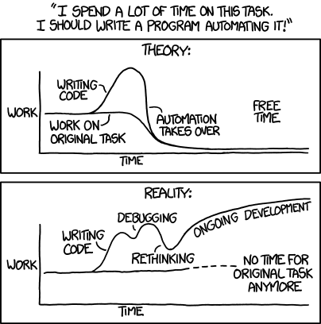

## {#topics-slide .center}

:::: {.columns}
::: {.column width="50%"}

### วันนี้เราจะเรียนรู้ 🚀

::: {.incremental}
1. **ทบทวน**ส่วนประกอบของการทำซ้ำ
2. **`range()`** function — สร้างลำดับตัวเลข
3. **`for`** statement
4. **Nested loop** (ลูปซ้อน)
5. **`break`** และ **`continue`** ในลูปซ้อน
:::

:::
::: {.column width="50%"}

```python
print("Multiplication Table")
n = int(input("Enter n: "))
col = 5
for i in range(1, 13):
    print(f"{i*n:4}", end="")
    if i % col == 0:
        print()
```

:::
::::

# ทบทวนส่วนประกอบของการทำซ้ำ 🔁 {background-color="#2c3e50" .white-text}

การทำซ้ำมี 3 ส่วนประกอบเสมอ

## ส่วนประกอบของการทำซ้ำ {#m7-loop-parts .smaller}

ส่วนประกอบของการทำซ้ำ มี 3 ส่วน

::: {.incremental}
1. **การทดสอบเงื่อนไข (Condition testing)**
   - ทดสอบเงื่อนไขในการทำซ้ำ ว่ายังเป็นจริง (`True`) หรือไม่
   - วนเข้าไปทำซ้ำในคำสั่งที่กำหนด หากเงื่อนไขยังเป็น `True`
   - จบการทำซ้ำ เมื่อผลการทดสอบเงื่อนไขเป็น `False`
   - เช่น `x<10, x>-5, x<=99, ans!="y"`

2. **การกำหนดค่าเริ่มต้น (Initialization)**
   - กำหนดค่าตั้งต้นให้กับตัวแปร ซึ่งจะใช้เป็นเงื่อนไขในการทำงาน
   - เช่น `x=0, y=100, ans="n"`

3. **การปรับปรุงค่า (Update: Increment / Decrement / Input)**
   - เพิ่มค่า (Increment) หรือลดค่า (Decrement) ของตัวแปรซึ่งใช้เป็นเงื่อนไข รวมถึงการรับค่าจาก input ใหม่
   - เช่น `x=x+1, x+=10, x-=1, ans = input()`
:::

::: {.callout-note}
ทบทวน: [while-loop (Module 6)](module06.html#m6-while) · [Assignment operators `+=` `-=` (Module 3)](module03a.html#m3-assignment)
:::

# range() function 📏 {background-color="#2c3e50" .white-text}

สร้างลำดับตัวเลขจำนวนเต็มไว้ล่วงหน้า

## `range()` function {#m7-range}

จากส่วนประกอบทั้งสามของการทำซ้ำ ซึ่งเป็นรูปแบบที่ใช้คู่กับคำสั่ง `while` ดังตัวอย่างที่พิมพ์เลข `1 3 5 7`

```python
i = 1         # Initialization (START)
while i < 9:  # Condition testing (STOP)
    print(i, end=" ")
    i += 2    # Increment/Decrement (STEP)
```

. . .

- ตัวแปร `i` เก็บค่าตัวเลขที่เป็นลำดับ ซึ่งถูกเปลี่ยนค่าไปในแต่ละรอบของลูป
- ฟังก์ชัน `range()` สามารถสร้างลำดับเลขเดียวกันนี้ (`1 3 5 7`) ไว้ล่วงหน้าได้

```python
range(1, 9, 2)
```

::: {.callout-important}
ฟังก์ชัน `range()` ใช้สร้างลำดับตัวเลข**จำนวนเต็ม**เท่านั้น
:::

## `range()` แบบที่ 1 {#m7-range-1}

ค่าแรกเริ่มที่ `START` เพิ่มค่าขึ้นทีละ `STEP` โดยค่าสุดท้ายคือค่าจำนวนเต็มก่อนถึงค่า `STOP` (**ไม่รวม `STOP`**)

```python
range(START, STOP, STEP)
```

. . .

*ตัวอย่าง:* `range(5, 20, 2)` ได้ลำดับ `5, 7, 9, 11, 13, 15, 17, 19`

(`START=5, STOP=20, STEP=2`)

## เห็นภาพ: `range()` ทำงานยังไง {#m7-range-viz}

`range(1, 9, 2)` — เริ่มที่ **START** ก้าวทีละ **STEP** จนก่อนถึง **STOP** (ไม่รวม STOP)

```{=html}
<svg viewBox="0 0 640 160" width="100%" style="max-width:820px" xmlns="http://www.w3.org/2000/svg" font-family="monospace" font-size="17">
  <defs>
    <marker id="rgd" markerWidth="9" markerHeight="9" refX="6" refY="3" orient="auto"><path d="M0,0 L6,3 L0,6 Z" fill="#2c3e50"/></marker>
    <marker id="rgr" markerWidth="9" markerHeight="9" refX="6" refY="3" orient="auto"><path d="M0,0 L6,3 L0,6 Z" fill="#e74c3c"/></marker>
  </defs>
  <text x="46" y="42" text-anchor="middle" fill="#27ae60" font-size="13" font-weight="bold">START</text>
  <rect x="20" y="52" width="52" height="50" rx="8" fill="#d5f5e3" stroke="#27ae60" stroke-width="2"/><text x="46" y="84" text-anchor="middle" font-weight="bold">1</text>
  <line x1="74" y1="77" x2="146" y2="77" stroke="#2c3e50" stroke-width="2" marker-end="url(#rgd)"/><text x="110" y="68" text-anchor="middle" fill="#2980b9" font-size="13">+2</text>
  <rect x="150" y="52" width="52" height="50" rx="8" fill="#d5f5e3" stroke="#27ae60" stroke-width="2"/><text x="176" y="84" text-anchor="middle" font-weight="bold">3</text>
  <line x1="204" y1="77" x2="276" y2="77" stroke="#2c3e50" stroke-width="2" marker-end="url(#rgd)"/><text x="240" y="68" text-anchor="middle" fill="#2980b9" font-size="13">+2</text>
  <rect x="280" y="52" width="52" height="50" rx="8" fill="#d5f5e3" stroke="#27ae60" stroke-width="2"/><text x="306" y="84" text-anchor="middle" font-weight="bold">5</text>
  <line x1="334" y1="77" x2="406" y2="77" stroke="#2c3e50" stroke-width="2" marker-end="url(#rgd)"/><text x="370" y="68" text-anchor="middle" fill="#2980b9" font-size="13">+2</text>
  <rect x="410" y="52" width="52" height="50" rx="8" fill="#d5f5e3" stroke="#27ae60" stroke-width="2"/><text x="436" y="84" text-anchor="middle" font-weight="bold">7</text>
  <line x1="464" y1="77" x2="536" y2="77" stroke="#e74c3c" stroke-width="2" stroke-dasharray="5 3" marker-end="url(#rgr)"/><text x="500" y="68" text-anchor="middle" fill="#2980b9" font-size="13">+2</text>
  <rect x="540" y="52" width="52" height="50" rx="8" fill="#fdedec" stroke="#e74c3c" stroke-width="2" stroke-dasharray="5 3"/><text x="566" y="84" text-anchor="middle" fill="#e74c3c" font-weight="bold">9</text>
  <line x1="548" y1="60" x2="584" y2="94" stroke="#e74c3c" stroke-width="2"/><line x1="584" y1="60" x2="548" y2="94" stroke="#e74c3c" stroke-width="2"/>
  <text x="566" y="122" text-anchor="middle" fill="#e74c3c" font-size="13" font-weight="bold">STOP</text>
  <text x="566" y="138" text-anchor="middle" fill="#e74c3c" font-size="12">(ไม่รวม)</text>
</svg>
```

ได้ลำดับ `1, 3, 5, 7` — ค่า `9` (STOP) **ถูกตัดทิ้ง** ไม่รวมในลำดับ

## `range()` ↔ Slice: โครงเดียวกัน {#m7-range-vs-slice}

`range()` ใช้ **`start : stop : step`** แบบเดียวกับ **slice** ที่เคยเรียนกับ List — และ **ไม่รวม STOP** เหมือนกัน!

:::: {.columns}
::: {.column width="50%"}

**Slice** — ตัดช่วงจาก list ที่มีอยู่

```{=html}
<pre class="code-pattern" style="font-size:1.1em">data[<span style="color:#e74c3c;font-weight:bold">1</span>:<span style="color:#2980b9;font-weight:bold">9</span>:<span style="color:#27ae60;font-weight:bold">2</span>]</pre>
```

```python
data = [0,1,2,3,4,5,6,7,8,9]
print(data[1:9:2])
```

```{.python .code-output}
[1, 3, 5, 7]
```

:::
::: {.column width="50%"}

**range()** — สร้างลำดับเลขใหม่

```{=html}
<pre class="code-pattern" style="font-size:1.1em">range(<span style="color:#e74c3c;font-weight:bold">1</span>, <span style="color:#2980b9;font-weight:bold">9</span>, <span style="color:#27ae60;font-weight:bold">2</span>)</pre>
```

```python
print(list(range(1, 9, 2)))
```

```{.python .code-output}
[1, 3, 5, 7]
```

:::
::::

[**start**]{style="color:#e74c3c"} · [**stop**]{style="color:#2980b9"} (ไม่รวม) · [**step**]{style="color:#27ae60"} — เหมือนกันทั้งคู่!

::: {.callout-note}
ทบทวน: [Slice ของ List (Module 4a)](module04a.html#m4-list-slice)
:::

## โจทย์ #1a {.exercise}

จงใช้ `range()` สร้างลำดับเลข `2, 6, 10, 14, 18`

::: {.panel-tabset}

### Live Code

```{pyodide}
#| autorun: false
a = range(2, ____, ____)   # 2, 6, 10, 14, 18
print(a)
print(list(a))
```

### Solution

```python
a = range(2, 20, 4)
print(a)
print(list(a))
```

```{.python .code-output}
range(2, 20, 4)
[2, 6, 10, 14, 18]
```

:::

## โจทย์ #1b {.exercise}

จงใช้ `range()` สร้างลำดับเลข `10, 7, 4`

::: {.callout-tip}
**คิดก่อน:** ลำดับนี้ค่าลดลง → `STEP` ต้องเป็นค่าใด?
:::

::: {.panel-tabset}

### Live Code

```{pyodide}
#| autorun: false
print(list(range(10, ____, ____)))   # 10, 7, 4
```

### Solution

```python
print(list(range(10, 1, -3)))
```

```{.python .code-output}
[10, 7, 4]
```

:::

## `range()` แบบที่ 2 {#m7-range-2}

ค่าแรกเริ่มที่ `START` เพิ่มค่าขึ้นทีละ 1 (`STEP=1`) ไปจนถึงค่าจำนวนเต็มก่อนถึงค่า `STOP` (**ไม่รวม `STOP`**)

```python
range(START, STOP)
```

. . .

*ตัวอย่าง:* `range(3, 6)` คือ `3, 4, 5`

(`START=3, STOP=6, STEP=1`)

## โจทย์ #1c {.exercise}

จงใช้ `range()` โดยละการกำหนด `STEP` ในการสร้างลำดับเลข `1, 2, 3, 4, 5, 6, 7, 8, 9, 10`

::: {.panel-tabset}

### Live Code

```{pyodide}
#| autorun: false
print(list(range(____, ____)))   # 1, 2, ..., 10
```

### Solution

```python
print(list(range(1, 10+1)))
```

```{.python .code-output}
[1, 2, 3, 4, 5, 6, 7, 8, 9, 10]
```

:::

## `range()` แบบที่ 3 {#m7-range-3}

ค่าแรกเริ่มที่ 0 (`START=0`) เพิ่มค่าขึ้นทีละ 1 (`STEP=1`) ไปจนถึงค่าจำนวนเต็มก่อนถึงค่า `STOP` (**ไม่รวม `STOP`**)

```python
range(STOP)
```

. . .

*ตัวอย่าง:* `range(6)` คือ `0, 1, 2, 3, 4, 5`

## โจทย์ #1d {.exercise}

จงใช้ `range()` โดยละการกำหนด `START` และ `STEP` ในการสร้างลำดับเลข `0, 1, 2, ..., 10`

::: {.panel-tabset}

### Live Code

```{pyodide}
#| autorun: false
print(list(range(____)))   # 0, 1, ..., 10
```

### Solution

```python
print(list(range(10+1)))
```

```{.python .code-output}
[0, 1, 2, 3, 4, 5, 6, 7, 8, 9, 10]
```

:::

## จำนวนค่าที่ได้ {#m7-range-count .smaller}

จำนวนค่าที่ได้จากคำสั่ง `range()` คำนวณได้จากสูตร

$$
\text{จำนวนค่า} = \bigg\lceil\frac{\text{STOP} - \text{START}}{\text{STEP}}\bigg\rceil
$$

โดย $\lceil\cdot\rceil$ หมายถึงปัดขึ้น เช่น

::: {.incremental}
- `range(2,20,4)` ได้ $\lceil\frac{20-2}{4}\rceil = 5$
- `range(2,20,3)` ได้ $\lceil\frac{20-2}{3}\rceil = 6$
- `range(10,1,-3)` ได้ $\lceil\frac{1-10}{-3}\rceil = 3$
:::

. . .

ตรวจสอบจำนวนค่าได้ด้วย `len()`

```{pyodide}
#| autorun: false
print(len(range(10, 1, -3)))
```

# for statement 🔂 {background-color="#2c3e50" .white-text}

ทำซ้ำตามลำดับค่า (iterable)

## คำสั่ง `for` {#m7-for}

`for` เป็นคำสั่งที่ใช้ในการทำซ้ำ แต่มีรูปแบบการใช้ต่างจาก `while`

::: {.incremental}
- นิยมใช้เมื่อ**ทราบจำนวนรอบ**ของการทำซ้ำล่วงหน้า
- สามารถใช้ทดแทน `while` statement ได้
- จำนวนรอบถูกกำหนดด้วย **`iterable`** (ลำดับค่าที่ไล่ดึงเป็นลำดับได้) ซึ่งอาจสร้างจาก `range()`, เป็น `list` หรือ `str` ก็ได้
:::

. . .

```python
for i in iterable:
    statement1
    statement2
    ...
next-statement
```

- `iterable` ได้แก่ `range(10)`, `[5,6,7,8,9]`, `"Engineer"` เป็นต้น
- ตัวแปร `i` รับค่าจาก `iterable` รอบละ 1 ค่า ตามลำดับ จนครบทุกค่า

## เห็นภาพ: `for` ดึงค่าทีละตัว {#m7-for-viz}

`for i in [10, 20, 30]:` — ตัวแปร `i` **รับค่าจาก iterable รอบละ 1 ค่า** ตามลำดับ

```{=html}
<svg viewBox="0 0 580 200" width="100%" style="max-width:820px" xmlns="http://www.w3.org/2000/svg" font-family="monospace" font-size="16">
  <defs><marker id="fw" markerWidth="9" markerHeight="9" refX="6" refY="3" orient="auto"><path d="M0,0 L6,3 L0,6 Z" fill="#2980b9"/></marker></defs>
  <text x="20" y="28" font-weight="bold">iterable = [10, 20, 30]</text>
  <text x="105" y="62" text-anchor="middle" fill="#7f8c8d" font-size="13">รอบ 1</text>
  <rect x="55" y="70" width="100" height="48" rx="8" fill="#eaf2f8" stroke="#2980b9" stroke-width="2"/>
  <text x="105" y="100" text-anchor="middle" font-weight="bold">i = 10</text>
  <text x="188" y="88" text-anchor="middle" fill="#2980b9" font-size="12">ถัดไป</text>
  <line x1="158" y1="94" x2="208" y2="94" stroke="#2980b9" stroke-width="2" marker-end="url(#fw)"/>
  <text x="262" y="62" text-anchor="middle" fill="#7f8c8d" font-size="13">รอบ 2</text>
  <rect x="212" y="70" width="100" height="48" rx="8" fill="#eaf2f8" stroke="#2980b9" stroke-width="2"/>
  <text x="262" y="100" text-anchor="middle" font-weight="bold">i = 20</text>
  <text x="345" y="88" text-anchor="middle" fill="#2980b9" font-size="12">ถัดไป</text>
  <line x1="315" y1="94" x2="365" y2="94" stroke="#2980b9" stroke-width="2" marker-end="url(#fw)"/>
  <text x="419" y="62" text-anchor="middle" fill="#7f8c8d" font-size="13">รอบ 3</text>
  <rect x="369" y="70" width="100" height="48" rx="8" fill="#eaf2f8" stroke="#2980b9" stroke-width="2"/>
  <text x="419" y="100" text-anchor="middle" font-weight="bold">i = 30</text>
  <line x1="472" y1="94" x2="518" y2="94" stroke="#27ae60" stroke-width="2" marker-end="url(#fw)"/>
  <text x="548" y="99" text-anchor="middle" fill="#27ae60" font-weight="bold">จบ</text>
  <text x="105" y="150" text-anchor="middle" font-size="12" fill="#7f8c8d">ทำ statement</text>
  <text x="262" y="150" text-anchor="middle" font-size="12" fill="#7f8c8d">ทำ statement</text>
  <text x="419" y="150" text-anchor="middle" font-size="12" fill="#7f8c8d">ทำ statement</text>
</svg>
```

ครบทุกค่าใน iterable แล้ว → ออกจากลูป (ไม่ต้องเขียน `i += 1` เอง!)

## `for` กับส่วนประกอบของลูป {#m7-for-parts .smaller}

ส่วน **Initialization**, **Condition**, และ **Update** ของลูป `for` แฝงตัวอยู่ในบรรทัด `for i in iterable`

เทียบกับแผนภาพของลูป `while` จะได้ว่า

:::: {.columns}
::: {.column width="50%"}

**`for` — 3 ส่วนซ่อนในบรรทัดเดียว**

```{=html}
<pre class="code-pattern" style="font-size:1.05em">for i in range(<span style="color:#27ae60;font-weight:bold">1</span>, <span style="color:#2980b9;font-weight:bold">n+1</span>, <span style="color:#e67e22;font-weight:bold">1</span>):</pre>
```

- 🟢 START = **init** — `i` เริ่มที่ `1`
- 🔵 STOP = **cond** — วนขณะ `i < n+1`
- 🟠 STEP = **update** — `i` รับค่าถัดไป

:::
::: {.column width="50%"}

**`while` — เขียนแยก 3 ส่วน**

```{=html}
<pre class="code-pattern" style="font-size:1.05em"><span style="color:#27ae60;font-weight:bold">i = 1</span>
<span style="color:#2980b9;font-weight:bold">while i &lt;= n</span>:
    print(i)
    <span style="color:#e67e22;font-weight:bold">i += 1</span></pre>
```

**สีเดียวกัน = ส่วนเดียวกัน** — `for` แค่ย่อ 3 ส่วนไว้บรรทัดเดียว

:::
::::

::: {.callout-note}
ทบทวน: [while-loop (Module 6)](module06.html#m6-while)
:::

## โจทย์ #2: พิมพ์ 1 ถึง n {.exercise}

โปรแกรมแสดงเลข `1` ถึง `n` ด้วย `while` เป็นดังนี้

```python
n = int(input("Enter n: "))
i = 1
while i <= n:
    print(i, end=" ")
    i += 1
```

. . .

จงเขียนโปรแกรมที่ให้ผลลัพธ์เดียวกัน โดยใช้คำสั่ง **`for`**

. . .

**คิดก่อน:** ต้องสร้างลำดับ `1, 2, ..., n` ด้วย `range()` อย่างไร?

::: {.panel-tabset}

### Live Code

```{pyodide}
#| autorun: false
print("Counting from 1 to n")
n = 10   # input() ไม่ทำงานใน Pyodide — สมมติผู้ใช้ป้อน 10
for i in range(____, ____):     # [1, 2, 3, ..., n]
    print(i, end=" ")
```

### Solution

```python
print("Counting from 1 to n")
n = int(input("Enter n: "))     # สมมติป้อน 10
for i in range(1, n+1):         # [1, 2, 3, ..., n]
    print(i, end=" ")
```

```{.python .code-output}
Counting from 1 to n
1 2 3 4 5 6 7 8 9 10
```

:::

## โจทย์ #2: ส่วนประกอบที่ยังคงอยู่ {.exercise}

โปรแกรมที่ใช้ลูป `for` ยังคงส่วนประกอบ ดังนี้

- **Initialization:** `i = 1`
- **Condition:** `i <= n`
- **Update:** `i += 1`

::: {.callout-note}
ส่วนประกอบเหล่านี้แฝงในคำสั่ง `for i in range(1, n+1)` จึงต้องอาศัยการตีความ
:::

## โจทย์ #3: สูตรคูณแม่ n {.exercise}

โปรแกรมแสดงสูตรคูณแม่ `n` ($1\times n$ ถึง $12\times n$) ด้วย `while`

```python
n = int(input("Enter n: "))
i = 1
col = 5
while i < 13:
    print(f"{i*n:4}", end="")
    if i % col == 0:
        print()
    i += 1
```

. . .

จงเขียนโปรแกรมที่ให้ผลลัพธ์เดียวกัน โดยใช้คำสั่ง **`for`** (พิมพ์ขึ้นบรรทัดใหม่ทุก 5 ค่า)

::: {.panel-tabset}

### Live Code

```{pyodide}
#| autorun: false
print("Multiplication Table")
n = 4   # สมมติผู้ใช้ป้อน 4
col = 5
for i in range(1, ____):
    print(f"{i*n:4}", end="")
    if i % col == ____:
        print()
```

### Solution

```python
print("Multiplication Table")
n = int(input("Enter n: "))     # สมมติป้อน 4
col = 5
for i in range(1, 13):
    print(f"{i*n:4}", end="")
    if i % col == 0:
        print()
```

```{.python .code-output}
Multiplication Table
   4   8  12  16  20
  24  28  32  36  40
  44  48
```

::: {.callout-note}
ทบทวน: [f-string format `{i*n:4}` (Module 3)](module03b.html#m3-fstring-format) · [if-else (Module 5)](module05.html#m5-if-else)
:::

:::

## โจทย์ #3: ส่วนประกอบที่ยังคงอยู่ {.exercise}

โปรแกรมที่ใช้ลูป `for` ยังคงส่วนประกอบ ดังนี้

- **Initialization:** `i = 1`
- **Condition:** `i < 13`
- **Update:** `i += 1`

## โจทย์ #4: ผลบวกกำลังสองของเลขคี่ {.exercise}

หาผลบวกกำลังสองของเลขคี่ระหว่าง `1` ถึง `n`

$$
\text{Sum} = n^2 + (n-2)^2 + ... + 5^2 + 3^2 + 1^2
$$

โปรแกรมเดิมเขียนด้วย `while` (ไล่ค่า `n` ลงมาทีละ 1)

. . .

จงเขียนใหม่โดยใช้ลูป **`for`** ที่ไล่ค่าจาก `n` ลงมาถึง `1`

::: {.panel-tabset}

### Live Code

```{pyodide}
#| autorun: false
print("Sum of squared odd numbers between 1 - n")
n = 10   # สมมติผู้ใช้ป้อน 10
Sum = 0
print("Odd number n(n^2):")
for i in range(n, ____, ____):     # i = n, n-1, ..., 1
    if i % 2 == 1:
        print(f"{i}({i**2}) ", end="")
        Sum ____ i**2
print("\nSummation:", Sum)
```

### Solution

```python
print("Sum of squared odd numbers between 1 - n")
n = int(input("Enter n: "))     # สมมติป้อน 10
Sum = 0
print("Odd number n(n^2):")
for i in range(n, 0, -1):       # i = n, n-1, ..., 1
    if i % 2 == 1:
        print(f"{i}({i**2}) ", end="")
        Sum += i**2
print("\nSummation:", Sum)
```

```{.python .code-output}
Sum of squared odd numbers between 1 - n
Odd number n(n^2):
9(81) 7(49) 5(25) 3(9) 1(1)
Summation: 165
```

::: {.callout-note}
ทบทวน: [Arithmetic `%` `**` (Module 3)](module03a.html#m3-arithmetic) · [Assignment `+=` (Module 3)](module03a.html#m3-assignment)
:::

:::

## โจทย์ #4: ส่วนประกอบที่ยังคงอยู่ {.exercise}

โปรแกรมที่ใช้ลูป `for` มีส่วนประกอบ ดังนี้

- **Initialization:** `i = n` (`n = input()`)
- **Condition:** `i > 0`
- **Update:** `i -= 1`

## โจทย์ #5a: ค่าเฉลี่ย {.exercise}

จงเขียนโปรแกรมหาค่าเฉลี่ย (Average) ของข้อมูล `n` ตัว

$$
\text{avg} = \frac{\text{Sum}}{n} = \frac{\text{data}_1 + \text{data}_2 + ... + \text{data}_n}{n}
$$

. . .

สร้างตัวแปร `Sum = 0.0`

. . .

วนลูป `for` รับค่า `data` แต่ละตัว (แปลงเป็น `float`) แล้วบวกทบ `Sum`

. . .

**คิดก่อน:** คำนวณค่าเฉลี่ยจาก `Sum` และ `n` อย่างไร?

::: {.panel-tabset}

### Live Code

```{pyodide}
#| autorun: false
# input() ไม่ทำงานใน Pyodide — จำลองข้อมูลด้วย list
data_list = [10, 20, 30]
n = len(data_list)
Sum = 0.0
for i in range(____):
    data = float(data_list[i])
    Sum ____ data
avg = Sum ____ n
print(f" sum: {Sum:.4f},  avg: {avg:.4f}")
```

### Solution

```python
n = int(input("Enter n: "))
Sum = 0.0
for i in range(n):           # [0,1,2,...,n-1]
    data = float(input(f"[{Sum:7.4f}], Data({i+1}): "))
    Sum += data
avg = Sum / n
print(f" sum: {Sum:.4f},  avg: {avg:.4f}")
```

```{.python .code-output}
Enter n: 3
[ 0.0000], Data(1): 10
[10.0000], Data(2): 20
[30.0000], Data(3): 30
 sum: 60.0000,  avg: 20.0000
```

::: {.callout-note}
ทบทวน: [Type conversion `float()` (Module 3)](module03a.html#m3-type-conversion) · [f-string format `{Sum:7.4f}` (Module 3)](module03b.html#m3-fstring-format)
:::

:::

# ลูปซ้อน (Nested loop) 🪆 {background-color="#2c3e50" .white-text}

ลูปภายในลูป — ลูปในจบก่อน ลูปนอกจบทีหลัง

## รูปแบบของลูปซ้อน {#m7-nested}

หัวข้อที่ผ่านมาใช้ลูปเพียงชั้นเดียว ในทางปฏิบัติสามารถเรียกใช้แบบลูปซ้อนกันได้ ทั้ง `while` และ `for` ผสมกัน

:::: {.columns}
::: {.column width="50%"}

```python
while condition1:
    statement1
    while condition2:
        statement2
    next_statement1
next_statement2
```

```python
while condition:
    statement1
    for i in iterable:
        statement2
    next_statement1
next_statement2
```

:::
::: {.column width="50%"}

```python
for i in iterable:
    statement1
    while condition:
        statement2
    next_statement1
next_statement2
```

```python
for i in iterable1:
    statement1
    for j in iterable2:
        statement2
    next_statement1
next_statement2
```

:::
::::

## เห็นภาพ: ลูปซ้อนวิ่งยังไง {#m7-nested-viz}

`for i in range(1,4):` (นอก) · `for j in range(1,4):` (ใน) → **ลูปในวิ่งครบ ก่อนลูปนอกขยับ 1 ขั้น**

```{=html}
<svg viewBox="0 0 430 330" width="100%" style="max-width:520px" xmlns="http://www.w3.org/2000/svg" font-family="monospace" font-size="15">
  <text x="140" y="40" text-anchor="middle" fill="#8e44ad" font-weight="bold">j=1</text>
  <text x="236" y="40" text-anchor="middle" fill="#8e44ad" font-weight="bold">j=2</text>
  <text x="332" y="40" text-anchor="middle" fill="#8e44ad" font-weight="bold">j=3</text>
  <text x="45" y="112" fill="#2980b9" font-weight="bold">i=1</text>
  <text x="45" y="197" fill="#2980b9" font-weight="bold">i=2</text>
  <text x="45" y="282" fill="#2980b9" font-weight="bold">i=3</text>
  <!-- row i=1 -->
  <g>
    <rect x="95" y="72" width="90" height="70" rx="6" fill="#eaf2f8" stroke="#2980b9" stroke-width="2"/><text x="140" y="114" text-anchor="middle">(1,1)</text><circle cx="108" cy="85" r="10" fill="#e74c3c"/><text x="108" y="89" text-anchor="middle" fill="#fff" font-size="11">1</text>
    <rect x="191" y="72" width="90" height="70" rx="6" fill="#eaf2f8" stroke="#2980b9" stroke-width="2"/><text x="236" y="114" text-anchor="middle">(1,2)</text><circle cx="204" cy="85" r="10" fill="#e74c3c"/><text x="204" y="89" text-anchor="middle" fill="#fff" font-size="11">2</text>
    <rect x="287" y="72" width="90" height="70" rx="6" fill="#eaf2f8" stroke="#2980b9" stroke-width="2"/><text x="332" y="114" text-anchor="middle">(1,3)</text><circle cx="300" cy="85" r="10" fill="#e74c3c"/><text x="300" y="89" text-anchor="middle" fill="#fff" font-size="11">3</text>
  </g>
  <!-- row i=2 -->
  <g>
    <rect x="95" y="157" width="90" height="70" rx="6" fill="#eafaf1" stroke="#27ae60" stroke-width="2"/><text x="140" y="199" text-anchor="middle">(2,1)</text><circle cx="108" cy="170" r="10" fill="#e74c3c"/><text x="108" y="174" text-anchor="middle" fill="#fff" font-size="11">4</text>
    <rect x="191" y="157" width="90" height="70" rx="6" fill="#eafaf1" stroke="#27ae60" stroke-width="2"/><text x="236" y="199" text-anchor="middle">(2,2)</text><circle cx="204" cy="170" r="10" fill="#e74c3c"/><text x="204" y="174" text-anchor="middle" fill="#fff" font-size="11">5</text>
    <rect x="287" y="157" width="90" height="70" rx="6" fill="#eafaf1" stroke="#27ae60" stroke-width="2"/><text x="332" y="199" text-anchor="middle">(2,3)</text><circle cx="300" cy="170" r="10" fill="#e74c3c"/><text x="300" y="174" text-anchor="middle" fill="#fff" font-size="11">6</text>
  </g>
  <!-- row i=3 -->
  <g>
    <rect x="95" y="242" width="90" height="70" rx="6" fill="#fef9e7" stroke="#f39c12" stroke-width="2"/><text x="140" y="284" text-anchor="middle">(3,1)</text><circle cx="108" cy="255" r="10" fill="#e74c3c"/><text x="108" y="259" text-anchor="middle" fill="#fff" font-size="11">7</text>
    <rect x="191" y="242" width="90" height="70" rx="6" fill="#fef9e7" stroke="#f39c12" stroke-width="2"/><text x="236" y="284" text-anchor="middle">(3,2)</text><circle cx="204" cy="255" r="10" fill="#e74c3c"/><text x="204" y="259" text-anchor="middle" fill="#fff" font-size="11">8</text>
    <rect x="287" y="242" width="90" height="70" rx="6" fill="#fef9e7" stroke="#f39c12" stroke-width="2"/><text x="332" y="284" text-anchor="middle">(3,3)</text><circle cx="300" cy="255" r="10" fill="#e74c3c"/><text x="300" y="259" text-anchor="middle" fill="#fff" font-size="11">9</text>
  </g>
</svg>
```

🔴 เลขในวงกลม = **ลำดับการทำงาน** (1→9) · แต่ละแถว (สี) = ลูปใน `j` วิ่งครบก่อน ลูปนอก `i` จึงเปลี่ยนแถว

## โจทย์ #5b: ค่าเฉลี่ยหลายชุด {.exercise}

จากโจทย์ #5a จงเพิ่มความสามารถให้คำนวณค่าเฉลี่ยได้**หลายชุด**

. . .

เมื่อคำนวณค่าเฉลี่ย 1 ชุดเสร็จ ให้รับค่า `n` ใหม่เพื่อคำนวณชุดถัดไป (ไม่ออกโปรแกรม)

. . .

หากค่า `n` ที่รับมาเป็น `n <= 0` ให้จบการทำงาน

. . .

**คิดก่อน:** จะนำโค้ดจาก #5a มาครอบด้วยลูปอะไร? เงื่อนไขใด?

::: {.panel-tabset}

### Live Code

```{pyodide}
#| autorun: false
# จำลองข้อมูลหลายชุด — แต่ละชุดเป็น list, [] (n=0) เพื่อจบ
datasets = [[10, 20, 30], [200, 100], []]
g = 0
n = len(datasets[g])
while n ____ 0:                 # outer loop: ทำต่อเมื่อยังมีข้อมูล
    Sum = 0.0
    for i in range(n):          # inner loop: รวม n ค่า
        Sum += float(datasets[g][i])
    avg = Sum / n
    print(f" sum: {Sum:.4f}, avg: {avg:.4f}")
    g += 1
    n = len(datasets[g])        # รับชุดถัดไป
print("See you later ... ")
```

### Solution

```python
n = int(input("Enter n: "))
while n > 0:                    # outer loop
    Sum = 0.0
    for i in range(n):          # inner loop
        data = float(input(f"[{Sum:7.4f}], Data({i+1}): "))
        Sum += data
    avg = Sum / n
    print(f" sum: {Sum:.4f}, avg: {avg:.4f}")
    n = int(input("Enter n: "))
print("See you later ... ")
```

```{.python .code-output}
Enter n: 3
[ 0.0000], Data(1): 10
[10.0000], Data(2): 20
[30.0000], Data(3): 30
 sum: 60.0000, avg: 20.0000
Enter n: 2
[ 0.0000], Data(1): 200
[200.0000], Data(2): 100
 sum: 300.0000, avg: 150.0000
Enter n: -1
See you later ...
```

:::

## โจทย์ #5b: ส่วนประกอบที่ใช้วนลูป {.exercise}

:::: {.columns}
::: {.column width="50%"}

**Outer `while`-loop**

- **Initialization:** `n = input()`
- **Condition:** `n > 0`
- **Update:** `n = input()`

:::
::: {.column width="50%"}

**Inner `for`-loop**

- **Initialization:** `i = 0`
- **Condition:** `i < n`
- **Update:** `i += 1`

:::
::::

## โจทย์ #6: nested for {.exercise}

จงเขียนโปรแกรมพิมพ์อักษรภาพต่อไปนี้ โดยใช้ลูป `for` 2 อันซ้อนกัน

```console
* 1 2 3 4 5 6 7
0 * 2 3 4 5 6 7
0 1 * 3 4 5 6 7
0 1 2 * 4 5 6 7
0 1 2 3 * 5 6 7
0 1 2 3 4 * 6 7
0 1 2 3 4 5 * 7
0 1 2 3 4 5 6 *
```

. . .

**วิธีคิด:** พิมพ์ให้จบทีละบรรทัด (ลูปใน ไล่คอลัมน์) แล้วขึ้นบรรทัดใหม่ทีละแถว (ลูปนอก ไล่แถว) — ตำแหน่งแนวทแยง (`r == c`) พิมพ์ `*` มิฉะนั้นพิมพ์เลขคอลัมน์ `c`

::: {.panel-tabset}

### Live Code

```{pyodide}
#| autorun: false
nrow, ncol = 8, 8
for r in range(nrow):           # outer: แถว
    for c in range(____):       # inner: คอลัมน์
        if r ____ c:
            print("*", end=" ")
        else:
            print(c, end=" ")
    print()
```

### Solution

```python
nrow, ncol = 8, 8
for r in range(nrow):
    for c in range(ncol):
        if r == c:
            print("*", end=" ")
        else:
            print(c, end=" ")
    print()
```

```{.python .code-output}
* 1 2 3 4 5 6 7
0 * 2 3 4 5 6 7
0 1 * 3 4 5 6 7
0 1 2 * 4 5 6 7
0 1 2 3 * 5 6 7
0 1 2 3 4 * 6 7
0 1 2 3 4 5 * 7
0 1 2 3 4 5 6 *
```

::: {.callout-note}
*ข้อสังเกต:* ทุก 1 รอบของ outer loop จะมี inner loop ทำงาน `ncol` รอบ
:::

:::

## โจทย์ #7: nested for with break {.exercise}

จากโจทย์ #6 จงดัดแปลงโดยใช้ `break` ให้พิมพ์เฉพาะส่วนสามเหลี่ยมล่าง (ค่าด้านขวาของ `*` หายไป)

```console
*
0 *
0 1 *
0 1 2 *
0 1 2 3 *
0 1 2 3 4 *
0 1 2 3 4 5 *
0 1 2 3 4 5 6 *
```

. . .

**วิธีคิด:** หลังพิมพ์ `*` ภายใต้เงื่อนไข `r == c` ให้ `break` ออกจากลูปในทันที เพื่อไปขึ้นบรรทัดใหม่

::: {.panel-tabset}

### Live Code

```{pyodide}
#| autorun: false
nrow, ncol = 8, 8
for r in range(nrow):
    for c in range(ncol):
        if r == c:
            print("*", end=" ")
            ____               # หยุดพิมพ์ค่าที่เหลือในแถวนี้
        else:
            print(c, end=" ")
    print()
```

### Solution

```python
nrow, ncol = 8, 8
for r in range(nrow):
    for c in range(ncol):
        if r == c:
            print("*", end=" ")
            break  # stop printing
        else:
            print(c, end=" ")
    print()
```

```{.python .code-output}
*
0 *
0 1 *
0 1 2 *
0 1 2 3 *
0 1 2 3 4 *
0 1 2 3 4 5 *
0 1 2 3 4 5 6 *
```

:::

## เห็นภาพ: `break` ในลูปซ้อน ออกแค่ลูปใน {#m7-nested-break-viz}

`break` หยุด **เฉพาะลูปใน (c)** ของแถวนั้น — **ลูปนอก (r) เดินต่อ** ไปแถวถัดไป

:::: {.columns}
::: {.column width="62%"}

```{=html}
<svg viewBox="0 0 420 320" width="100%" style="max-width:470px" xmlns="http://www.w3.org/2000/svg" font-family="monospace" font-size="15">
  <defs><marker id="nbk" markerWidth="9" markerHeight="9" refX="6" refY="3" orient="auto"><path d="M0,0 L6,3 L0,6 Z" fill="#2980b9"/></marker></defs>
  <g fill="#8e44ad" font-weight="bold" text-anchor="middle" font-size="14"><text x="132" y="58">c=0</text><text x="207" y="58">c=1</text><text x="282" y="58">c=2</text><text x="357" y="58">c=3</text></g>
  <g fill="#2980b9" font-weight="bold" font-size="14"><text x="58" y="108">r=0</text><text x="58" y="166">r=1</text><text x="58" y="224">r=2</text><text x="58" y="282">r=3</text></g>
  <!-- r=0 -->
  <rect x="98" y="73" width="69" height="52" rx="5" fill="#fdedec" stroke="#e74c3c" stroke-width="2"/><text x="132" y="100" text-anchor="middle" fill="#e74c3c" font-weight="bold">*</text><text x="132" y="116" text-anchor="middle" fill="#e74c3c" font-size="10">break</text>
  <rect x="173" y="73" width="69" height="52" rx="5" fill="#f4f6f7" stroke="#bdc3c7" stroke-width="2" stroke-dasharray="4 3"/><text x="207" y="105" text-anchor="middle" fill="#c0c4c7" font-size="11">ข้าม</text>
  <rect x="248" y="73" width="69" height="52" rx="5" fill="#f4f6f7" stroke="#bdc3c7" stroke-width="2" stroke-dasharray="4 3"/><text x="282" y="105" text-anchor="middle" fill="#c0c4c7" font-size="11">ข้าม</text>
  <rect x="323" y="73" width="69" height="52" rx="5" fill="#f4f6f7" stroke="#bdc3c7" stroke-width="2" stroke-dasharray="4 3"/><text x="357" y="105" text-anchor="middle" fill="#c0c4c7" font-size="11">ข้าม</text>
  <!-- r=1 -->
  <rect x="98" y="131" width="69" height="52" rx="5" fill="#d5f5e3" stroke="#27ae60" stroke-width="2"/><text x="132" y="163" text-anchor="middle">0</text>
  <rect x="173" y="131" width="69" height="52" rx="5" fill="#fdedec" stroke="#e74c3c" stroke-width="2"/><text x="207" y="158" text-anchor="middle" fill="#e74c3c" font-weight="bold">*</text><text x="207" y="174" text-anchor="middle" fill="#e74c3c" font-size="10">break</text>
  <rect x="248" y="131" width="69" height="52" rx="5" fill="#f4f6f7" stroke="#bdc3c7" stroke-width="2" stroke-dasharray="4 3"/><text x="282" y="163" text-anchor="middle" fill="#c0c4c7" font-size="11">ข้าม</text>
  <rect x="323" y="131" width="69" height="52" rx="5" fill="#f4f6f7" stroke="#bdc3c7" stroke-width="2" stroke-dasharray="4 3"/><text x="357" y="163" text-anchor="middle" fill="#c0c4c7" font-size="11">ข้าม</text>
  <!-- r=2 -->
  <rect x="98" y="189" width="69" height="52" rx="5" fill="#d5f5e3" stroke="#27ae60" stroke-width="2"/><text x="132" y="221" text-anchor="middle">0</text>
  <rect x="173" y="189" width="69" height="52" rx="5" fill="#d5f5e3" stroke="#27ae60" stroke-width="2"/><text x="207" y="221" text-anchor="middle">1</text>
  <rect x="248" y="189" width="69" height="52" rx="5" fill="#fdedec" stroke="#e74c3c" stroke-width="2"/><text x="282" y="216" text-anchor="middle" fill="#e74c3c" font-weight="bold">*</text><text x="282" y="232" text-anchor="middle" fill="#e74c3c" font-size="10">break</text>
  <rect x="323" y="189" width="69" height="52" rx="5" fill="#f4f6f7" stroke="#bdc3c7" stroke-width="2" stroke-dasharray="4 3"/><text x="357" y="221" text-anchor="middle" fill="#c0c4c7" font-size="11">ข้าม</text>
  <!-- r=3 -->
  <rect x="98" y="247" width="69" height="52" rx="5" fill="#d5f5e3" stroke="#27ae60" stroke-width="2"/><text x="132" y="279" text-anchor="middle">0</text>
  <rect x="173" y="247" width="69" height="52" rx="5" fill="#d5f5e3" stroke="#27ae60" stroke-width="2"/><text x="207" y="279" text-anchor="middle">1</text>
  <rect x="248" y="247" width="69" height="52" rx="5" fill="#d5f5e3" stroke="#27ae60" stroke-width="2"/><text x="282" y="279" text-anchor="middle">2</text>
  <rect x="323" y="247" width="69" height="52" rx="5" fill="#fdedec" stroke="#e74c3c" stroke-width="2"/><text x="357" y="274" text-anchor="middle" fill="#e74c3c" font-weight="bold">*</text><text x="357" y="290" text-anchor="middle" fill="#e74c3c" font-size="10">break</text>
  <!-- outer continue arrow -->
  <line x1="20" y1="80" x2="20" y2="292" stroke="#2980b9" stroke-width="2.5" marker-end="url(#nbk)"/>
</svg>
```

:::
::: {.column width="38%"}

::: {style="font-size:0.9em"}
- 🟢 พิมพ์ค่า `c`
- 🔴 เจอ `r==c` → พิมพ์ `*` แล้ว **`break`**
- ⬜ ที่เหลือในแถว **ถูกข้าม**
- 🔵 ลูปนอก `r` **เดินต่อ** ลงแถวถัดไป
:::

:::
::::

**สรุป:** `break` ในลูปซ้อน ออกจาก**ลูปในสุดชั้นเดียว** ไม่ได้ออกทั้งหมด

## โจทย์ #8: nested for with continue {.exercise}

จากโจทย์ #6 จงดัดแปลงโดยใช้ `continue` เพื่อ**ข้าม**การพิมพ์อักษร `*` (ดอกจันแนวทแยงหายไป)

```console
1 2 3 4 5 6 7
0 2 3 4 5 6 7
0 1 3 4 5 6 7
0 1 2 4 5 6 7
0 1 2 3 5 6 7
0 1 2 3 4 6 7
0 1 2 3 4 5 7
0 1 2 3 4 5 6
```

. . .

**วิธีคิด:** ขณะวนลูปในและอยู่ภายใต้เงื่อนไข `r == c` ให้แทรก `continue` ก่อนที่จะพิมพ์ `*` ลูปในจะกลับไปรับค่า `c` ค่าใหม่ทันที

::: {.panel-tabset}

### Live Code

```{pyodide}
#| autorun: false
nrow, ncol = 8, 8
for r in range(nrow):
    for c in range(ncol):
        if r == c:
            ____               # ข้ามการพิมพ์ * ไปค่า c ถัดไป
            print("*", end=" ")
        else:
            print(c, end=" ")
    print()
```

### Solution

```python
nrow, ncol = 8, 8
for r in range(nrow):
    for c in range(ncol):
        if r == c:
            continue # skip line
            print("*", end=" ")
        else:
            print(c, end=" ")
    print()
```

```{.python .code-output}
1 2 3 4 5 6 7
0 2 3 4 5 6 7
0 1 3 4 5 6 7
0 1 2 4 5 6 7
0 1 2 3 5 6 7
0 1 2 3 4 6 7
0 1 2 3 4 5 7
0 1 2 3 4 5 6
```

:::

## เห็นภาพ: `continue` ในลูปซ้อน ข้ามแค่รอบเดียว {#m7-nested-continue-viz}

`continue` ข้าม **เฉพาะช่องแนวทแยง** (`r==c`) — **แถวยังพิมพ์ต่อจนครบ** (ต่างจาก `break`)

:::: {.columns}
::: {.column width="62%"}

```{=html}
<svg viewBox="0 0 420 320" width="100%" style="max-width:470px" xmlns="http://www.w3.org/2000/svg" font-family="monospace" font-size="15">
  <g fill="#8e44ad" font-weight="bold" text-anchor="middle" font-size="14"><text x="132" y="58">c=0</text><text x="207" y="58">c=1</text><text x="282" y="58">c=2</text><text x="357" y="58">c=3</text></g>
  <g fill="#2980b9" font-weight="bold" font-size="14"><text x="58" y="108">r=0</text><text x="58" y="166">r=1</text><text x="58" y="224">r=2</text><text x="58" y="282">r=3</text></g>
  <!-- r=0 : skip c0, print 1,2,3 -->
  <rect x="98" y="73" width="69" height="52" rx="5" fill="#fdf2e9" stroke="#e67e22" stroke-width="2" stroke-dasharray="4 3"/><text x="132" y="99" text-anchor="middle" fill="#e67e22" font-size="11">ข้าม</text><text x="132" y="114" text-anchor="middle" fill="#e67e22" font-size="9">continue</text>
  <rect x="173" y="73" width="69" height="52" rx="5" fill="#d5f5e3" stroke="#27ae60" stroke-width="2"/><text x="207" y="105" text-anchor="middle">1</text>
  <rect x="248" y="73" width="69" height="52" rx="5" fill="#d5f5e3" stroke="#27ae60" stroke-width="2"/><text x="282" y="105" text-anchor="middle">2</text>
  <rect x="323" y="73" width="69" height="52" rx="5" fill="#d5f5e3" stroke="#27ae60" stroke-width="2"/><text x="357" y="105" text-anchor="middle">3</text>
  <!-- r=1 -->
  <rect x="98" y="131" width="69" height="52" rx="5" fill="#d5f5e3" stroke="#27ae60" stroke-width="2"/><text x="132" y="163" text-anchor="middle">0</text>
  <rect x="173" y="131" width="69" height="52" rx="5" fill="#fdf2e9" stroke="#e67e22" stroke-width="2" stroke-dasharray="4 3"/><text x="207" y="157" text-anchor="middle" fill="#e67e22" font-size="11">ข้าม</text><text x="207" y="172" text-anchor="middle" fill="#e67e22" font-size="9">continue</text>
  <rect x="248" y="131" width="69" height="52" rx="5" fill="#d5f5e3" stroke="#27ae60" stroke-width="2"/><text x="282" y="163" text-anchor="middle">2</text>
  <rect x="323" y="131" width="69" height="52" rx="5" fill="#d5f5e3" stroke="#27ae60" stroke-width="2"/><text x="357" y="163" text-anchor="middle">3</text>
  <!-- r=2 -->
  <rect x="98" y="189" width="69" height="52" rx="5" fill="#d5f5e3" stroke="#27ae60" stroke-width="2"/><text x="132" y="221" text-anchor="middle">0</text>
  <rect x="173" y="189" width="69" height="52" rx="5" fill="#d5f5e3" stroke="#27ae60" stroke-width="2"/><text x="207" y="221" text-anchor="middle">1</text>
  <rect x="248" y="189" width="69" height="52" rx="5" fill="#fdf2e9" stroke="#e67e22" stroke-width="2" stroke-dasharray="4 3"/><text x="282" y="215" text-anchor="middle" fill="#e67e22" font-size="11">ข้าม</text><text x="282" y="230" text-anchor="middle" fill="#e67e22" font-size="9">continue</text>
  <rect x="323" y="189" width="69" height="52" rx="5" fill="#d5f5e3" stroke="#27ae60" stroke-width="2"/><text x="357" y="221" text-anchor="middle">3</text>
  <!-- r=3 -->
  <rect x="98" y="247" width="69" height="52" rx="5" fill="#d5f5e3" stroke="#27ae60" stroke-width="2"/><text x="132" y="279" text-anchor="middle">0</text>
  <rect x="173" y="247" width="69" height="52" rx="5" fill="#d5f5e3" stroke="#27ae60" stroke-width="2"/><text x="207" y="279" text-anchor="middle">1</text>
  <rect x="248" y="247" width="69" height="52" rx="5" fill="#d5f5e3" stroke="#27ae60" stroke-width="2"/><text x="282" y="279" text-anchor="middle">2</text>
  <rect x="323" y="247" width="69" height="52" rx="5" fill="#fdf2e9" stroke="#e67e22" stroke-width="2" stroke-dasharray="4 3"/><text x="357" y="273" text-anchor="middle" fill="#e67e22" font-size="11">ข้าม</text><text x="357" y="288" text-anchor="middle" fill="#e67e22" font-size="9">continue</text>
</svg>
```

:::
::: {.column width="38%"}

::: {style="font-size:0.9em"}
- 🟢 พิมพ์ค่า `c` ตามปกติ
- 🟠 เจอ `r==c` → **`continue`** ข้ามช่องนี้
- ✅ ช่อง `c` ที่เหลือ **ยังพิมพ์ต่อ**
:::

**ต่างจาก `break`:** `break` ตัดท้ายแถว · `continue` เว้นแค่ช่องเดียว

:::
::::

## โจทย์ #9: nested loop with break + continue {.exercise}

จากโจทย์ #7 จงดัดแปลงโดยใช้ `continue` เพิ่ม เพื่อพิมพ์**แถวเว้นแถว** (ข้ามแถวที่ `r` เป็นเลขคี่)

```console
*
0 1 *
0 1 2 3 *
0 1 2 3 4 5 *
```

. . .

**วิธีคิด:** สั่ง `continue` ที่ **ลูปนอก แต่ก่อนลูปใน** ถ้าค่า `r` เป็นเลขคี่ ให้ข้ามการพิมพ์ทั้งบรรทัด

::: {.panel-tabset}

### Live Code

```{pyodide}
#| autorun: false
nrow, ncol = 8, 8
for r in range(nrow):
    if r % 2 ____ 0:           # ข้ามแถวคี่
        continue
    for c in range(ncol):
        if r == c:
            print("*", end=" ")
            break
        else:
            print(c, end=" ")
    print()
```

### Solution

```python
nrow, ncol = 8, 8
for r in range(nrow):
    if r % 2 != 0:        # skip odd rows
        continue
    for c in range(ncol):
        if r == c:
            print("*", end=" ")
            break
        else:
            print(c, end=" ")
    print()
```

```{.python .code-output}
*
0 1 *
0 1 2 3 *
0 1 2 3 4 5 *
```

::: {.callout-important}
`break` และ `continue` ใน Nested-Loop **มีผลเฉพาะกับลูปที่มีคำสั่งนั้นเท่านั้น**
:::

:::

## เห็นภาพ: `break` + `continue` คนละระดับ {#m7-nested-both-viz}

`continue` ที่ **ลูปนอก** → ข้าม**ทั้งแถว** (แถวคี่) · `break` ที่ **ลูปใน** → ตัด**ท้ายแถว** (แถวคู่)

```{=html}
<svg viewBox="0 0 500 330" width="100%" style="max-width:640px" xmlns="http://www.w3.org/2000/svg" font-family="monospace" font-size="14">
  <g fill="#2980b9" font-weight="bold" font-size="13">
    <text x="20" y="42">r=0</text><text x="20" y="79">r=1</text><text x="20" y="116">r=2</text><text x="20" y="153">r=3</text><text x="20" y="190">r=4</text><text x="20" y="227">r=5</text><text x="20" y="264">r=6</text><text x="20" y="301">r=7</text>
  </g>
  <!-- even rows: green (break cuts tail) -->
  <rect x="60" y="24" width="420" height="28" rx="5" fill="#eafaf1" stroke="#27ae60" stroke-width="2"/><text x="72" y="43">*</text><text x="120" y="43" fill="#e74c3c" font-size="12">← break ตัดท้ายแถว</text>
  <rect x="60" y="98" width="420" height="28" rx="5" fill="#eafaf1" stroke="#27ae60" stroke-width="2"/><text x="72" y="117">0 1 *</text><text x="150" y="117" fill="#e74c3c" font-size="12">← break ตัดท้ายแถว</text>
  <rect x="60" y="172" width="420" height="28" rx="5" fill="#eafaf1" stroke="#27ae60" stroke-width="2"/><text x="72" y="191">0 1 2 3 *</text><text x="190" y="191" fill="#e74c3c" font-size="12">← break ตัดท้ายแถว</text>
  <rect x="60" y="246" width="420" height="28" rx="5" fill="#eafaf1" stroke="#27ae60" stroke-width="2"/><text x="72" y="265">0 1 2 3 4 5 *</text><text x="250" y="265" fill="#e74c3c" font-size="12">← break ตัดท้ายแถว</text>
  <!-- odd rows: orange dashed (outer continue skips whole row) -->
  <rect x="60" y="61" width="420" height="28" rx="5" fill="#fdf2e9" stroke="#e67e22" stroke-width="2" stroke-dasharray="5 3"/><text x="72" y="80" fill="#e67e22">ข้ามทั้งแถว — r คี่ → continue (ลูปนอก)</text>
  <rect x="60" y="135" width="420" height="28" rx="5" fill="#fdf2e9" stroke="#e67e22" stroke-width="2" stroke-dasharray="5 3"/><text x="72" y="154" fill="#e67e22">ข้ามทั้งแถว — r คี่ → continue (ลูปนอก)</text>
  <rect x="60" y="209" width="420" height="28" rx="5" fill="#fdf2e9" stroke="#e67e22" stroke-width="2" stroke-dasharray="5 3"/><text x="72" y="228" fill="#e67e22">ข้ามทั้งแถว — r คี่ → continue (ลูปนอก)</text>
  <rect x="60" y="283" width="420" height="28" rx="5" fill="#fdf2e9" stroke="#e67e22" stroke-width="2" stroke-dasharray="5 3"/><text x="72" y="302" fill="#e67e22">ข้ามทั้งแถว — r คี่ → continue (ลูปนอก)</text>
</svg>
```

🟠 `continue` (ลูปนอก) จัดการ **ระดับแถว** · 🔴 `break` (ลูปใน) จัดการ **ระดับคอลัมน์** — แต่ละคำสั่งมีผลเฉพาะลูปของตัวเอง

## โจทย์ #9: ส่วนประกอบที่ใช้วนลูป {.exercise}

:::: {.columns}
::: {.column width="50%"}

**Outer `for`-loop** (นับแถว)

- **Initialization:** `r = 0`
- **Condition:** `r < nrow`
- **Update:** `r += 1`
- **Continue (skip):** `r` คี่

:::
::: {.column width="50%"}

**Inner `for`-loop** (นับคอลัมน์)

- **Initialization:** `c = 0`
- **Condition:** `c < ncol`
- **Update:** `c += 1`
- **Break:** `r == c`

:::
::::

## พักสมอง 😄 {#m7-xkcd-automation .center}

ความฝัน vs ความจริงของการ **automate** ด้วยลูป

{height="440px" fig-align="center"}

::: {style="font-size:0.5em"}
ที่มา: [xkcd #1319 — "Automation"](https://xkcd.com/1319/) (CC BY-NC 2.5)
:::

# Summary 🎯 {background-color="#2c3e50" .white-text}

## สรุป Module 7 🎉 {.smaller}

:::: {.columns}
::: {.column width="50%"}

**`range()`**

- ใช้สร้างลำดับตัวเลข**จำนวนเต็ม**
- `range(START, STOP, STEP)`
- `range(START, STOP)` — `STEP=1`
- `range(STOP)` — `START=0, STEP=1`
- ไม่รวมค่า `STOP`
- จำนวนค่า = $\lceil\frac{\text{STOP}-\text{START}}{\text{STEP}}\rceil$

**`for`**

- ใช้แทน `while` ได้
- นิยมใช้เมื่อทราบจำนวนรอบล่วงหน้า
- รวม init / condition / update ไว้ด้วยกัน

:::
::: {.column width="50%"}

**Nested loop** (ลูปซ้อน)

- ผสม `while` / `for` ซ้อนกันได้
- ลูปใน (Inner) จบก่อน
- ลูปนอก (Outer) จบทีหลัง

**`break` / `continue`**

- ใช้กับ nested loop ได้
- **มีผลเฉพาะลูปที่มีคำสั่งนั้น**
- `break` — ออกจากลูป
- `continue` — ข้ามไปรอบถัดไป

:::
::::
