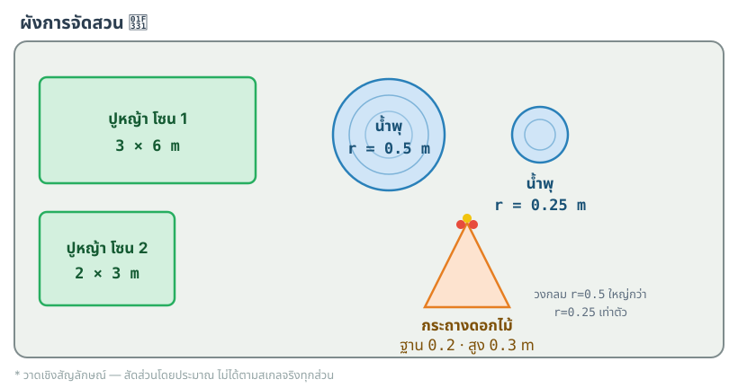
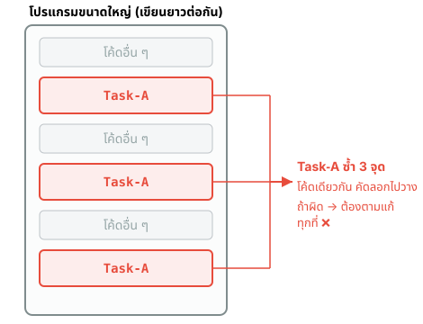
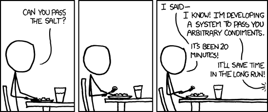
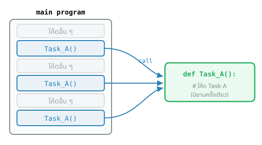
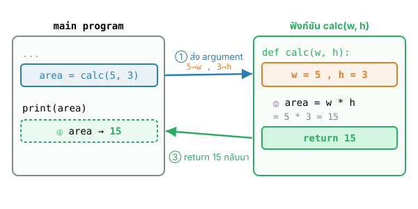
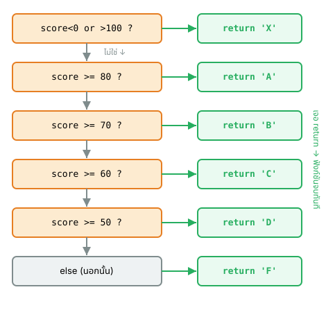
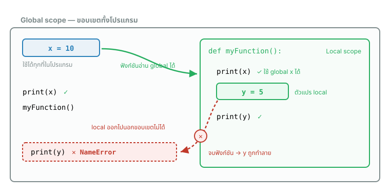
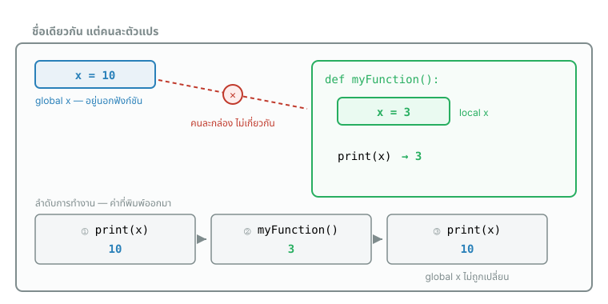

## {#topics-slide .center}

:::: {.columns}
::: {.column width="50%"}

### วันนี้เราจะเรียนรู้ 🚀

::: {.incremental}
1. ปัญหาในการพัฒนาโปรแกรม**ขนาดใหญ่**
2. **ฟังก์ชันคืออะไร** (What is function?)
3. การ**นิยาม**ฟังก์ชัน (Function definition)
4. การ**ใช้งาน**ฟังก์ชัน (Function call)
5. **ขอบเขต**การใช้งานตัวแปร (Scope of variables)
:::

:::
::: {.column width="50%"}

```python
def area_circle(radius):
    return 3.14 * radius * radius

# main program
print("Area:", area_circle(7))
```

```{.python .code-output}
Area: 153.86
```

:::
::::

# เริ่มจากปัญหา 🤔 {background-color="#2c3e50" .white-text}

ลองเขียนโปรแกรมแบบยังไม่มีฟังก์ชันกันก่อน

## โจทย์ #1 {.exercise}

ให้เขียนโค้ดเพื่อคำนวณพื้นที่ของ**สี่เหลี่ยม**, **วงกลม**, **สามเหลี่ยม** โดยใช้ค่าที่กำหนดให้ แล้วแสดงผลออกมา ดังนี้

```
Area of rectangle: (พื้นที่)
Area of circle: (พื้นที่)
Area of triangle: (พื้นที่)
```

::: {.callout-tip}
พื้นที่วงกลม = $\pi r^2$ (ใช้ $\pi \approx 3.14$) · พื้นที่สามเหลี่ยม = $\tfrac{1}{2} \times \text{ฐาน} \times \text{สูง}$
:::

## โจทย์ #1 (ต่อ) {.exercise}

::: {.panel-tabset}

### Live Code

```{pyodide}
#| autorun: false
# Calculating the area of a rectangle
length_rect = 10
width_rect = 5
area_rect = length_rect ____ width_rect
print("Area of rectangle:", area_rect)

# Calculating the area of a circle
radius_circle = 7
area_circle = 3.14 ____ radius_circle ____ radius_circle
print("Area of circle:", area_circle)

# Calculating the area of a triangle
base_triangle = 6
height_triangle = 4
area_triangle = ____ * base_triangle * height_triangle
print("Area of triangle:", area_triangle)
```

### Solution

```python
# Calculating the area of a rectangle
length_rect = 10
width_rect = 5
area_rect = length_rect * width_rect
print("Area of rectangle:", area_rect)

# Calculating the area of a circle
radius_circle = 7
area_circle = 3.14 * radius_circle * radius_circle
print("Area of circle:", area_circle)

# Calculating the area of a triangle
base_triangle = 6
height_triangle = 4
area_triangle = 0.5 * base_triangle * height_triangle
print("Area of triangle:", area_triangle)
```

```{.python .code-output}
Area of rectangle: 50
Area of circle: 153.86
Area of triangle: 12.0
```

:::

## โจทย์ #2 {.exercise}

:::: {.columns}
::: {.column width="45%"}

เขียนโปรแกรมคำนวณพื้นที่ที่ต้องใช้สำหรับการ**จัดสวน** ประกอบด้วย

- **ปูหญ้า** (สี่เหลี่ยม) 2 โซน ขนาด `2x3` m. กับ `3x6` m.
- **น้ำพุ** (วงกลม) 2 อัน รัศมี `0.5` m. กับ `0.25` m.
- **กระถางดอกไม้** (สามเหลี่ยม) 1 อัน ฐาน `0.2` m. สูง `0.3` m.

หา**ผลรวม**ของพื้นที่ทั้งหมด แล้วแสดงผลดังนี้

```
Total Area: (พื้นที่ทั้งหมด)
```

:::
::: {.column width="55%"}

{height="500px" fig-align="center"}

:::
::::

## โจทย์ #2 (ต่อ) {.exercise}

::: {.panel-tabset}

### Live Code

```{pyodide}
#| autorun: false
# grass zones (rectangle) + fountains (circle) + flower pot (triangle)
total_area = (2*3) + (3*6) \
           + 3.14*0.5____2 + 3.14*0.25____2 \
           + 0.5*0.2*0.3
print("Total Area:", ____)
```

### Solution

```python
total_area = (2*3) + (3*6) \
           + 3.14*0.5**2 + 3.14*0.25**2 \
           + 0.5*0.2*0.3
print("Total Area:", total_area)
```

```{.python .code-output}
Total Area: 25.01125
```

:::

::: {.callout-note}
ทบทวน: [Arithmetic operators (`**`) (Module 3)](module03a.html#m3-arithmetic)
:::

## โจทย์ #3 {.exercise}

เหมือนโจทย์ #2 แต่ปรับ landscape เป็นดังนี้

- **ปูหญ้า** 1 โซน ขนาด `4x8` m.
- **น้ำพุ** 3 อัน รัศมี `0.3` m. , `0.8` m. , `1` m.
- **กระถางดอกไม้** 1 อัน ฐาน `0.21` m. สูง `0.13` m.

. . .

**คิดก่อน:** ต้องแก้ไขโค้ดกี่จุด? ถ้าสูตรพื้นที่วงกลมผิด ต้องตามแก้ทุกที่ที่คำนวณวงกลมเลยไหม?

## โจทย์ #3 (ต่อ) {.exercise}

::: {.panel-tabset}

### Live Code

```{pyodide}
#| autorun: false
total_area = (4*8) \
           + 3.14*0.3**2 + 3.14*0.8**2 + 3.14*1**2 \
           + 0.5*0.21*0.13
print("Total Area:", ____)
```

### Solution

```python
total_area = (4*8) \
           + 3.14*0.3**2 + 3.14*0.8**2 + 3.14*1**2 \
           + 0.5*0.21*0.13
print("Total Area:", total_area)
```

```{.python .code-output}
Total Area: 37.44585
```

:::

::: {.callout-important}
เห็นไหมว่าสูตรพื้นที่เดิม ๆ ถูก**คัดลอกซ้ำ ๆ** หลายจุด → เดี๋ยวเราจะแก้ปัญหานี้ด้วย **ฟังก์ชัน**
:::

## ปัญหาในการพัฒนาโปรแกรมขนาดใหญ่ {#m9-problem}

::: {.incremental}
- การเขียนโค้ดจำนวนมากต่อเนื่องกันไปเรื่อย ๆ มีโอกาส**ผิดพลาดได้สูง**
- การตรวจสอบความผิดพลาด (**debug**) ทำได้ยากขึ้น
- อาจมีการ**คัดลอก (copy)** โค้ดเพื่อการทำงานลักษณะเดียวกันไปใช้หลายจุดในโปรแกรม
  - เกิดความ**ซ้ำซ้อน**ของโค้ด (redundancy)
  - ถ้าโค้ดผิดพลาด ต้อง**ตามแก้ไขในทุก ๆ จุด**ที่มีการใช้งานโค้ดดังกล่าว
:::

## โค้ดที่ทำงานซ้ำ ๆ {#m9-redundancy}

{width="560px" fig-align="center"}

Task-A ถูกเขียนซ้ำหลายจุด → ถ้าต้องแก้ ต้องแก้ทุกที่

## พักสมอง 😄 {#m9-xkcd .center}

แต่ก็อย่า **generalize** จนเกินพอดี 😅

{height="380px" fig-align="center"}

::: {style="font-size:0.5em"}
ที่มา: [xkcd #974 — "The General Problem"](https://xkcd.com/974/) (CC BY-NC 2.5)
:::

# โปรแกรมที่ใช้งานฟังก์ชัน 🧩 {background-color="#2c3e50" .white-text}

แยกงานซ้ำ ๆ ออกมาเป็นฟังก์ชัน แล้วเรียกใช้ซ้ำได้

## แนวคิดของฟังก์ชัน {#m9-idea}

{width="680px" fig-align="center"}

::: {.incremental}
- แบ่งงานทั้งหมดออกเป็นโปรแกรมเล็ก ๆ หลายส่วน เรียกว่า **ฟังก์ชัน (function)**
- **เรียกใช้งานโค้ดของฟังก์ชันเดียวกัน** ซ้ำได้ (แทนการคัดลอกโค้ด)
- แก้โค้ดของฟังก์ชัน **จุดเดียว** → ทุกที่ที่เรียกใช้ได้ผลลัพธ์ใหม่ทันที
:::

## ประโยชน์ของฟังก์ชัน {#m9-benefits}

::: {.incremental}
- การพัฒนาฟังก์ชันซึ่งมีขนาดไม่ใหญ่ทำได้**ง่ายกว่า** มีโอกาสผิดพลาด**น้อยกว่า**
- มีการ**เรียกใช้งานโค้ดของฟังก์ชันเดียวกัน** เมื่อต้องการประมวลผลลักษณะเดียวกัน
- **โปรแกรมหลัก (main program)** คือโค้ดส่วนที่โปรแกรมเริ่มต้นและสิ้นสุดการทำงาน
  - มีการ**เรียกใช้งานฟังก์ชัน (function call)** เมื่อต้องการผลลัพธ์บางอย่าง
  - เมื่อฟังก์ชันทำงานเสร็จ จะ**คืนค่าผลลัพธ์ (return)** กลับมายังโค้ดที่เรียกใช้
- ฟังก์ชันหนึ่ง ๆ อาจมีการ**เรียกใช้ฟังก์ชันอื่น ๆ** ต่อได้
:::

# ฟังก์ชันคืออะไร 🔎 {background-color="#2c3e50" .white-text}

What is a function?

## ฟังก์ชันคืออะไร (What is function?) {#m9-what-is-function}

- **ฟังก์ชัน (function)** คือโปรแกรมย่อย ซึ่งเป็นกลุ่มของชุดคำสั่ง (statement) ที่ประมวลผลเพื่อให้เกิดผลลัพธ์บางอย่างที่ต้องการ
- การแบ่งส่วนโค้ดจาก**โปรแกรมหลัก (main program)** เพื่อสร้างเป็นฟังก์ชันทำได้หลายรูปแบบ ขึ้นอยู่กับผู้พัฒนา

. . .

แบ่งประเภทของฟังก์ชันแบบกว้าง ๆ ได้ 2 กลุ่ม

:::: {.columns}
::: {.column width="50%" .fragment}
**Built-in functions**

มาพร้อมกับภาษา หรือติดตั้งเพิ่มเติม

```python
print(), input(), math.sin(),
sum(), random.randint(), ...
```
:::
::: {.column width="50%" .fragment}
**User-defined functions**

ฟังก์ชันที่เราพัฒนาเอง

```python
bmiCalculation(),
gpaxCalculation(), ...
```
:::
::::

## การนิยามฟังก์ชัน (Function definition) {#m9-definition}

การกำหนดและตั้งชื่อให้กับกลุ่มของชุดคำสั่งที่ทำงานร่วมกัน อยู่ในรูปแบบ

```python
def function_name( parameter_list ):
    # โค้ดของฟังก์ชัน มีการย่อหน้าอย่างเหมาะสม
    statement_1
    statement_2
    ...
    result = ...    # ตัวแปรที่เก็บค่าผลลัพธ์
    return result   # ส่งค่าผลลัพธ์คืนให้โค้ดที่เรียกใช้ฟังก์ชัน
```

::: {.incremental}
- `def` คือ **คีย์เวิร์ด**สำหรับการนิยามฟังก์ชัน
- `function_name` คือ **ชื่อฟังก์ชัน** ซึ่งเป็นไปตามกฎการตั้งชื่อ
- `parameter_list` คือ **รายการข้อมูลที่ต้องส่งให้ฟังก์ชัน** ฟังก์ชันจึงจะทำงานได้ **(อินพุต)**
- `result` คือ **ตัวแปรเก็บผลลัพธ์** ซึ่งจะถูกส่งคืนด้วยคำสั่ง `return` **(เอาต์พุต)**
:::

## นิยามก่อน แล้วจึงเรียกใช้ {#m9-def-placement}

**การนิยามฟังก์ชัน** ต้องทำไว้**ก่อน**บรรทัดที่จะเรียกใช้งานฟังก์ชันนั้นเสมอ (หลักการเดียวกับการประกาศตัวแปรก่อนใช้)

:::: {.columns}
::: {.column width="46%"}
```python
1   # Function definition
2   def functionA(x, y, z):
3       statement_1
4       ...
5       result = ...
6       return result   
7   # end-of-function definition
8
9   # Main program
10  print('Program starts here!!!')
11  n = int(input('Enter data: '))
12
13  # Function call
14  y = functionA(n, 10, [2.5, 2.0])
15  print(f'Result: {y:.2f}')
```
:::
::: {.column width="53%"}

[**ลำดับการทำงาน**]{#m9-def-order}

::: {.incremental style="font-size:0.7em"}
- Python interpreter เริ่มอ่านโค้ดจากบรรทัดแรกของไฟล์
- Python **ทำความรู้จัก**ฟังก์ชันที่ประกาศไว้ แต่ยัง**ไม่ประมวลผล** (ยังไม่รัน)
- Python เริ่มประมวลผล(รัน)โค้ดใน**ส่วนโปรแกรมหลัก**เสมอ
- เมื่อพบการ**เรียกใช้ฟังก์ชัน** `functionA()` ใน `บรรทัดที่ 14` จึงเริ่มประมวลผลฟังก์ชัน
  - เริ่มรันโค้ดของฟังก์ชัน (`บรรทัดที่ 2-6`) โดย `x=n`, `y=10`, `z=[2.5, 2.0]`
  - เมื่อจบการทำงาน **ผลลัพธ์**ใน `result` จะถูกส่งไปให้ตัวแปร `y` ในโปรแกรมหลัก
:::

:::
::::

# ฟังก์ชันที่รับพารามิเตอร์ และคืนค่า 📥📤 {background-color="#2c3e50" .white-text}

มีทั้งอินพุต (parameter) และเอาต์พุต (return)

## โจทย์ #4 {.exercise}

ให้เขียน**ฟังก์ชัน**เพื่อคำนวณพื้นที่ของสี่เหลี่ยม, วงกลม, สามเหลี่ยม ตั้งชื่อว่า `area_rectangle`, `area_circle`, `area_triangle`

แต่ละฟังก์ชันรับ**พารามิเตอร์**ที่ต้องใช้คำนวณ แล้ว**คืนค่า (return)** พื้นที่ออกมา

. . .

จากนั้นเรียกใช้ฟังก์ชันเพื่อแสดงผล

```
Area of rectangle: (พื้นที่)
Area of circle: (พื้นที่)
Area of triangle: (พื้นที่)
```

## โจทย์ #4 (ต่อ) {.exercise}

::: {.panel-tabset}

### Live Code

```{pyodide}
#| autorun: false
def area_rectangle(length, width):
    return length ____ width

def area_circle(radius):
    return 3.14 ____ radius ____ radius

def area_triangle(base, height):
    return ____ * base * height

# Using functions
print("Area of rectangle:", area_rectangle(10, 5))
print("Area of circle:", area_circle(____))
print("Area of triangle:", area_triangle(6, 4))
```

### Solution

```python
def area_rectangle(length, width):
    return length * width

def area_circle(radius):
    return 3.14 * radius * radius

def area_triangle(base, height):
    return 0.5 * base * height

# Using functions
print("Area of rectangle:", area_rectangle(10, 5))
print("Area of circle:", area_circle(7))
print("Area of triangle:", area_triangle(6, 4))
```

```{.python .code-output}
Area of rectangle: 50
Area of circle: 153.86
Area of triangle: 12.0
```

:::

## โจทย์ #5 {.exercise}

ทำโจทย์เดียวกับ #2 (จัดสวน) แต่รอบนี้ให้ใช้**ฟังก์ชัน**คำนวณพื้นที่ที่เขียนเองจาก #4

- ปูหญ้า 2 โซน `2x3` m. กับ `3x6` m.
- น้ำพุ 2 อัน รัศมี `0.5` m. กับ `0.25` m.
- กระถางดอกไม้ 1 อัน ฐาน `0.2` m. สูง `0.3` m.

. . .

หาผลรวมพื้นที่ทั้งหมด แล้วแสดง `Total Area: (พื้นที่ทั้งหมด)`

## โจทย์ #5 (ต่อ) {.exercise}

::: {.panel-tabset}

### Live Code

```{pyodide}
#| autorun: false
def area_rectangle(length, width):
    return length * width

def area_circle(radius):
    return 3.14 * radius * radius

def area_triangle(base, height):
    return 0.5 * base * height

# Using functions
total_area = area_rectangle(2, 3) + area_rectangle(3, 6) \
           + area_circle(0.5) + area_circle(____) \
           + area_triangle(0.2, 0.3)
print("Total Area:", total_area)
```

### Solution

```python
def area_rectangle(length, width):
    return length * width

def area_circle(radius):
    return 3.14 * radius * radius

def area_triangle(base, height):
    return 0.5 * base * height

total_area = area_rectangle(2, 3) + area_rectangle(3, 6) \
           + area_circle(0.5) + area_circle(0.25) \
           + area_triangle(0.2, 0.3)
print("Total Area:", total_area)
```

```{.python .code-output}
Total Area: 25.01125
```

:::

::: {.callout-tip}
ผลลัพธ์เท่ากับ #2 แต่โค้ด**อ่านง่ายกว่า** และถ้าสูตรพื้นที่ผิด แก้แค่ในฟังก์ชัน**จุดเดียว**
:::

## คืนค่าผลลัพธ์มากกว่า 1 ค่า {#m9-multi-return}

ฟังก์ชัน `mySumAvg` — รับ 3 ตัว (`x, y, z`) และ**คืนค่า 2 ตัว** (`sm`, `avg`)

```python
def mySumAvg(x, y, z):
    sm = x + y + z
    avg = sm / 3
    return sm, avg       # คืนค่า 2 ค่า

# Main Program
s, a = mySumAvg(10, 20, 30)     # รับค่า 2 ตัวพร้อมกัน
print(f'sum:{s:.2f}, average:{a:.2f}')
```

```{.python .code-output}
sum:60.00, average:20.00
```

::: {.callout-note}
ทบทวน: [f-string format spec `:.2f` (Module 3)](module03b.html#m3-fstring-format)
:::

## คืนค่าเป็น List {#m9-return-list}

ฟังก์ชัน `mySumAvg2` — รับ **List 1 ตัว** (`data`) และคืนค่าเป็น **List** ที่สร้างจาก `sm` และ `avg`

```python
def mySumAvg2(data):
    sm = sum(data)
    avg = sm / len(data)
    return [sm, avg]     # คืนค่าเป็น list

# Main program
s, a = mySumAvg2([100, 200, 300])
print(f'sum:{s:.2f}, average:{a:.2f}')
```

```{.python .code-output}
sum:600.00, average:200.00
```

::: {.callout-note}
ทบทวน: [List (Module 4)](module04a.html#m4-list)
:::

## โจทย์ #6 {.exercise-think}

เขียนฟังก์ชันคำนวณ**พื้นที่**และ**เส้นรอบรูป**ของส่วนประกอบต่าง ๆ ในสวน (ค่าเหมือน #5)

. . .

**คิดก่อน:** จะออกแบบฟังก์ชันให้คืน**ทั้ง 2 ค่า** (area, perimeter) พร้อมกันอย่างไร?

. . .

แสดงผล

```
Total Area: (พื้นที่ทั้งหมด)
Total Perimeter: (เส้นรอบรูปทั้งหมด)
```

::: {.callout-tip}
เส้นรอบรูปวงกลม = $2\pi r$ · สี่เหลี่ยม = $2(l+w)$ · สามเหลี่ยมมุมฉาก = $b + h + \sqrt{b^2+h^2}$
:::

## โจทย์ #6 (ต่อ) {.exercise-think}

::: {.panel-tabset}

### Live Code

```{pyodide}
#| autorun: false
def rectangle(length, width):
    area = length * width
    perimeter = 2 * (length + width)
    return area, perimeter          # คืน 2 ค่า

def circle(radius):
    area = 3.14 * radius * radius
    perimeter = 2 * 3.14 * radius
    return area, perimeter

def triangle(base, height):
    area = 0.5 * base * height
    perimeter = base + height + (base**2 + height**2)____0.5
    return area, perimeter

parts = [rectangle(2, 3), rectangle(3, 6),
         circle(0.5), circle(0.25), triangle(0.2, 0.3)]

total_area = 0
total_peri = 0
for a, p in parts:
    total_area ____ a
    total_peri ____ p

print("Total Area:", total_area)
print("Total Perimeter:", total_peri)
```

### Solution

```python
def rectangle(length, width):
    area = length * width
    perimeter = 2 * (length + width)
    return area, perimeter

def circle(radius):
    area = 3.14 * radius * radius
    perimeter = 2 * 3.14 * radius
    return area, perimeter

def triangle(base, height):
    area = 0.5 * base * height
    perimeter = base + height + (base**2 + height**2)**0.5
    return area, perimeter

parts = [rectangle(2, 3), rectangle(3, 6),
         circle(0.5), circle(0.25), triangle(0.2, 0.3)]

total_area = 0
total_peri = 0
for a, p in parts:
    total_area += a
    total_peri += p

print("Total Area:", total_area)
print("Total Perimeter:", total_peri)
```

```{.python .code-output}
Total Area: 25.01125
Total Perimeter: 33.5705551275464
```

:::

::: {.callout-note}
ทบทวน: [for-loop (Module 7)](module07.html#m7-for) · [Assignment operators (`+=`) (Module 3)](module03a.html#m3-arithmetic)
:::

# รูปแบบอื่น ๆ ของฟังก์ชัน 🧰 {background-color="#2c3e50" .white-text}

ฟังก์ชันไม่จำเป็นต้องมี return หรือ parameter เสมอไป

## รับพารามิเตอร์ แต่ไม่คืนค่า {#m9-no-return}

`calculateEquation` — รับ `x, y` แต่**ไม่มี `return`** (พิมพ์ผลลัพธ์อยู่ภายในฟังก์ชันเอง)

```python
def calculateEquation(x, y):
    z = x**2 + 2*x*y + y**2
    print(f'({x}+{y})^2 = {z}')
```

. . .

```python
# Main program
a, b = input().split()          # เช่น ป้อน:  2 3
a = float(a); b = float(b)
calculateEquation(a, b)
calculateEquation(20.0, 30.0)
```

```{.python .code-output}
(2.0+3.0)^2 = 25.0
(20.0+30.0)^2 = 2500.0
```

::: {.callout-note}
ทบทวน: [`input().split()` (Module 3)](module03b.html#m3-split)
:::

## เรียกฟังก์ชันซ้ำ ๆ ใน loop {#m9-call-in-loop}

เมื่อมีฟังก์ชันแล้ว การเรียกใช้ซ้ำ ๆ ทำได้ง่ายด้วย for-loop

```python
for i in range(10):
    calculateEquation(i+1, 10*i)
```

```{.python .code-output}
(1+0)^2 = 1
(2+10)^2 = 144
(3+20)^2 = 529
(4+30)^2 = 1156
(5+40)^2 = 2025
(6+50)^2 = 3136
(7+60)^2 = 4489
(8+70)^2 = 6084
(9+80)^2 = 7921
(10+90)^2 = 10000
```

## ไม่รับพารามิเตอร์ และไม่คืนค่า {#m9-no-param}

`printLine` — **ไม่มีพารามิเตอร์** และ**ไม่คืนค่า** ใช้พิมพ์เส้นคั่นซ้ำ ๆ

:::: {.columns}
::: {.column width="48%"}
```python
def printLine():
    print("\n-----------------------")

# Main program
N = 5      # int(input("Enter N: "))
printLine()
for i in range(N):
    print(i, end=" ")
printLine()
for j in range(N):
    print(2*j+1, end=" ")
printLine()
for k in range(N):
    print(k*k, end=" ")
printLine()
```
:::
::: {.column width="52%"}
```{.python .code-output}

-----------------------
0 1 2 3 4
-----------------------
1 3 5 7 9
-----------------------
0 1 4 9 16
-----------------------
```
:::
::::

# การส่งค่าและการคืนค่า 🔄 {background-color="#2c3e50" .white-text}

Parameter passing & return value

## ขั้นตอนการส่งค่าและคืนค่า {#m9-param-passing}

{width="820px" fig-align="center"}

**call** ส่งพารามิเตอร์เข้าฟังก์ชัน → ฟังก์ชันทำงาน → **return** คืนค่ากลับมายังโปรแกรมหลัก

## ตัวอย่าง: 2 ฟังก์ชันในโปรแกรมเดียว {#m9-example-graphic}

- **`myPrintString(cnt)`** — รับ `cnt`, รับข้อความจากผู้ใช้ แล้ววนพิมพ์ข้อความ `cnt` รอบ
- **`myGraphic(ch, cnt)`** — รับ `ch`, `cnt`; for-loop ด้านนอกขึ้นบรรทัดใหม่, ด้านในพิมพ์ตามเงื่อนไข

:::: {.columns}
::: {.column width="48%"}
```python
def myPrintString(cnt):
    i = 0
    print("------ myPrintString ------")
    str = input("Enter string: ")
    while i < cnt:
        i = i + 1
        print(f"\t{i}. {str}")
    print("---- End myPrintString ----")
```
:::
::: {.column width="52%"}
```python
def myGraphic(ch, cnt):
    print("------ myGraphic ------")
    for i in range(cnt):
        for j in range(cnt):
            if (i+j) % 2 != 0:
                print(ch, end=" ")
            else:
                print(i+j, end=" ")
        print()
    print("---- End myGraphic ----")
```
:::
::::

## ตัวอย่าง: การเรียกใช้และผลลัพธ์ {#m9-example-graphic-run}

:::: {.columns}
::: {.column width="48%"}
```python
# Main Program
N = 3       # int(input("Enter N: "))
myPrintString(N)      # str = "Hello"

ch = "*"    # input("Enter a character: ")
myGraphic(ch, N)
```

::: {.callout-note}
ทบทวน: [while-loop (Module 6)](module06.html#m6-while) · [for-loop (Module 7)](module07.html#m7-for)
:::
:::
::: {.column width="52%"}
```{.python .code-output}
------ myPrintString ------
	1. Hello
	2. Hello
	3. Hello
---- End myPrintString ----
------ myGraphic ------
0 * 2
* 2 *
2 * 4
---- End myGraphic ----
```
:::
::::

## ฟังก์ชันที่มี `return` หลายแห่ง {#m9-multiple-return}

:::: {.columns}
::: {.column width="45%"}

- **ฟังก์ชันจะจบการทำงาน และส่งค่าคืนทันที** เมื่อทำงานไปจนพบคำสั่ง `return`
- ฟังก์ชันจะจบที่บรรทัดใด ขึ้นอยู่กับค่าตัวแปร `score`

:::
::: {.column width="55%"}

{height="580px" fig-align="center"}

:::
::::

## `return` หลายแห่ง: การเรียกใช้และผลลัพธ์ {#m9-multiple-return-run}

:::: {.columns}
::: {.column width="48%"}
```python
def myGrade(score):
    if score < 0 or score > 100:
        print("Invalid score!:", score)
        return 'X'
    elif score >= 80: return 'A'
    elif score >= 70: return 'B'
    elif score >= 60: return 'C'
    elif score >= 50: return 'D'
    else: return 'F'

# Main program
scores = [78, 92, 48, 75, 155, 75]
grades = []
for s in scores:
    grades.append(myGrade(s))   # เก็บค่าที่ return
```
:::
::: {.column width="52%"}
```python
for i in range(len(scores)):
    print(f"Student#{i+1} ({scores[i]}) "
          f"gets {grades[i]}")
```

```{.python .code-output}
Invalid score!: 155
Student#1 (78) gets B
Student#2 (92) gets A
Student#3 (48) gets F
Student#4 (75) gets B
Student#5 (155) gets X
Student#6 (75) gets B
```
:::
::::

::: {.callout-note}
ทบทวน: [if-elif-else (Module 5)](module05.html#m5-if-else) · [list (Module 4a)](module04a.html#m4-list)
:::

## `return` vs พิมพ์ในฟังก์ชัน {#m9-return-vs-print}

:::: {.columns}
::: {.column width="50%"}
**แบบ A — `return` ค่ากลับไป**

```python
def myGrade(score):
    if score < 0 or score > 100:
        return 'X'
    elif score >= 80: return 'A'
    elif score >= 70: return 'B'
    elif score >= 60: return 'C'
    elif score >= 50: return 'D'
    else: return 'F'
```

ฟังก์ชัน**ส่งเกรดกลับ** — ไม่พิมพ์อะไรเลย
:::
::: {.column width="50%"}
**แบบ B — assign แล้ว `print` ในฟังก์ชัน**

```python
def showGrade(score):
    if score < 0 or score > 100:
        grade = 'X'
    elif score >= 80: grade = 'A'
    elif score >= 70: grade = 'B'
    elif score >= 60: grade = 'C'
    elif score >= 50: grade = 'D'
    else: grade = 'F'
    print(grade)      # พิมพ์ทิ้งไปเลย
```

ฟังก์ชัน**พิมพ์เอง** — ไม่ส่งค่ากลับ
:::
::::

## ต่างกันตอนเอาไปใช้ต่อ {#m9-return-vs-print-run}

:::: {.columns}
::: {.column width="50%"}
```python
g = myGrade(92)          # g = 'A'
print(f"Grade: {g}")
if g == 'A':
    print("Excellent!")
```

```{.python .code-output}
Grade: A
Excellent!
```

✅ ค่าถูกเก็บใน `g` → **เอาไปคิดต่อได้**
:::
::: {.column width="50%"}
```python
g = showGrade(92)        # พิมพ์ A ทันที
print(f"Grade: {g}")
if g == 'A':
    print("Excellent!")
```

```{.python .code-output}
A
Grade: None
```

❌ ฟังก์ชันไม่มี `return` → `g` เป็น `None`
:::
::::

. . .

::: {.callout-important}
ฟังก์ชันที่ไม่มี `return` จะคืนค่า **`None`** เสมอ — เอาไปเก็บ ไปเทียบ หรือไปคำนวณต่อไม่ได้
:::

::: {.callout-tip}
**หลักคิด:** ให้ฟังก์ชัน**คำนวณแล้ว `return`** ส่วนการ `print` ปล่อยให้โปรแกรมหลักตัดสินใจเอง — ฟังก์ชันแบบนี้นำกลับมาใช้ซ้ำได้มากกว่า
:::

## ระวัง: ลืมวงเล็บ `()` {#m9-call-no-paren}

**เขียนแค่ชื่อฟังก์ชัน = ยังไม่ได้เรียกใช้** — ต้องมี `()` ต่อท้ายเสมอ

:::: {.columns}
::: {.column width="50%"}
```python
g = myGrade(92)     # มี ()
print(g)
```

```{.python .code-output}
A
```

✅ ฟังก์ชัน**ทำงาน** → `g` เก็บค่าที่ `return`
:::
::: {.column width="50%"}
```python
g = myGrade         # ลืม ()
print(g)
```

```{.python .code-output}
<function myGrade at 0x7330...>
```

❌ ฟังก์ชัน**ไม่ทำงาน** → `g` คือ**ตัวฟังก์ชันเอง**
:::
::::

. . .

::: {.callout-warning}
เขียน `printLine` เฉย ๆ ก็**ไม่มีอะไรเกิดขึ้น** และ**ไม่ฟ้อง error** ด้วย — ต้องเขียน `printLine()` เท่านั้น
:::

## ระวัง: ลืมวงเล็บ `()` (ต่อ) {.exercise-think}

**คิดก่อน:** โค้ดนี้พิมพ์อะไรออกมา?

```python
def myGrade(score):
    if score >= 80: return 'A'
    else: return 'F'

g = myGrade
if g == 'A':
    print("Excellent!")
else:
    print("Not an A")
```

<details><summary>เฉลย</summary>

พิมพ์ `Not an A` — เพราะ `g` เป็น**ตัวฟังก์ชัน** ไม่ใช่ `'A'` โปรแกรม**ไม่ error** แต่ผลลัพธ์**ผิด** → บั๊กแบบนี้หายาก ต้องระวังตอนเขียน

</details>

# ขอบเขตตัวแปร (Scope) 🔒 {background-color="#2c3e50" .white-text}

Local vs Global variables

## ขอบเขตในการเรียกใช้งานตัวแปร {#m9-scope}

:::: {.columns}
::: {.column width="50%" .fragment}
**ตัวแปรภายใน (Local Variable)**

- ประกาศ**ภายใน** function หรือ iteration
- เรียกใช้ได้**เฉพาะภายในขอบเขต**ที่ถูกสร้างขึ้นเท่านั้น
- ถูก**ทำลาย**เมื่อขอบเขตนั้นสิ้นสุดการทำงาน
:::
::: {.column width="50%" .fragment}
**ตัวแปรภายนอก (Global Variable)**

- ประกาศ**ภายนอก**ขอบเขตของทุก ๆ function
- เรียกใช้ได้**ทุกที่**ในโปรแกรม (ตั้งแต่บรรทัดที่ประกาศ)
- **คงอยู่**ตลอดการทำงานของโปรแกรม
:::
::::

## ภาพรวม: กล่องซ้อนกล่อง {#m9-scope-diagram}

{width="820px" fig-align="center"}

**ในมองออกได้ · นอกมองเข้าไม่ได้** — ฟังก์ชันอ่าน global ได้ แต่ตัวแปร local ออกนอกฟังก์ชันไม่ได้

## ตัวอย่าง I: global x, local y {#m9-scope-1}

- `x` เป็น **Global** (ประกาศนอกทุกฟังก์ชัน) → เรียกใช้ในฟังก์ชันได้
- `y` เป็น **Local** ของ `myFunction()` → รู้จักเฉพาะในฟังก์ชันนี้

:::: {.columns}
::: {.column width="55%"}
```python
# Global x
x = 10

def myFunction():
    print("myFunction():x", x)   # ใช้ global x
    y = 5                        # local y
    print("myFunction():y", y)

print(x)
myFunction()
```
:::
::: {.column width="45%"}
```{.python .code-output}
10
myFunction():x 10
myFunction():y 5
```
:::
::::

## ตัวอย่าง II: ใช้ local นอกฟังก์ชัน → Error {#m9-scope-2}

- `y1` เป็น **Local** ของ `myFunction()` → เรียกใช้**นอก**ฟังก์ชันไม่ได้

:::: {.columns}
::: {.column width="55%"}
```python
x = 10

def myFunction():
    print("myFunction():x", x)
    y1 = 5                       # local
    print("myFunction():y", y1)

print(x)
myFunction()
print(y1)      # พิมพ์ y1 นอกฟังก์ชัน
```
:::
::: {.column width="45%"}
```{.python .code-output}
10
myFunction():x 10
myFunction():y 5
NameError: name 'y1' is not
defined
```
:::
::::

## ตัวอย่าง III: ชื่อซ้ำ แต่คนละตัว {#m9-scope-3}

- `x` บรรทัดนอกฟังก์ชัน เป็น **Global** ; `x` ในฟังก์ชันเป็น **Local** (คนละตัว ไม่เกี่ยวกัน)

:::: {.columns}
::: {.column width="55%"}
```python
# Global x
x = 10
def myFunction():
    x = 3                    # local x
    print("myFunction():x", x)

print(x)          # global
myFunction()      # local
print(x)          # global เหมือนเดิม
```
:::
::: {.column width="45%"}
```{.python .code-output}
10
myFunction():x 3
10
```
:::
::::

## ทำไม `x` ถึงไม่เปลี่ยน? {#m9-scope-shadow}

{width="820px" fig-align="center"}

`x = 3` ในฟังก์ชัน **สร้างตัวแปรใหม่** ในขอบเขตของฟังก์ชัน — ไม่ได้ไปแก้ global `x`

## ตัวอย่าง IV: parameter ก็เป็น local {#m9-scope-4}

- `x` ที่เป็น **parameter** ก็เป็น **Local** ของฟังก์ชัน (คนละตัวกับ global `x`)
- การเปลี่ยนค่า global `x` เกิดขึ้นตอน `x = myFunction(x)` **นอก**ฟังก์ชัน

:::: {.columns}
::: {.column width="55%"}
```python
# Global x
x = 10
def myFunction(x):
    x = x + 3                # local x
    print("myFunction():x", x)
    return x * 2

print(x)
x = myFunction(x)            # อัปเดต global x
print(x)
```
:::
::: {.column width="45%"}
```{.python .code-output}
10
myFunction():x 13
26
```
:::
::::

# Summary 🎯 {background-color="#2c3e50" .white-text}

## สรุป Module 9 🎉 {.smaller}

:::: {.columns}
::: {.column width="50%"}

**ฟังก์ชัน (Function)**

- กลุ่มของชุดคำสั่งที่ทำงานด้วยกันเพื่อผลลัพธ์ที่ต้องการ
- **built-in** (`print`, `sum`, …) และ **user-defined**
- ช่วยลด**ความซ้ำซ้อน** แก้จุดเดียวมีผลทุกที่

**นิยาม & เรียกใช้**

- `def name(params):` … `return result`
- ต้อง**นิยามก่อน**บรรทัดที่เรียกใช้
- **parameter** = อินพุต · **return** = เอาต์พุต

:::
::: {.column width="50%"}

**รูปแบบฟังก์ชัน**

- คืนค่า **1 ค่า / หลายค่า / list**
- มี/ไม่มี **parameter** · มี/ไม่มี **return**
- `return` ได้**หลายแห่ง** — จบทันทีที่พบ

**ขอบเขตตัวแปร (Scope)**

- **Local** — ใช้เฉพาะในฟังก์ชัน/iteration
- **Global** — ใช้ได้ทั้งโปรแกรม
- **parameter** ก็เป็น Local

::: {.callout-tip}
แบ่งโปรแกรมใหญ่เป็นฟังก์ชันเล็ก ๆ → เขียนง่าย, debug ง่าย, ใช้ซ้ำได้
:::

:::
::::

::: {.callout-note}
ต่อ Module 10: [List Comprehension และ 2D Arrays](module10.html) 👉
:::
