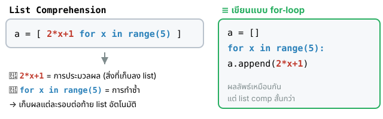
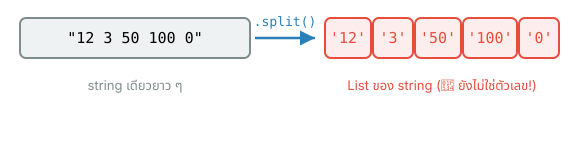
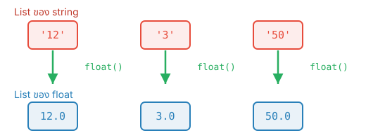
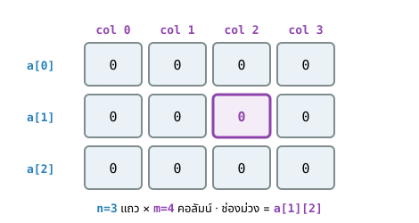

## {#topics-slide .center}

:::: {.columns}
::: {.column width="50%"}

### วันนี้เราจะเรียนรู้ 🚀

::: {.incremental}
1. การสร้าง List ของข้อมูลด้วย **Loop**
2. การสร้าง List ด้วย **List Comprehension**
3. การเพิ่ม**เงื่อนไข** และใช้ร่วมกับ**ฟังก์ชัน**
4. List แบบ **2 มิติ** (2D list)
:::

:::
::: {.column width="50%"}

```python
a = [ 2*i for i in range(10) ]
print(a)
```

```{.python .code-output}
[0, 2, 4, 6, 8, 10, 12, 14, 16, 18]
```

:::
::::

# สร้าง List ด้วย Loop 🔁 {background-color="#2c3e50" .white-text}

ทบทวน: สร้างรายการข้อมูลทีละ item ด้วยลูป

## การสร้าง List ด้วย Loop {#m10-list-with-loop}

ทำได้ด้วยการสร้างตัวแปรที่มีค่าเริ่มต้นเป็น **`empty list`** แล้วใช้ `For-loop` หรือ `While-loop` เพิ่ม item ใหม่ ๆ เข้าไปในแต่ละรอบ

```python
a = []                  # empty list
for i in range(10):
    a.append(2*i)       # เพิ่ม item ต่อท้ายในแต่ละรอบ
print(a)
```

::: {.callout-note}
ทบทวน: [List `.append()` (Module 8)](module08.html#m8-list-add) · [for-loop / `range()` (Module 7)](module07.html#m7-range)
:::

## โจทย์ #1.1 {.exercise}

ให้สร้าง list ที่มีหน้าตาแบบนี้ `[0, 2, 4, 6, 8, 10, 12, 14, 16, 18]` โดยใช้ **While-loop** เก็บไว้ในตัวแปรชื่อ `a` แล้วแสดงผล

::: {.panel-tabset}

### Live Code

```{pyodide}
#| autorun: false
a = []
i = 0
while i < 10:              # True ถ้า i=0,1,2,...,9
    a.append(____)         # เพิ่ม item ที่มีค่าเป็นเลขคู่
    i ____ 1
print(a)
```

### Solution

```python
a = []
i = 0
while i < 10:
    a.append(2*i)
    i += 1
print(a)
```

```{.python .code-output}
[0, 2, 4, 6, 8, 10, 12, 14, 16, 18]
```

:::

::: {.callout-note}
ทบทวน: [while-loop (Module 6)](module06.html#m6-while)
:::

## โจทย์ #1.2 {.exercise}

สร้าง list เดิม `[0, 2, 4, 6, 8, 10, 12, 14, 16, 18]` แต่รอบนี้ให้ใช้ **for-loop** เก็บในตัวแปร `a` แล้วแสดงผล

::: {.panel-tabset}

### Live Code

```{pyodide}
#| autorun: false
a = []
for i in range(____):     # i = 0,1,2,...,9
    a.append(____)        # a += [2*i] ก็ให้ผลเหมือนกัน
print(a)
```

### Solution

```python
a = []
for i in range(10):
    a.append(2*i)
    # a += [2*i]   # ให้ผลลัพธ์เหมือนบรรทัดด้านบน
print(a)
```

```{.python .code-output}
[0, 2, 4, 6, 8, 10, 12, 14, 16, 18]
```

:::

## โจทย์ #2 {.exercise}

กำหนดสมการ $f(x) = x^2 + 2x + 1$ โดยที่ $x = [0.5, 2.3, 5.0, 10, 20, 25]$

. . .

ให้หาค่า $f(x)$ เก็บเป็น**ทศนิยม 2 ตำแหน่ง** แล้วแสดงผล `f(x)`

::: {.panel-tabset}

### Live Code

```{pyodide}
#| autorun: false
xs = [0.5, 2.3, 5.0, 10, 20, 25]   # List ของข้อมูล x
fx = []                            # List สำหรับเก็บผลลัพธ์ f(x)

for x in xs:
    y = x**2 + 2*x + 1             # f(x) = x^2 + 2x + 1
    fx.append( ____(y, 2) )        # ปัดเป็นทศนิยม 2 ตำแหน่ง
print(fx)
```

### Solution

```python
xs = [0.5, 2.3, 5.0, 10, 20, 25]
fx = []

for x in xs:
    y = x**2 + 2*x + 1
    fx.append( round(y, 2) )
print(fx)
```

```{.python .code-output}
[2.25, 10.89, 36.0, 121, 441, 676]
```

:::

::: {.callout-note}
ทบทวน: [Arithmetic (`**`) (Module 3)](module03a.html#m3-arithmetic)
:::

## โจทย์ #3 {.exercise}

จากสมการเดิม $f(x) = x^2 + 2x + 1$ และ $x = [0.5, 2.3, 5.0, 10, 20, 25]$

. . .

ให้หาค่า $f(x)$ **เฉพาะเมื่อ $x > 3.0$** (เก็บเป็นทศนิยม 2 ตำแหน่ง) แล้วแสดงผล

::: {.panel-tabset}

### Live Code

```{pyodide}
#| autorun: false
xs = [0.5, 2.3, 5.0, 10, 20, 25]
ys = []

for x in xs:
    ____ x > 3.0:                 # ประมวลผลเมื่อ x > 3.0
        y = x**2 + 2*x + 1
        ys.append( round(y, 2) )
print(ys)
```

### Solution

```python
xs = [0.5, 2.3, 5.0, 10, 20, 25]
ys = []

for x in xs:
    if x > 3.0:
        y = x**2 + 2*x + 1
        ys.append( round(y, 2) )
print(ys)
```

```{.python .code-output}
[36.0, 121, 441, 676]
```

:::

::: {.callout-note}
ทบทวน: [if condition (Module 5)](module05.html#m5-if-else)
:::

## โจทย์ #4 {.exercise}

ให้สร้าง**ฟังก์ชัน**ประมวลผลลิสต์ `z` แล้วคืนผลลัพธ์เป็นลิสต์ `data`

::: {.incremental}
- **`myFunc1(z)`** — คำนวณ $x^2$ (ทศนิยม 2 ตำแหน่ง) ของทุก item
- **`myFunc2(z)`** — คำนวณ $x^2$ **เฉพาะเมื่อ $z \geqslant 4$**
:::

. . .

เรียกใช้ทั้งสองฟังก์ชันด้วย input `xs = [3.2, 4, 5, 6, 8, 1, 1]`

## โจทย์ #4 (ต่อ) {.exercise}

::: {.panel-tabset}

### Live Code

```{pyodide}
#| autorun: false
def myFunc1(z):           # z: รายการของตัวเลข
    data = []
    for x in z:
        data.append( round(x**2, 2) )
    return data

def myFunc2(z):
    data = []
    for x in z:
        if x ____ 4:      # เพิ่มข้อมูลเมื่อ x เป็นไปตามเงื่อนไข
            data.append( round(x**2, 2) )
    return data

xs = [3.2, 4, 5, 6, 8, 1, 1]
print(f'myFunc1: {myFunc1(xs)}')
print(f'myFunc2: {myFunc2(xs)}')
```

### Solution

```python
def myFunc1(z):
    data = []
    for x in z:
        data.append( round(x**2, 2) )
    return data

def myFunc2(z):
    data = []
    for x in z:
        if x >= 4:
            data.append( round(x**2, 2) )
    return data

xs = [3.2, 4, 5, 6, 8, 1, 1]
print(f'myFunc1: {myFunc1(xs)}')
print(f'myFunc2: {myFunc2(xs)}')
```

```{.python .code-output}
myFunc1: [10.24, 16, 25, 36, 64, 1, 1]
myFunc2: [16, 25, 36, 64]
```

:::

::: {.callout-note}
ทบทวน: [Function definition (Module 9)](module09.html#m9-definition)
:::

# List Comprehension ✨ {background-color="#2c3e50" .white-text}

เขียนการสร้าง List ให้กระชับในบรรทัดเดียว

## List Comprehension คืออะไร {#m10-listcomp}

**List comprehension** คือรูปแบบคำสั่งใน Python ที่ใช้**สร้างรายการ List ของข้อมูล** โดยอาศัยส่วนประกอบ 3 ส่วน

::: {.incremental}
1. การ**ทำซ้ำ** (for-loop)
2. การ**ประมวลผล**ข้อมูล
3. **เงื่อนไข**ในการทำงาน (optional)
:::

. . .

แล้วนำผลลัพธ์จากการประมวลผลแต่ละรอบไป**เพิ่มเป็น item ต่อท้ายใน List** ให้อัตโนมัติ

## กายวิภาคของ List Comprehension {#m10-listcomp-anatomy}

{width="840px" fig-align="center"}

<pre class="code-pattern" style="font-size:1.1em">a = [ <span style="color:#c0392b">2*x+1</span>  <span style="color:#2980b9">for x in range(5)</span> ]</pre>

- <span style="color:#c0392b">**การประมวลผล**</span> — สิ่งที่จะเก็บเป็น item
- <span style="color:#2980b9">**การทำซ้ำ**</span> — วนค่า `x` ไปเรื่อย ๆ

## โจทย์ #5 {.exercise}

สร้าง list `[0, 2, 4, 6, 8, 10, 12, 14, 16, 18]` (จากข้อ 1) **โดยใช้ List comprehension** เก็บในตัวแปร `a` แล้วแสดงผล

::: {.panel-tabset}

### Live Code

```{pyodide}
#| autorun: false
# การทำซ้ำ:  for i in range(10)
# ประมวลผล: 2*i
a = [ ____  for i in range(____) ]
print(a)
```

### Solution

```python
a = [ 2*i  for i in range(10) ]
print(a)
```

```{.python .code-output}
[0, 2, 4, 6, 8, 10, 12, 14, 16, 18]
```

:::

ให้ผลลัพธ์เช่นเดียวกับการใช้ `for-loop` แต่เขียนสั้นกว่า

## การเพิ่มเงื่อนไขในการประมวลผล {#m10-listcomp-cond}

ในกรณีที่ต้องการกำหนด**เงื่อนไข**ในการทำงาน ทำได้โดย**เพิ่มคำสั่ง `if` ไว้ด้านท้าย**ของ `for-loop`

<pre class="code-pattern" style="font-size:1.1em">[ <span style="color:#c0392b">expr</span>  <span style="color:#2980b9">for x in data</span>  <span style="color:#27ae60">if condition</span> ]</pre>

. . .

```python
N1 = [ (2*i)+1  for i in range(101)  if i>=51 and i<76 ]
```

จะเก็บผลลัพธ์ **เฉพาะรอบ**ที่เงื่อนไข `if` เป็นจริงเท่านั้น

## โจทย์ #6 {.exercise}

จากตัวเลขในช่วง `[0, 100]` ถ้าค่าอยู่ระหว่าง `[51, 76)` ให้คำนวณด้วยสูตร $2x+1$ แล้วเก็บในตัวแปร `N1` แล้วแสดงผล **(ใช้ List comprehension)**

::: {.panel-tabset}

### Live Code

```{pyodide}
#| autorun: false
# การทำซ้ำ:        for i in range(101)
# ประมวลผล:        2*i+1
# เงื่อนไขการทำงาน:  if i>=51 and i<76
N1 = [ (2*i)+1  for i in range(101)  ____ i>=51 ____ i<76 ]
print(N1)
```

### Solution

```python
N1 = [ (2*i)+1  for i in range(101)  if i>=51 and i<76 ]
print(N1)
```

```{.python .code-output}
[103, 105, 107, 109, 111, 113, 115, 117, 119, 121, 123, 125, 127, 129, 131, 133, 135, 137, 139, 141, 143, 145, 147, 149, 151]
```

:::

::: {.callout-note}
ทบทวน: [Logical operators `and` (Module 3)](module03a.html#m3-logical)
:::

## โจทย์ #7 {.exercise}

จากข้อมูล `xs = [15,6,65,53,34,5,99,70,53,68,0,74,42,58,56,26]` ถ้า $x > 5$ ให้คำนวณด้วยสูตร $x^2+2x+1$ แล้วแสดงผล **(ใช้ List comprehension)**

::: {.panel-tabset}

### Live Code

```{pyodide}
#| autorun: false
xs = [15,6,65,53,34,5,99,70,53,68,0,74,42,58,56,26]
# ประมวลผล: x^2 + 2x + 1 ; เงื่อนไข: x > 5
fx = [ ____  for x in xs  if ____ ]
print(fx)
```

### Solution

```python
xs = [15,6,65,53,34,5,99,70,53,68,0,74,42,58,56,26]
fx = [ x**2 + 2*x + 1  for x in xs  if x>5 ]
print(fx)
```

```{.python .code-output}
[256, 49, 4356, 2916, 1225, 10000, 5041, 2916, 4761, 5625, 1849, 3481, 3249, 729]
```

:::

## List Comprehension ร่วมกับฟังก์ชัน {#m10-listcomp-func}

สามารถเขียน List comprehension **ไว้ภายในฟังก์ชัน** เพื่อสร้างและคืนค่าลิสต์ได้

```python
def myf4(size):
    data2 = [ x**2  for x in range(size) ]
    return data2

print(myf4(20))
```

```{.python .code-output}
[0, 1, 4, 9, 16, 25, 36, 49, 64, 81, 100, 121, 144, 169, 196, 225, 256, 289, 324, 361]
```

## โจทย์ #8 {.exercise}

เขียนฟังก์ชันสร้างลิสต์ โดยรับพารามิเตอร์เป็น**จำนวนสมาชิก** และให้สมาชิกแต่ละตัวมีค่าเท่ากับ $x^2$ เมื่อ `x` คือ **index** ของสมาชิกตัวนั้น

::: {.panel-tabset}

### Live Code

```{pyodide}
#| autorun: false
def myf4(size):
    data2 = [ ____  for x in range(____) ]
    return data2

print(myf4(20))
```

### Solution

```python
def myf4(size):
    data2 = [ x**2  for x in range(size) ]
    return data2

print(myf4(20))
```

```{.python .code-output}
[0, 1, 4, 9, 16, 25, 36, 49, 64, 81, 100, 121, 144, 169, 196, 225, 256, 289, 324, 361]
```

:::

## List Comprehension แปลงชนิดข้อมูล {#m10-convert .smaller}

รับข้อมูลจากคีย์บอร์ดด้วย `input().split()` จะได้ลิสต์ของ **string**

{width="760px" fig-align="center"}

. . .

ใช้ List comprehension เรียก `int()` / `float()` กับทุก item เพื่อ**แปลงชนิดข้อมูล**

{width="700px" fig-align="center"}

<pre class="code-pattern" style="font-size:1.05em">[ <span style="color:#27ae60;font-weight:bold">float(d)</span> <span style="color:#2980b9">for d in data</span> ]</pre>

## ตัวอย่าง: แปลงเป็น float แล้วหาค่าเฉลี่ย {#m10-convert-example}

```python
# สมมติค่าที่ผู้ใช้ป้อน (แทน input().split())
data = "12 3 50 100 0 -99".split()
print(data)

float_data = [ float(d)  for d in data ]
print(float_data)
print(f'Average: {sum(float_data)/len(float_data)}')
```

```{.python .code-output}
['12', '3', '50', '100', '0', '-99']
[12.0, 3.0, 50.0, 100.0, 0.0, -99.0]
Average: 11.0
```

::: {.callout-note}
ทบทวน: [`input().split()` (Module 3)](module03b.html#m3-split) · [Type conversion (Module 3)](module03a.html#m3-type-conversion)
:::

# List แบบ 2 มิติ 🗂️ {background-color="#2c3e50" .white-text}

List ที่มี item ภายในเป็น List อีกชั้น (list of lists)

## เห็นภาพ: 2 มิติ = แถว × คอลัมน์ {#m10-2d-photo .center}

ที่นั่งในสนามกีฬา — ระบุตำแหน่งด้วย **แถว** แล้วตามด้วย **ที่นั่งในแถวนั้น** เหมือน `a[row][col]` 🏟️

{height="400px" fig-align="center"}

::: {style="font-size:0.5em"}
ภาพ: ["olympic stadium munich"](https://www.flickr.com/photos/125167502@N02/46944595855) โดย markus spiske · [CC0 1.0](https://creativecommons.org/publicdomain/zero/1.0/)
:::

## ข้อมูล List แบบ 2 มิติ {#m10-2d}

**List แบบ 2 มิติ** คือ List ที่มี item ภายในเป็น **List อีกชั้นหนึ่ง** (list of lists)

```python
a2d = [ [0,1,2], [3,4,5], [6,7,8], [0,0,0] ]

print(f'a2d: {a2d}')
print(f'len(a2d): {len(a2d)}')
```

```{.python .code-output}
a2d: [[0, 1, 2], [3, 4, 5], [6, 7, 8], [0, 0, 0]]
len(a2d): 4
```

::: {.callout-note}
ทบทวน: [Nested collections (Module 8)](module08.html#m8-nested-access-viz)
:::

## การอ้างอิงข้อมูลใน 2D list {#m10-2d-index}

`a2d` มี item ย่อยเป็น List 4 รายการ อ้างอิงด้วย `a2d[index]`

- `a2d[0]` = `[0,1,2]`
- `a2d[1]` = `[3,4,5]`
- `a2d[2]` = `[6,7,8]`
- `a2d[3]` = `[0,0,0]`

```python
print(f'a2d[0]: {a2d[0]}')
print(f'len(a2d[0]): {len(a2d[0])}')
print(f'a2d[2]: {a2d[2]}')
print(f'len(a2d[2]): {len(a2d[2])}')
```

```{.python .code-output}
a2d[0]: [0, 1, 2]
len(a2d[0]): 3

a2d[2]: [6, 7, 8]
len(a2d[2]): 3
```

## การสร้าง 2D list ด้วย loop {#m10-2d-loop}

สร้าง List ขนาด **`n-row`** × **`m-column`** ที่ทุก item มีค่าเป็น `0`

{width="560px" fig-align="center"}

```python
n = 3; m = 4
a = []
for i in range(n):
    a.append( [0] * m )     # แต่ละรอบเพิ่ม 1 row
print(a)
```

```{.python .code-output}
[[0, 0, 0, 0], [0, 0, 0, 0], [0, 0, 0, 0]]
```

## โจทย์ #9 {.exercise}

ให้สร้าง 2D-list ขนาด **3 row × 4 column** ที่มีสมาชิกทุกตัวเป็น `0`

::: {.panel-tabset}

### Live Code

```{pyodide}
#| autorun: false
n = 3; m = 4
a = []
for i in range(n):
    a.append( ____ )       # 1 row มี m ช่อง ค่า 0
print(a)
```

### Solution

```python
n = 3; m = 4
a = []
for i in range(n):
    a.append( [0] * m )
print(a)
```

```{.python .code-output}
[[0, 0, 0, 0], [0, 0, 0, 0], [0, 0, 0, 0]]
```

:::

## การสร้าง 2D list ด้วย List Comprehension {#m10-2d-comp}

ใช้ **List comprehension ซ้อนกัน 2 ชั้น** — ชั้นนอกคือ row, ชั้นในคือ column

```python
n = 3; m = 4
b = [ [ 0 for j in range(m) ]  for i in range(n) ]
print(b)
```

. . .

หรือเขียนสั้นกว่าเดิมด้วย `[0]*m`

```python
b = [ [0]*m  for i in range(n) ]
print(b)
```

```{.python .code-output}
[[0, 0, 0, 0], [0, 0, 0, 0], [0, 0, 0, 0]]
```

## โจทย์ #10 {.exercise}

ให้สร้าง 2D-list ขนาด **3 row × 4 column** ที่มีสมาชิกเป็น **index ของ column**

```
[0, 1, 2, 3]
[0, 1, 2, 3]
[0, 1, 2, 3]
```

::: {.panel-tabset}

### Live Code

```{pyodide}
#| autorun: false
n = 3; m = 4
b = [ [ ____ for j in range(m) ]  for i in range(n) ]
print(b)
```

### Solution

```python
n = 3; m = 4
b = [ [ j for j in range(m) ]  for i in range(n) ]
print(b)
```

```{.python .code-output}
[[0, 1, 2, 3], [0, 1, 2, 3], [0, 1, 2, 3]]
```

:::

## ตัวอย่าง: หาค่า max ในแต่ละ row {#m10-2d-rowmax}

วนลูปสองชั้นเพื่อหา **maximum ของแต่ละ row** พร้อมหาผลรวมและค่าเฉลี่ยทั้งหมด

```python
a = [[0,1,3],[1,2,9],[4,2,1],[3,6,2],[8,4,5]]
nrow = len(a)             # จำนวน row = 5
ncol = len(a[0])          # จำนวน column = 3
rmax = [-1]*nrow          # ค่าเริ่มต้นของ max แต่ละ row
sm = 0

for i in range(nrow):
    for j in range(ncol):
        if a[i][j] > rmax[i]:   # หา max ของ row i
            rmax[i] = a[i][j]
        sm += a[i][j]
        print(f"a[{i}][{j}]={a[i][j]} ", end='')
    print(f", max[{i}]={rmax[i]}")

print(f"Total={sm}")
print(f"Average={sm/(nrow*ncol):.2f}")
```

## ตัวอย่าง: ผลลัพธ์ {#m10-2d-rowmax-out}

```{.python .code-output}
a[0][0]=0 a[0][1]=1 a[0][2]=3 , max[0]=3
a[1][0]=1 a[1][1]=2 a[1][2]=9 , max[1]=9
a[2][0]=4 a[2][1]=2 a[2][2]=1 , max[2]=4
a[3][0]=3 a[3][1]=6 a[3][2]=2 , max[3]=6
a[4][0]=8 a[4][1]=4 a[4][2]=5 , max[4]=8
Total=51
Average=3.40
```

::: {.callout-note}
ทบทวน: [Nested for-loop (Module 7)](module07.html#m7-for) · [f-string format spec (Module 3)](module03b.html#m3-fstring-format)
:::

# Summary 🎯 {background-color="#2c3e50" .white-text}

## สรุป Module 10 🎉 {.smaller}

:::: {.columns}
::: {.column width="50%"}

**สร้าง List ด้วย Loop**

- เริ่มจาก **empty list** แล้ว `.append()` ในลูป
- ใช้ได้ทั้ง **while** และ **for**

**List Comprehension**

- `[ expr for x in data if cond ]`
- **ประมวลผล + ทำซ้ำ + เงื่อนไข** (optional)
- กระชับ อ่านง่าย — อีกวิธีที่มีประสิทธิภาพ
- ใช้ร่วมกับ**ฟังก์ชัน**และ**แปลงชนิดข้อมูล** (`int`/`float`) ได้

:::
::: {.column width="50%"}

**List แบบ 2 มิติ**

- List ที่มี item เป็น List อีกชั้น (list of lists)
- อ้างอิงด้วย `a[x][y]` — `x` = row, `y` = column
- สร้างด้วย **loop** หรือ **nested list comprehension**
  - `[ [0]*m  for i in range(n) ]`

::: {.callout-tip}
List comprehension = loop + ประมวลผล + เงื่อนไข ในบรรทัดเดียว
:::

:::
::::

::: {.callout-note}
ต่อ Module 11: [Data Visualization ด้วย Matplotlib](module11.html) 👉
:::
