## {#topics-slide .center}

:::: {.columns}
::: {.column width="50%"}

### วันนี้เราจะเรียนรู้ 📊

::: {.incremental}
1. **Matplotlib** และ `pyplot`
2. **Line plot** และการตกแต่งกราฟ
3. **Bar plot** · **Histogram** · **Pie chart**
4. **Heatmap** (2D data) · **Subplots** · **Figures**
:::

:::
::: {.column width="50%"}

```python
import matplotlib.pyplot as plt

data = [6, 0, 2, 1, -5, 4, 3, 8]
plt.plot(data)
plt.show()
```

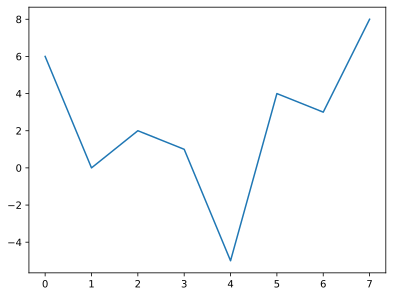{height="250px"}

:::
::::

::: {.callout-note}
Live Code ในโมดูลนี้ใช้ **matplotlib** จริงใน browser (Pyodide) — กด **Run** เพื่อดูกราฟ
:::

# Matplotlib 🎨 {background-color="#2c3e50" .white-text}

ไลบรารีสำหรับการสร้างภาพจากข้อมูลด้วย Python

## Matplotlib คืออะไร {#m11-matplotlib}

::: {.incremental}
- ไลบรารีสำหรับสร้างการแสดงผลข้อมูลเชิงภาพด้วย Python
- ภายใต้ `matplotlib` มี `module` ย่อย ๆ หลายตัว
- `Module` หลักที่เราจะใช้ คือ **`pyplot`**
- ดูรายละเอียดเพิ่มเติมที่ [matplotlib.org](https://matplotlib.org/)
:::

. . .

ก่อนใช้งาน ต้อง **import** โมดูลก่อน

```python
import matplotlib.pyplot
```

เมื่อ import แล้ว จะเรียกใช้ฟังก์ชันภายใต้ `pyplot` ได้ด้วย `.` operator

# Line Plot 📈 {background-color="#2c3e50" .white-text}

กราฟเส้น — plot จุดข้อมูลตามลำดับแล้วลากเส้นเชื่อม

## Line Plot {#m11-lineplot}

**กราฟเส้น (line plot)** เกิดจากการ plot จุดข้อมูลตามลำดับ แล้วลากเส้นเชื่อม

- **`.plot()`** สร้างกราฟเส้น โดยส่ง List ของตัวเลขเป็นพารามิเตอร์
- **`.show()`** ใช้แสดงภาพออกมา

. . .

ถ้าส่ง List ให้ `.plot()` **เพียงรายการเดียว**

- **x-axis** แสดงลำดับของข้อมูลใน List เริ่มจาก `0` เพิ่มทีละ `1`
- **y-axis** แสดงค่าของข้อมูล

::: {.callout-note}
ทบทวน: [List (Module 8)](module08.html#m8-list)
:::

## โจทย์ #1 {.exercise}

ให้พล็อตกราฟของข้อมูล `data = [6, 0, 2, 1, -5, 4, 3, 8]`

::: {.panel-tabset}

### Live Code

```{pyodide}
#| autorun: false
import matplotlib.pyplot

data = [6, 0, 2, 1, -5, 4, 3, 8]
matplotlib.pyplot.____(data)
matplotlib.pyplot.show()
```

### Solution

```python
import matplotlib.pyplot

data = [6, 0, 2, 1, -5, 4, 3, 8]
matplotlib.pyplot.plot(data)
matplotlib.pyplot.show()
```

{height="300px"}

:::

## การตั้งชื่อเล่น (alias name) {#m11-alias}

การพิมพ์ `matplotlib.pyplot.` ทุกครั้งไม่สะดวก เราลดรูปด้วยการตั้ง **ชื่อเล่น (alias)** ให้โมดูล

```python
import <some-module> as <alias-name>
```

สำหรับ `pyplot` เรามักตั้งชื่อเล่นว่า **`plt`**

## โจทย์ #2 {.exercise}

พล็อตกราฟของ `data = [6, 0, 2, 1, -5, 4, 3, 8]` โดยตั้ง **alias name** ให้ `matplotlib.pyplot` ว่า `plt`

::: {.panel-tabset}

### Live Code

```{pyodide}
#| autorun: false
import matplotlib.pyplot ____ plt

data = [6, 0, 2, 1, -5, 4, 3, 8]
plt.plot(data)
plt.show()
```

### Solution

```python
import matplotlib.pyplot as plt

data = [6, 0, 2, 1, -5, 4, 3, 8]
plt.plot(data)
plt.show()
```

{height="290px"}

:::

## การ import เฉพาะฟังก์ชัน {#m11-import-func}

ถ้าเรียกใช้ฟังก์ชันบางตัวบ่อยมาก สามารถ import เฉพาะฟังก์ชันเข้ามาแล้วเรียกใช้**โดยตรง** (ไม่ต้องระบุชื่อโมดูล)

::: {.callout-warning}
วิธีนี้ไม่ค่อยนิยม เพราะถ้าตั้งชื่อฟังก์ชันของเราซ้ำกัน อาจเกิดความสับสนเวลาเรียกใช้
:::

## โจทย์ #3 {.exercise}

พล็อตกราฟของ `data` เดิม โดย **import ฟังก์ชัน** `plot` กับ `show` เข้ามาใช้เลย (ไม่ต้องเรียกชื่อโมดูลซ้ำ)

::: {.panel-tabset}

### Live Code

```{pyodide}
#| autorun: false
from matplotlib.pyplot import ____, ____

data = [6, 0, 2, 1, -5, 4, 3, 8]
plot(data)
show()
```

### Solution

```python
from matplotlib.pyplot import plot, show

data = [6, 0, 2, 1, -5, 4, 3, 8]
plot(data)
show()
```

{height="290px"}

:::

## Plot ด้วยข้อมูล 2 รายการ {#m11-plot-xy}

ถ้าส่ง List ให้ `.plot()` **2 รายการ** จะนำมาสร้างเป็น**คู่ลำดับ**ของข้อมูล

- **x-axis** แสดงค่าจากรายการแรก
- **y-axis** แสดงค่าจากรายการที่สอง

ข้อมูลจะถูก plot **ตามลำดับคู่อันดับ** จาก item แรกถึง item สุดท้าย พร้อมลากเส้นเชื่อมแต่ละจุด

## โจทย์ #4 {.exercise}

พล็อตกราฟของข้อมูลคู่ลำดับที่กำหนดให้

. . .

รูปแรก: `x` เป็นแกนนอน, `y` เป็นแกนตั้ง — รูปที่สอง: `y` เป็นแกนนอน, `x` เป็นแกนตั้ง

::: {.panel-tabset}

### Live Code

```{pyodide}
#| autorun: false
import matplotlib.pyplot as plt

x = [-2,-1,2,4, 8,9,12,17]
y = [ 6, 0,2,1,-5,4, 3, 8]

plt.plot(____, ____)      # x เป็นแกนนอน
plt.show()

plt.plot(____, ____)      # y เป็นแกนนอน
plt.show()
```

### Solution

```python
import matplotlib.pyplot as plt

x = [-2,-1,2,4, 8,9,12,17]
y = [ 6, 0,2,1,-5,4, 3, 8]

plt.plot(x, y)
plt.show()
plt.plot(y, x)
plt.show()
```

:::: {.columns}
::: {.column width="50%"}
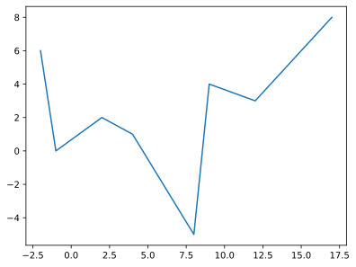{height="220px"}
:::
::: {.column width="50%"}
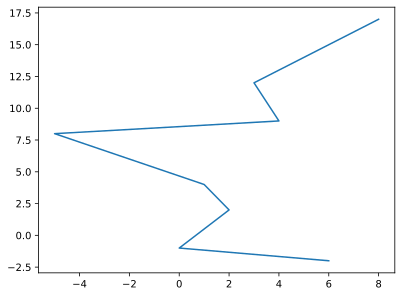{height="220px"}
:::
::::

:::

## โจทย์ #5 {.exercise}

พล็อตกราฟของข้อมูลคู่ลำดับ 2 ชุด — รูปแรก `(x1, y1)`, รูปที่สอง `(x2, y2)`

::: {.panel-tabset}

### Live Code

```{pyodide}
#| autorun: false
import matplotlib.pyplot as plt

x1 = [17,-2,-1,2,4, 8,9,12]
y1 = [ 8, 6, 0,2,1,-5,4, 3]
x2 = [5,3,4,5,6,7,5,5.35,4.65,5]
y2 = [0,2,3,2.5,3,2,0,0.9,1.7,2.5]

plt.plot(____, ____)
plt.show()
plt.plot(____, ____)
plt.show()
```

### Solution

```python
plt.plot(x1, y1)
plt.show()
plt.plot(x2, y2)
plt.show()
```

:::: {.columns}
::: {.column width="50%"}
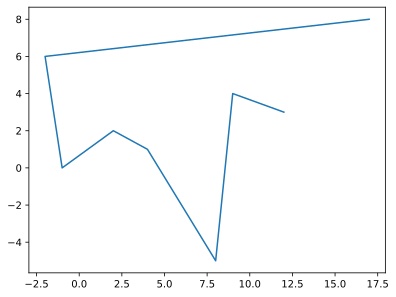{height="210px"}
:::
::: {.column width="50%"}
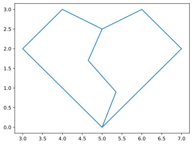{height="210px"}
:::
::::

:::

## โจทย์ #6 {.exercise}

พล็อตกราฟการเคลื่อนที่ของวัตถุในช่วงวินาทีที่ `0` ถึง `9`

ความสัมพันธ์ของระยะทาง $s = ut + \dfrac{1}{2}at^2$ เมื่อ $u=3\ m/s$ (ความเร็วต้น), $a=10\ m/s^2$ (ความเร่ง), $t$ = เวลา (s)

. . .

**คิดก่อน:** จะสร้าง `distances` จาก `times` ด้วย **list comprehension** อย่างไร?

## โจทย์ #6 (ต่อ) {.exercise}

::: {.panel-tabset}

### Live Code

```{pyodide}
#| autorun: false
import matplotlib.pyplot as plt

u = 3
a = 10
times = range(0, 10)                  # times = [0,1,2,...,9]
print(f"times: {list(times)}")

distances = [ ____ for t in times]    # s = u*t + 0.5*a*t**2
print(f"distances: {distances}")

plt.plot(times, distances)
plt.show()
```

### Solution

```python
u = 3
a = 10
times = range(0, 10)
distances = [u*t + 0.5*a*t**2 for t in times]

plt.plot(times, distances)
plt.show()
```

```{.python .code-output}
times: [0, 1, 2, 3, 4, 5, 6, 7, 8, 9]
distances: [0.0, 8.0, 26.0, 54.0, 92.0, 140.0, 198.0, 266.0, 344.0, 432.0]
```

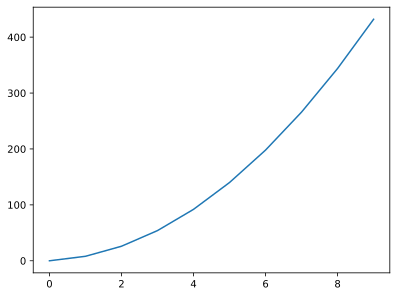{height="200px"}

:::

::: {.callout-note}
ทบทวน: [List comprehension (Module 10)](module10.html#m10-listcomp) · [`range()` (Module 7)](module07.html#m7-range)
:::

## การเพิ่มคำอธิบายให้ Chart {#m11-labels}

เพิ่มคำอธิบายพื้นฐานให้ chart ได้ด้วยฟังก์ชัน (ต้องเรียก**ก่อน** `.show()`)

- **`.xlabel()`** — คำอธิบาย x-axis
- **`.ylabel()`** — คำอธิบาย y-axis
- **`.title()`** — ชื่อของ chart

## โจทย์ #7 {.exercise}

จากโจทย์ข้อ 6 ให้เพิ่มป้ายชื่อแกนและ title — แกน `x`: `Time(s)`, แกน `y`: `Distance(m)`, title: `Vehicle Movement Chart`

::: {.panel-tabset}

### Live Code

```{pyodide}
#| autorun: false
import matplotlib.pyplot as plt

u = 3; a = 10
t = range(0, 10, 1)
s = [u*ts + 0.5*a*ts**2 for ts in t]

plt.plot(t, s)
plt.____('Time(s)')
plt.____('Distance(m)')
plt.____('Vehicle Movement Chart')
plt.show()
```

### Solution

```python
plt.plot(t, s)
plt.xlabel('Time(s)')
plt.ylabel('Distance(m)')
plt.title('Vehicle Movement Chart')
plt.show()
```

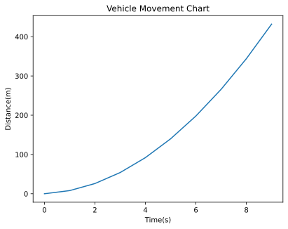{height="290px"}

:::

# การตกแต่ง Chart 🖌️ {background-color="#2c3e50" .white-text}

กำหนด option ให้ `.plot()` เพื่อปรับสี เส้น และจุดข้อมูล

## Line color {#m11-color}

กำหนดสีด้วย `color` option โดยระบุสัดส่วนแม่สีแสง `(red, green, blue)` แต่ละค่าเป็น float `0.0`–`1.0`

:::: {.columns}
::: {.column width="55%"}
```python
x = [5,3,4,5,6,7,5,5.35,4.65,5]
y = [0,2,3,2.5,3,2,0,0.9,1.7,2.5]

plt.plot(x, y, color=(0.5,0,1), marker='*')
plt.show()

plt.plot(x, y, color=(1,0,0))   # red=1.0
plt.plot(x, y, color=(0,1,0))   # green=1.0
plt.plot(x, y, color=(0,0,1))   # blue=1.0
plt.plot(x, y, color=(105/255, 66/255, 24/255))
plt.show()
```
:::
::: {.column width="45%"}
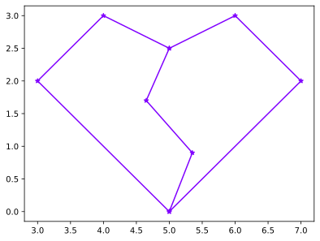{height="300px"}
:::
::::

## Line width & Line style {#m11-line-style}

:::: {.columns}
::: {.column width="50%"}
**`linewidth`** — ความหนาของเส้น
```python
plt.plot(x, y, color=(1,0.5,0),
         linewidth=4.0)
plt.show()
```
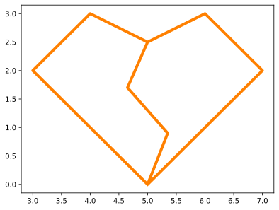{height="300px"}
:::
::: {.column width="50%"}
**`linestyle`** — รูปแบบของเส้น
```python
plt.plot(x, y, color=(1,0.5,0),
         linewidth=4.0, linestyle=':')
plt.show()
```
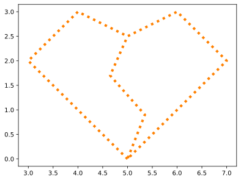{height="300px"}
:::
::::

## Marker & Marker size {#m11-marker}

:::: {.columns}
::: {.column width="50%"}
**`marker`** — รูปแบบจุดข้อมูล
```python
plt.plot(x, y, color=(1,0.5,0),
         linewidth=4.0,
         linestyle='--', marker='o')
plt.show()
```
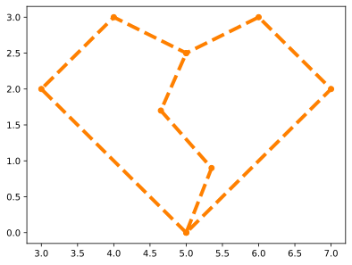{height="300px"}
:::
::: {.column width="50%"}
**`markersize`** — ขนาดจุดข้อมูล
```python
plt.plot(x, y, color=(1,0,0),
         linewidth=4.0, linestyle='',
         marker='+', markersize=12)
plt.show()
```
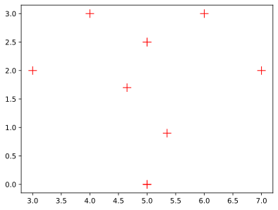{height="300px"}
:::
::::

## หลาย plot ใน Chart เดียวกัน {#m11-multiplot}

เรียก `.plot()` หลายครั้งกับข้อมูลแต่ละชุด แล้วเรียก `.show()` ครั้งเดียวตอนท้าย

:::: {.columns}
::: {.column width="55%"}
```python
x1 = range(-1,6); y1 = [0.5*i for i in x1]
x2 = range(-3,4); y2 = [i**2 for i in x2]
x3 = range(1,7);  y3 = [1/i for i in x3]

plt.plot(x1, y1)
plt.plot(x2, y2)
plt.plot(x3, y3)
plt.show()

# หรือส่งเป็นคู่ ๆ ต่อกัน
plt.plot(x1, y1, x2, y2, x3, y3)
plt.show()
```
:::
::: {.column width="45%"}
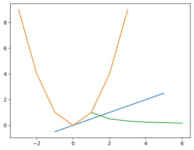{height="300px"}
:::
::::

## กำหนด style ให้แต่ละ plot {#m11-multiplot-style}

:::: {.columns}
::: {.column width="55%"}
```python
plt.plot(x1, y1, color=(1,0,0), linestyle='-', marker='s')
plt.plot(x2, y2, color=(0,0,1), linestyle=':', marker='^')
plt.plot(x3, y3, color=(1,0,1), linestyle='',  marker='.')
plt.show()
```
:::
::: {.column width="45%"}
{height="300px"}
:::
::::

## รูปแบบข้อความย่อ `'xyz'` {#m11-format-string}

กำหนด `color`, `linestyle`, `marker` พร้อมกันด้วยข้อความ `'xyz'`

- **`x`** = สี เช่น `r`(red), `g`(green), `b`(blue), `m`(magenta)
- **`y`** = เส้น เช่น ` `(no line), `-`(line), `:`(dot)
- **`z`** = จุด เช่น `s`(square), `^`(triangle), `.`(dot)

:::: {.columns}
::: {.column width="55%"}
```python
plt.plot(x1, y1, 'r-s')
plt.plot(x2, y2, 'b:^')
plt.plot(x3, y3, 'm .')
plt.show()
```
:::
::: {.column width="45%"}
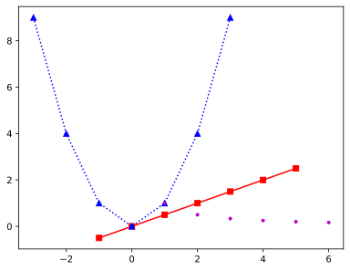{height="300px"}
:::
::::

## แสดงคำอธิบายด้วย `.legend()` {#m11-legend}

กำหนด `label` ให้แต่ละ plot แล้วเรียก **`.legend()`** เพื่อแสดงกล่องคำอธิบาย (Matplotlib จัดตำแหน่งให้อัตโนมัติ)

:::: {.columns}
::: {.column width="55%"}
```python
plt.plot(x1, y1, color=(1,0,0), linestyle='-',
         marker='s', label='Line1')
plt.plot(x2, y2, 'b:^', label='Line2')
plt.plot(x3, y3, 'm.',  label='Line3')
plt.legend()
plt.show()
```
:::
::: {.column width="45%"}
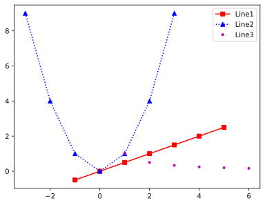{height="300px"}
:::
::::

## การกำหนดขนาด Chart {#m11-figsize}

ขนาด chart ปกติคือ `6.4 x 4.8` นิ้ว เปลี่ยนได้ผ่าน **`.figure()`** โดยกำหนด `figsize` เป็น **Tuple** `(width, height)`

:::: {.columns}
::: {.column width="55%"}
```python
plt.figure( figsize=(5, 5) )
plt.plot(x1, y1, color=(1,0,0), linestyle='-',
         marker='s', label='Line1')
plt.plot(x2, y2, 'b:^', label='Line2')
plt.plot(x3, y3, 'm.',  label='Line3')
plt.legend()
plt.show()
```
:::
::: {.column width="45%"}
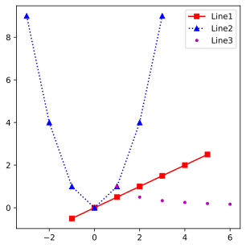{height="300px"}
:::
::::

::: {.callout-note}
ทบทวน: [Tuple (Module 4)](module04b.html#m4-tuple)
:::

# Bar Plot 📊 {background-color="#2c3e50" .white-text}

เหมาะกับข้อมูลประเภท Categorical Data

## Bar Plot {#m11-bar}

ใช้ **`.bar()`** ส่ง **labels** (Categorical Data บนแกนนอน) ตามด้วย **ค่า** (ความสูงแท่งบนแกนตั้ง)

:::: {.columns}
::: {.column width="55%"}
```python
import matplotlib.pyplot as plt
labels = ['Jan', 'Feb', 'Mar', 'Apr', 'May']
data = [10, 20, 25, 12, 17]

plt.bar(labels, data)   # location=x, values=data
plt.show()
```
:::
::: {.column width="45%"}
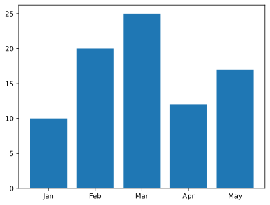{height="300px"}
:::
::::

## Bar plot แนวนอน {#m11-barh}

ใช้ **`.barh()`** สร้าง Bar plot แนวนอน — แกน `y` เรียง `first-to-last` อัตโนมัติ

กลับทิศ `y-axis` เป็น `last-to-first` ด้วย `plt.gca().invert_yaxis()`

:::: {.columns}
::: {.column width="50%"}
```python
plt.barh(labels, data)
plt.show()
```
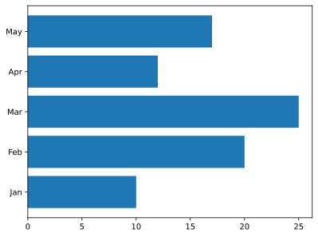{height="300px"}
:::
::: {.column width="50%"}
```python
plt.barh(labels, data)
plt.gca().invert_yaxis()
plt.show()
```
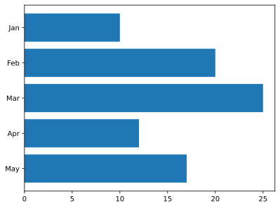{height="300px"}
:::
::::

## กำหนดความกว้างของ Bar {#m11-bar-width}

กำหนดความกว้างแท่ง (bar width) ด้วยค่า `float` เป็นพารามิเตอร์ตัวที่ 3 ของ `.bar()`

:::: {.columns}
::: {.column width="55%"}
```python
plt.bar(labels, data, 0.5)
plt.show()
```
:::
::: {.column width="45%"}
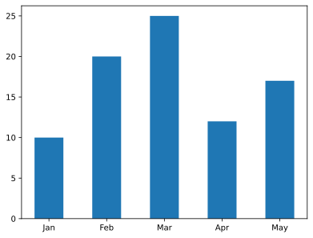{height="300px"}
:::
::::

## Bar หลายชุดใน chart เดียว {#m11-bar-multi}

::: {.callout-warning}
**หมายเหตุ:** เนื้อหาการวาดกราฟแท่งหลายชุดใน chart เดียวกันนี้ **ไม่ออกสอบ**
:::

ถ้าใช้ `labels` ชุดเดียวกัน แท่งข้อมูลจะ**ทับกัน** — แก้ด้วยการส่ง **ตำแหน่ง (x)** แทน labels

:::: {.columns}
::: {.column width="55%"}
```python
values1 = [10, 20, 25, 12, 17]
values2 = [12, 5, 28, 4, 7]
barwidth = 0.4

plt.bar(labels, values1, barwidth, label='values1')
plt.bar(labels, values2, barwidth, label='values2')
plt.legend()
plt.show()
```
:::
::: {.column width="45%"}
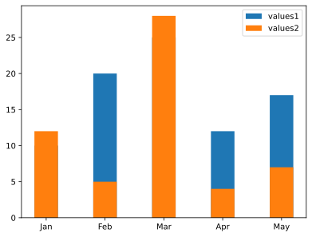{height="300px"}
:::
::::

## แยกตำแหน่งแท่ง + `.xticks()` {#m11-bar-ticks}

เลื่อนตำแหน่งแท่งแต่ละชุดด้วย `barwidth/2` แล้วกำหนด label ที่ถูกต้องด้วย **`.xticks()`**

:::: {.columns}
::: {.column width="55%"}
```python
x1 = [i-barwidth/2 for i in range(len(labels))]
x2 = [i+barwidth/2 for i in range(len(labels))]
# x1: [-0.2, 0.8, 1.8, 2.8, 3.8]
# x2: [ 0.2, 1.2, 2.2, 3.2, 4.2]

plt.bar(x1, values1, barwidth, label='values1')
plt.bar(x2, values2, barwidth, label='values2')
plt.xticks(range(len(labels)), labels)
plt.legend()
plt.show()
```
:::
::: {.column width="45%"}
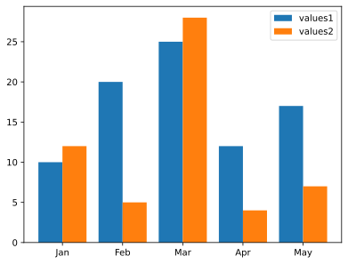{height="300px"}
:::
::::

# Histograms 📶 {background-color="#2c3e50" .white-text}

แสดงการกระจายตัวของข้อมูลในแต่ละช่วง (bin)

## Histogram {#m11-hist}

ใช้ **`.hist()`** — ฟังก์ชันจะกำหนด**จำนวนช่วง (bin)** ให้อัตโนมัติ หรือส่งค่า `int` เป็นพารามิเตอร์ที่ 2 เพื่อกำหนดเอง

:::: {.columns}
::: {.column width="50%"}
```python
data = [12,0,21,15,41,50,55,44,100,
        48,51,93,72,5,13,16,12,27,
        38,49,21,65,7,72]
plt.hist(data)
plt.show()
```
{height="300px"}
:::
::: {.column width="50%"}
```python
plt.hist(data, 20)    # (data, #bin)
plt.show()
```
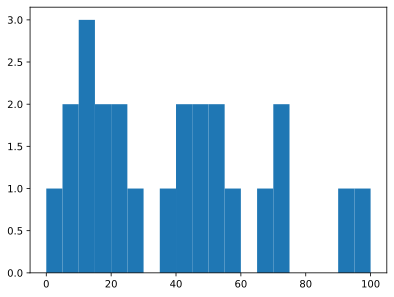{height="300px"}
:::
::::

## Histogram — ticks & สี {#m11-hist-style}

กำหนด `x-ticks` ด้วย `.xticks()` และปรับสีด้วย `facecolor` (สีแท่ง) / `edgecolor` (สีขอบ)

:::: {.columns}
::: {.column width="50%"}
```python
plt.hist(data)
plt.xticks(range(0,105,5))  # 0,5,...,100
plt.show()
```
{height="300px"}
:::
::: {.column width="50%"}
```python
plt.hist(data, facecolor="blue",
         edgecolor="black")
plt.xticks(range(0,105,10))
plt.show()
```
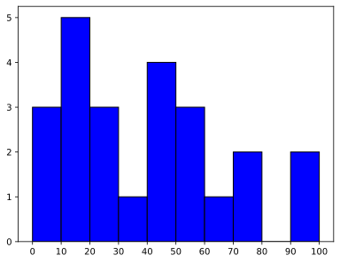{height="300px"}
:::
::::

# Pie charts 🥧 {background-color="#2c3e50" .white-text}

แสดงสัดส่วนของข้อมูลด้วยกราฟวงกลม

## Pie chart {#m11-pie}

ใช้ **`.pie()`** ส่งรายการข้อมูล — เพิ่มคำอธิบายแต่ละส่วนด้วย `labels` option

:::: {.columns}
::: {.column width="50%"}
```python
lbls = ['Jan','Feb','Mar','Apr','May']
values = [10, 20, 25, 12, 17]

plt.pie(values)
plt.show()
```
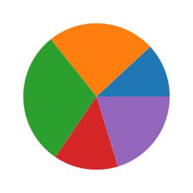{height="300px"}
:::
::: {.column width="50%"}
```python
plt.pie(values, labels=lbls)
plt.show()
```
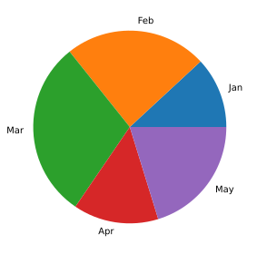{height="300px"}
:::
::::

## Pie — สัดส่วน & แยกส่วน {#m11-pie-pct}

แสดงตัวเลขสัดส่วนด้วย `autopct` (ใส่ `'%%'` เพื่อแสดง `%`) และดึงข้อมูลออกด้วย `explode` (List ของค่าทศนิยม)

:::: {.columns}
::: {.column width="50%"}
```python
plt.pie(values, labels=labels,
        autopct='%.2f%%')
plt.show()
```
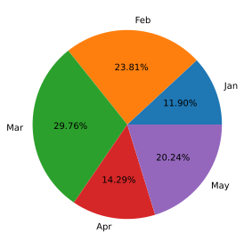{height="300px"}
:::
::: {.column width="50%"}
```python
expld = [0, 0, 0.1, 0, 0]
plt.pie(values, labels=labels,
        explode=expld, autopct='%.2f%%')
plt.show()
```
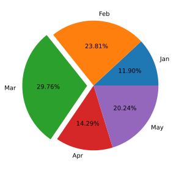{height="300px"}
:::
::::

# Visualizing 2D Data 🌡️ {background-color="#2c3e50" .white-text}

แสดงข้อมูล 2 มิติเป็นแผนที่ความร้อน (heatmap)

## Heatmap ด้วย `.imshow()` {#m11-imshow}

**`.imshow()`** แสดงข้อมูล 2 มิติเป็น **heatmap** — ใช้ความเข้มของสีแทนค่าข้อมูล

:::: {.columns}
::: {.column width="55%"}
```python
data2d = [
    [1,2,3,4,5,6,7],
    [2,4,6,8,10,12,10],
    [3,6,3,6,3,6,3],
    [6,5,4,3,2,1,2],
    [6,6,6,9,9,9,6],
    [10,12,10,8,5,2,5]
]
plt.imshow(data2d)
plt.show()
```
:::
::: {.column width="45%"}
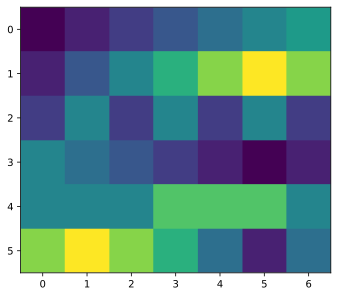{height="300px"}
:::
::::

::: {.callout-note}
ทบทวน: [2D list (Module 10)](module10.html#m10-2d)
:::

## Heatmap — ticks & colormap {#m11-imshow-cmap}

กำหนด ticks ด้วย `.xticks()`/`.yticks()` · เลือก **color mapping** ด้วย `cmap` · แสดงช่วงค่าด้วย **`.colorbar()`**

:::: {.columns}
::: {.column width="50%"}
```python
plt.imshow(data2d)
plt.xticks(range(len(data2d[0])),
           range(1, len(data2d[0])+1))
plt.yticks(range(len(data2d)),
           range(5, len(data2d)+5))
plt.show()
```
{height="300px"}
:::
::: {.column width="50%"}
```python
plt.imshow(data2d, cmap='hot')
plt.colorbar()
plt.show()
# cmap อื่น ๆ เช่น 'jet', 'gray'
```
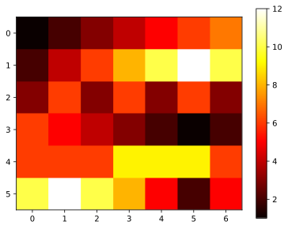{height="300px"}
:::
::::

# Subplots 🗂️ {background-color="#2c3e50" .white-text}

วาดหลาย chart ในภาพเดียวกัน แต่ละอันมีแกนของตัวเอง

## Subplots {#m11-subplot .smaller}

ใช้ **`.subplot(row, col, location)`** — นับตำแหน่งจากซ้ายไปขวา บนลงล่าง

:::: {.columns}
::: {.column width="55%"}
```python
import math
x = [i*0.1 for i in range(201)]
y1 = [math.sin(i) for i in x]
y2 = [math.sin(2*i) for i in x]
# ... y3 ... y6

plt.subplot(2,3,1); plt.plot(x, y1)
plt.subplot(2,3,2); plt.plot(x, y2)
plt.subplot(2,3,3); plt.plot(x, y3)
plt.subplot(2,3,4); plt.plot(x, y4)
plt.subplot(2,3,5); plt.plot(x, y5)
plt.subplot(2,3,6); plt.plot(x, y6)
plt.show()
```
:::
::: {.column width="45%"}
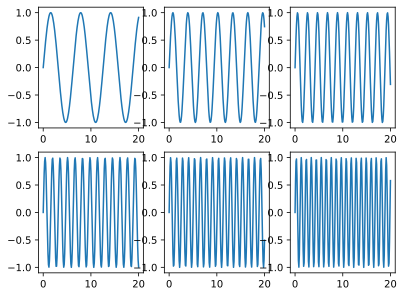{height="400px"}
:::
::::

::: {.callout-note}
ทบทวน: [math module (Module 3)](module03a.html#m3-math)
:::

## Subplots ด้วย loop {#m11-subplot-loop .smaller}

ใช้ loop + list comprehension สร้างข้อมูล 8 ชุด แล้ววาดใน subplot ขนาด `2 x 4`

:::: {.columns}
::: {.column width="55%"}
```python
x = [i*0.01 for i in range(2001)]  # 0,0.01,...,20

# 2-layer list comprehension
y = [[math.sin(i*(j+1)) for i in x] for j in range(8)]

for j in range(8):
    plt.subplot(2, 4, j+1)   # j+1 = 1,2,...,8
    plt.plot(x, y[j])        # j = 0,1,...,7
plt.show()
```
:::
::: {.column width="45%"}
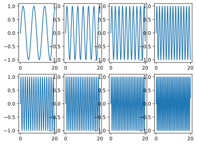{height="400px"}
:::
::::

::: {.callout-note}
ทบทวน: [Nested list comprehension (Module 10)](module10.html#m10-2d)
:::

# Figures 🖼️ {background-color="#2c3e50" .white-text}

สร้างรูปภาพ (หน้าต่าง) ใหม่สำหรับวาด chart

## Figures {#m11-figure}

**`.figure()`** สร้างรูปภาพใหม่สำหรับวาด chart — แต่ละรูปมี subplot ของตัวเองได้

:::: {.columns}
::: {.column width="55%"}
```python
import matplotlib.pyplot as plt
import math
x = [i*0.1 for i in range(201)]
y1 = [math.sin(i) for i in x]
y2 = [math.sin(2*i) for i in x]
y3 = [math.sin(3*i) for i in x]
y4 = [math.sin(4*i) for i in x]

plt.figure(); plt.plot(x, y1)   # รูปที่ 1
plt.figure(); plt.plot(x, y2)   # รูปที่ 2
plt.figure(); plt.plot(x, y3)   # รูปที่ 3
plt.figure(); plt.plot(x, y4)   # รูปที่ 4
plt.show()
```
:::
::: {.column width="45%"}
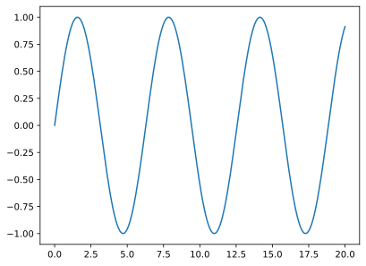{height="300px"}

แต่ละ `plt.figure()` เปิดรูปใหม่ → ได้ **4 รูปแยกกัน**
:::
::::

## พักสมอง 😄 {#m11-xkcd .center}

กราฟที่ดีมีผลต่อความน่าเชื่อถือของงาน — อย่าปล่อยให้กราฟของเราตกอยู่ในยุค MS Paint 📉

{height="400px" fig-align="center"}

::: {style="font-size:0.5em"}
ที่มา: [xkcd #1945 — "Scientific Paper Graph Quality"](https://xkcd.com/1945/) (CC BY-NC 2.5)
:::

# Summary 🎯 {background-color="#2c3e50" .white-text}

## สรุป Module 11 🎉 {.smaller}

:::: {.columns}
::: {.column width="50%"}

**Matplotlib / pyplot**

- `import matplotlib.pyplot as plt`
- **Line plot** — `.plot()` + `.show()`
- ตกแต่ง: `color`, `linewidth`, `linestyle`, `marker`, `'xyz'`
- คำอธิบาย: `.xlabel()` `.ylabel()` `.title()` `.legend()`

**Bar plot**

- `.bar()` / `.barh()` · bar width · `.xticks()`

:::
::: {.column width="50%"}

**Histogram & Pie**

- `.hist(data, bins)` · `facecolor`/`edgecolor`
- `.pie()` · `labels` · `autopct` · `explode`

**2D / Layout**

- `.imshow()` + `cmap` + `.colorbar()` — heatmap
- `.subplot(r, c, loc)` — หลาย chart ในภาพเดียว
- `.figure(figsize=(w,h))` — รูปใหม่ / กำหนดขนาด

::: {.callout-tip}
เลือกชนิดกราฟให้เหมาะกับข้อมูล → สื่อสารข้อมูลได้ชัดเจน
:::

:::
::::

::: {.callout-note}
ต่อ Module 12a: [N-Dimensional Arrays ด้วย NumPy (I)](module12a.html) 👉
:::
