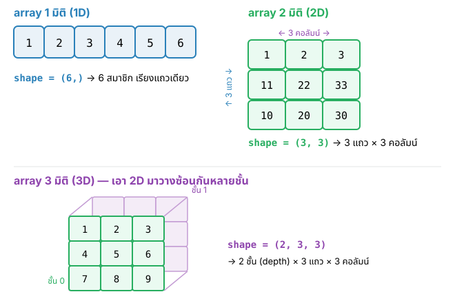
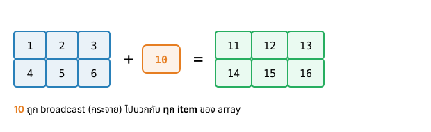
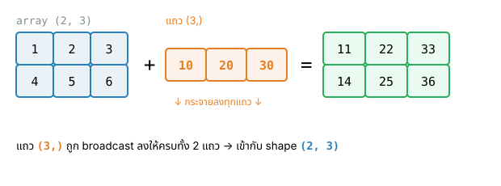
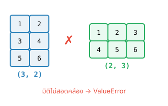
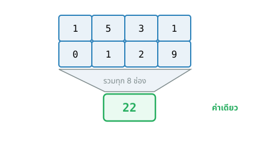
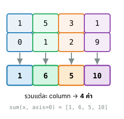
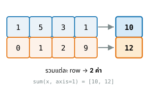

## {#topics-slide .center}

:::: {.columns}
::: {.column width="50%"}

### วันนี้เราจะเรียนรู้ 🔢

::: {.incremental}
1. **NumPy** คืออะไร และประสิทธิภาพ
2. การ**สร้าง** `NumPy array`
3. การประมวลผล**ทางคณิตศาสตร์**กับ array (element-wise, broadcasting, สถิติ)
:::

:::
::: {.column width="50%"}

```python
import numpy as np

x = np.arange(1, 11, 0.5)
y = x**2 + 2*x + 1
print(y)
```

```{.python .code-output}
[  4.     6.25   9.    12.25 ...
 121.   132.25]
```

:::
::::

::: {.callout-note}
Live Code ในโมดูลนี้ใช้ **NumPy** จริงใน browser (Pyodide) — กด **Run** เพื่อดูผลลัพธ์ · โมดูลนี้แบ่งเป็น 2 ตอน ตอนต่อไป → [Module 12b — เข้าถึงข้อมูล & Matrix](module12b.html)
:::

# NumPy คืออะไร? 📦 {background-color="#2c3e50" .white-text}

ไลบรารีสำหรับ array หลายมิติ และการคำนวณเชิงตัวเลข

## NumPy คืออะไร {#m12-numpy}

::: {.incremental}
- ไลบรารี(แพ็กเกจ)สำหรับประมวลผลข้อมูลในรูปแบบ **`array` หลายมิติ** ใน Python
- เป็นแพ็กเกจพื้นฐานสำหรับงาน**วิทยาการข้อมูล (Data science)**
- นิยมใช้ประมวลผล **Matrix** และการคำนวณ**ด้านคณิตศาสตร์**
- Data type พื้นฐานเรียกว่า **`NumPy array`**
:::

. . .

**จุดเด่นของ NumPy**

- **Speed** — เร็วกว่าการใช้ Python List มาก
- **Fewer loops** — ลดการใช้ Loop
- **Clearer code** — โค้ดใกล้เคียงกับคณิตศาสตร์
- **Better quality** — พัฒนาโดยผู้เชี่ยวชาญจำนวนมาก

## การ import และตรวจสอบ version {#m12-import}

ก่อนใช้งานต้อง **import** โมดูล (นิยมตั้งชื่อเล่นว่า `np`)

```python
import numpy as np
```

. . .

ตรวจสอบ version ที่ติดตั้งได้ด้วย

```python
print(np.__version__)
```

```{.python .code-output}
1.26.4
```

::: {.callout-warning .fragment}
โค้ดที่พัฒนาด้วยแพ็กเกจ (`Matplotlib`, `NumPy`, …) **version เก่า อาจเกิดข้อผิดพลาด**หากนำไปรันในระบบที่ใช้ version ใหม่กว่า เพราะบางฟังก์ชันอาจถูกตัดออกไปใน version ใหม่
:::

## โจทย์ #1.1 {.exercise}

สร้างตัวแปร `data1` เป็น **list** ที่เก็บตัวเลขตั้งแต่ `1` ถึง `10,000` โดยใช้ **list comprehension**

::: {.panel-tabset}

### Live Code

```{pyodide}
#| autorun: false
data1 = [i for i in range(____, ____, 1)]
print(data1)
```

### Solution

```python
data1 = [i for i in range(1, 10000+1, 1)]
print(data1)
```

```{.python .code-output}
[1, 2, 3, ..., 9998, 9999, 10000]
```

:::

::: {.callout-note}
ทบทวน: [List comprehension (Module 10)](module10.html#m10-listcomp) · [`range()` (Module 7)](module07.html#m7-range)
:::

## โจทย์ #1.2 {.exercise}

สร้างตัวแปร `data2` ที่เก็บตัวเลข `1` ถึง `10,000` แบบเดียวกัน แต่คราวนี้ใช้ **NumPy** (`np.arange()`)

::: {.panel-tabset}

### Live Code

```{pyodide}
#| autorun: false
import numpy as np

data2 = np.____(1, 10001, 1)
print(data2)
```

### Solution

```python
import numpy as np

data2 = np.arange(1, 10001, 1)
print(data2)
```

```{.python .code-output}
[    1     2     3 ...  9998  9999 10000]
```

:::

## ประสิทธิภาพของ NumPy {#m12-performance}

เปรียบเทียบการบวก `1` ให้ทุก item ของ `[0,1,...,9999]` ด้วย **List comprehension** กับ **NumPy** (รัน 5 ครั้ง ครั้งละ 1000 รอบ)

```python
# ใช้ List comprehension
%timeit -r5 -n1000 [i+1 for i in range(10_000)]

# ใช้ NumPy
%timeit -r5 -n1000 np.arange(10_000) + 1
```

::: {.callout-tip}
NumPy **เร็วกว่ามาก** เพราะกระจายการคำนวณเข้าไปในทุก item โดยไม่ต้องใช้ loop ของ Python
:::


# การสร้าง NumPy array 🧱 {background-color="#2c3e50" .white-text}

`np.array()` · `np.zeros()` · `np.ones()` · `np.identity()` · `np.arange()`

## การสร้าง array ด้วย `np.array()` {#m12-array}

ใช้ **`np.array()`** สร้าง NumPy array จาก **List** (List ที่ส่งให้อาจมีมากกว่า 1 มิติ)

```python
np_array_variable = np.array(...)
```

{width="760px" fig-align="center"}

::: {.callout-note}
ทบทวน: [2D list (Module 10)](module10.html#m10-2d)
:::

## โจทย์ #2 {.exercise}

สร้างตัวแปร `x1`, `x2`, `x3`

- `x1` — array **1 มิติ** `[1 2 3 4 5 6]` (สร้างด้วย numpy array)
- `x2` — array **2 มิติ** `[[1,2,3],[11,22,33],[10,20,30]]` (numpy array)
- `x3` — array **2 มิติ** เดียวกัน แต่สร้างด้วย **2D list**

::: {.panel-tabset}

### Live Code

```{pyodide}
#| autorun: false
import numpy as np

x1 = np.____([1,2,3,4,5,6])
x2 = np.____([[1,2,3],[11,22,33],[10,20,30]])
print(x2)

x3 = [[1,2,3],[11,22,33],[10,20,30]]
print(x3)
```

### Solution

```python
x1 = np.array([1,2,3,4,5,6])
x2 = np.array([[1,2,3],[11,22,33],[10,20,30]])
print(x2)

x3 = [[1,2,3],[11,22,33],[10,20,30]]
print(x3)
```

```{.python .code-output}
[[ 1  2  3]
 [11 22 33]
 [10 20 30]]
[[1, 2, 3], [11, 22, 33], [10, 20, 30]]
```

:::

## โจทย์ #3 {.exercise}

แสดงผล array `x1`, `x2` และ 2D list `x3`

::: {.panel-tabset}

### Live Code

```{pyodide}
#| autorun: false
print(f'x1 1D-Array: \n{x1}')
print(f'x2 2D-Array: \n{____}')
print(f'x3 2D List: \n{____}')
```

### Solution

```python
print(f'x1 1D-Array: \n{x1}')
print(f'x2 2D-Array: \n{x2}')
print(f'x3 2D List: \n{x3}')
```

```{.python .code-output}
x1 1D-Array:
[1 2 3 4 5 6]
x2 2D-Array:
[[ 1  2  3]
 [11 22 33]
 [10 20 30]]
x3 2D List:
[[1, 2, 3], [11, 22, 33], [10, 20, 30]]
```

:::

::: {.callout-tip}
การ `print()` array จะจัดรูปแบบ **ไม่มี comma** และขึ้นบรรทัดใหม่ในแต่ละ row → อ่านง่ายกว่า List
:::

## ตรวจสอบขนาดด้วย `.shape` {#m12-shape}

property **`.shape`** บอกขนาดในแต่ละมิติ (ผลลัพธ์เป็น **Tuple**)

:::: {.columns}
::: {.column width="50%"}
```python
# NumPy ".shape" property
print(f"x1.shape: {x1.shape}")  # 1D
print(f"x2.shape: {x2.shape}")  # 2D
```
```{.python .code-output}
x1.shape: (6,)
x2.shape: (3, 3)
```
:::
::: {.column width="50%"}
```python
# Python List ไม่มี .shape
rows = len(x3)     # มิติแรก
cols = len(x3[0])  # มิติที่ 2
print(rows, cols)
```
```{.python .code-output}
3 3
```
:::
::::

::: {.callout-note}
ทบทวน: [Tuple (Module 4)](module04b.html#m4-tuple)
:::

## ⚠️ `function` vs `property` {#m12-func-prop}

:::: {.columns}
::: {.column width="50%"}
**`function`** — ต้องมี **`()`** ต่อท้าย

- `.upper()` ของ String
- `.append()` ของ List
- `.array()` ของ NumPy

ใช้ **ส่งข้อมูล**ให้ฟังก์ชันทำงาน
:::
::: {.column width="50%"}
**`property`** — **ไม่มี** `()`

- `.shape` ของ NumPy array
- `.dtype` ของ NumPy array

บอก**สถานะปัจจุบัน**ของข้อมูล
:::
::::

## 1D array vs 2D array (1×5) {#m12-1d-vs-2d}

สังเกตความต่างระหว่าง **1D array 5 item** กับ **2D array ขนาด 1×5**

```python
a1 = np.array([4,2,1,3,2])    # 1D array
a2 = np.array([[4,2,1,3,2]])  # 2D array
print('x1.shape =', a1.shape)
print('x2.shape =', a2.shape)
```

```{.python .code-output}
x1.shape = (5,)
x2.shape = (1, 5)
```

## Data type ของข้อมูลใน array {#m12-dtype}

ทุก item ใน array เดียวกัน **ต้องเป็นชนิดเดียวกัน** (ต่างจาก List) — ถ้าสร้างจากข้อมูลต่างชนิด NumPy จะ**แปลงให้เป็นชนิดเดียวกันอัตโนมัติ**

```python
a = np.array([1,2])          # int
b = np.array([1,2.0])        # float
c = np.array(['apple',20])   # string

print(f"{a} data type: {a.dtype}")
print(f"{b} data type: {b.dtype}")
print(f"{c} data type: {c.dtype}")
```

```{.python .code-output}
[1 2] data type: int64
[1. 2.] data type: float64
['apple' '20'] data type: <U21
```

## `np.zeros()` และ `np.ones()` {#m12-zeros-ones}

สร้าง array ที่มีสมาชิกเป็น `0` หรือ `1` ทั้งหมด — ส่ง **`shape`** เป็น **Tuple**

- `(15,)` — 1D 15 item · `(2,4)` — 2D 2×4 · `(3,3,3)` — 3D 3×3×3

## เห็นภาพ: shape `(3, 3, 3)` {#m12-shape-photo .center}

ลูกบาศก์รูบิคคือ array 3 มิติขนาด `3x3x3` — เอา 2D ขนาด `3x3` มาวางซ้อนกัน 3 ชั้น 🧊

{height="380px" fig-align="center"}

::: {style="font-size:0.5em"}
ภาพ: ["Rubik's Cube"](https://www.flickr.com/photos/151415985@N06/36940314035) โดย Wallboat · [CC0 1.0](https://creativecommons.org/publicdomain/zero/1.0/)
:::

## โจทย์ #4 {.exercise}

สร้าง array ต่อไปนี้ แล้วแสดงค่า

::: {.incremental}
1. `a` — 1D array 10 ตัว เป็น `0` ทั้งหมด
2. `b` — 2D array ขนาด `5x2` เป็น `1` ทั้งหมด
3. `c` — 2D array ขนาด `2x5` เป็น `0` ทั้งหมด
4. `d` — 3D array ขนาด `2x3x4` เป็น `1` ทั้งหมด
:::

## โจทย์ #4 (ต่อ) {.exercise}

::: {.panel-tabset}

### Live Code

```{pyodide}
#| autorun: false
import numpy as np

a = np.____((10,))
b = np.____((5,2))
c = np.____((2,5))
d = np.____((2,3,4))

print(f'a={a}')
print(f'b={b}')
print(f'c={c}')
print(f'd={d}')
```

### Solution

```python
a = np.zeros((10,))
b = np.ones((5,2))
c = np.zeros((2,5))
d = np.ones((2,3,4))
print(f'a={a}'); print(f'b={b}')
print(f'c={c}'); print(f'd={d}')
```

```{.python .code-output}
a=[0. 0. 0. 0. 0. 0. 0. 0. 0. 0.]
b=[[1. 1.]
 [1. 1.]
 [1. 1.]
 [1. 1.]
 [1. 1.]]
c=[[0. 0. 0. 0. 0.]
 [0. 0. 0. 0. 0.]]
d=[[[1. 1. 1. 1.] ... ]]  (2×3×4)
```

:::

## โจทย์ #5 {.exercise}

สร้าง **identity matrix** ขนาด `5x5` ด้วย `np.identity()`

::: {.panel-tabset}

### Live Code

```{pyodide}
#| autorun: false
import numpy as np

g = np.____(5)
print(f'g={g}')
```

### Solution

```python
g = np.identity(5)
print(f'g={g}')
```

```{.python .code-output}
g=[[1. 0. 0. 0. 0.]
 [0. 1. 0. 0. 0.]
 [0. 0. 1. 0. 0.]
 [0. 0. 0. 1. 0.]
 [0. 0. 0. 0. 1.]]
```

:::

## `np.arange()` กับข้อมูลทศนิยม {#m12-arange}

`range()` สร้างได้เฉพาะ **จำนวนเต็ม** — step เป็น float จะ error

```python
x = range(1, 11, 0.5)   # error!
```

```{.python .code-output}
TypeError: 'float' object cannot be interpreted as an integer
```

. . .

**`np.arange(start, stop, step)`** สร้างรายการเลข **ทศนิยม** ได้ (ผลลัพธ์เป็น NumPy array)

## โจทย์ #6 {.exercise}

สร้างข้อมูล `x` ตั้งแต่ `1` ถึง `10.5` เพิ่มทีละ `0.5` และ `y = x^2 + 2x + 1`

::: {.panel-tabset}

### Live Code

```{pyodide}
#| autorun: false
import numpy as np

x = np.arange(1, 11, ____)
y = x**2 + 2*x + 1

print(f'x={x}')
print(f'y={y}')
```

### Solution

```python
x = np.arange(1, 11, 0.5)
y = x**2 + 2*x + 1
print(f'x={x}')
print(f'y={y}')
```

```{.python .code-output}
x=[ 1.   1.5  2.  ... 10.  10.5]
y=[  4.     6.25   9.   ... 121.   132.25]
```

:::

# การประมวลผลทางคณิตศาสตร์ ➗ {background-color="#2c3e50" .white-text}

NumPy กระจายการคำนวณเข้าไปในทุก item ของ array

## number กับ array {#m12-scalar-op}

นำ **array** ไปคำนวณกับ **ตัวเลขเดี่ยว (int/float)** ด้วย operator ทางคณิตศาสตร์ → กระจายการคำนวณเข้าไปยังทุก item

## โจทย์ #7 {.exercise}

หา `y = x^10` และ `z = 3x^2` เมื่อ `x` อยู่ในช่วง `1` ถึง `10` เพิ่มทีละ `0.5` แล้วแสดง `x, y, z`

::: {.panel-tabset}

### Live Code

```{pyodide}
#| autorun: false
import numpy as np

x = np.arange(1, 10.5, 0.5)
print(x.shape)
y = x ____ 10
z = 3 * (x ____ 2)

print(f'x={x}')
print(f'y={y}')
print(f'z={z}')
```

### Solution

```python
x = np.arange(1, 10.5, 0.5)
y = x**10
z = 3 * (x**2)
print(f'x={x}'); print(f'y={y}'); print(f'z={z}')
```

```{.python .code-output}
(19,)
x=[ 1.   1.5 ...  9.5 10. ]
y=[1.00e+00 5.77e+01 ... 1.00e+10]
z=[  3.     6.75 ... 270.75 300.  ]
```

:::

::: {.callout-note}
ทบทวน: [Arithmetic operators (Module 3)](module03a.html#m3-arithmetic)
:::

## array กับ array (ขนาดเท่ากัน) {#m12-elementwise}

ใช้ operator กับ array ที่มี **`shape` เหมือนกัน** → คำนวณ **item ตำแหน่งเดียวกัน** (element-wise)

:::: {.columns}
::: {.column width="50%"}
```python
x1 = np.array([1,2,3,4])
x2 = np.array([5,4,3,2])
print(x1 + x2)
print(x1 - x2)
print(x1 * x2)
print(x1 / x2)
print(x1 // x2)
print(x1 % x2)
print(x1 ** x2)
```
:::
::: {.column width="50%"}
```{.python .code-output}
[6 6 6 6]
[-4 -2  0  2]
[5 8 9 8]
[0.2 0.5 1.  2. ]
[0 0 1 2]
[1 2 0 0]
[ 1 16 27 16]
```
:::
::::

## array กับ array (2 มิติ) {#m12-elementwise-2d}

ทำงานแบบ element-wise เช่นกันสำหรับ array 2 มิติ

:::: {.columns}
::: {.column width="55%"}
```python
x1 = np.array([[1,2,3],[4,1,0]])
x2 = np.array([[5,4,3],[2,2,1]])

print(x1 + x2)
print(x1 * x2)
print(x1 ** x2)
```
:::
::: {.column width="45%"}
```{.python .code-output}
[[6 6 6]
 [6 3 1]]
[[5 8 9]
 [8 2 0]]
[[ 1 16 27]
 [16  1  0]]
```
:::
::::

::: {.callout-warning}
**item-wise:** `*` คือการคูณ item ตำแหน่งเดียวกัน — **ไม่ใช่** การคูณเมตริกซ์ (matrix multiplication)
:::

## Broadcasting {#m12-broadcast}

เมื่อ array มี **`shape` ไม่เท่ากัน** NumPy จะกระจายการคำนวณได้ก็ต่อเมื่อ shape สอดคล้องกับกฎ **broadcasting**

{width="760px" fig-align="center"}

## Broadcasting — ตัวอย่าง {#m12-broadcast-example}

{width="760px" fig-align="center"}

## Broadcasting — กรณีที่ทำไม่ได้ {#m12-broadcast-error}

:::: {.columns}
::: {.column width="52%"}
```python
# shape (3,2) กับ (2,3) → error
x1 = np.array([[1,2],[3,4],[5,6]])
x2 = np.array([[1,2,3],[4,5,6]])
print(x1 - x2)
```
```{.python .code-output}
ValueError: operands could not be
broadcast together with
shapes (3,2) (2,3)
```
:::
::: {.column width="48%"}
{width="360px" fig-align="center"}
:::
::::

## ฟังก์ชันทางคณิตศาสตร์ของ NumPy {#m12-math-func}

`math` โมดูล**ไม่รองรับ List/array** ต้องใช้ loop/list comprehension ซึ่งไม่ค่อยมีประสิทธิภาพ

:::: {.columns}
::: {.column width="50%"}
```python
import math
x = [1, np.e, np.e**2]
print(math.log(x))     # error!
```
```{.python .code-output}
TypeError: must be real
number, not list
```
:::
::: {.column width="50%"}
```python
# ต้องวนทีละ item
y = [math.log(item) for item in x]
print(y)
```
```{.python .code-output}
[0.0, 1.0, 2.0]
```
:::
::::

## ฟังก์ชันคณิตศาสตร์กับ array {#m12-np-math}

NumPy มีฟังก์ชันคณิตศาสตร์ที่**กระจายการคำนวณเข้าไปในทุก item** เช่น `np.cos()`, `np.log()`, `np.sqrt()`, `np.sin()` และค่าคงที่ `np.pi`, `np.e`

:::: {.columns}
::: {.column width="55%"}
```python
a = np.array([1, np.e, np.e**2])
print(np.log(a))

b = np.array([0, np.pi/2, np.pi*3/4])
print(np.sin(b))
```
:::
::: {.column width="45%"}
```{.python .code-output}
[0. 1. 2.]
[0.  1.  0.70710678]
```
:::
::::

::: {.callout-note}
ทบทวน: [math module (Module 3)](module03a.html#m3-math)
:::

## ฟังก์ชันทางสถิติของ NumPy {#m12-stats-all}

`np.sum()` `np.mean()` `np.max()` `np.min()` `np.var()` `np.std()` — ถ้า **ไม่กำหนด `axis`** จะยุบ **ทั้ง array** เหลือ **ค่าเดียว**

{width="620px" fig-align="center"}

`np.sum(x)` = 1+5+3+1+0+1+2+9 = **`22`**

## ฟังก์ชันทางสถิติของ NumPy {#m12-stats}

`np.sum()` `np.mean()` `np.max()` `np.min()` `np.var()` `np.std()` — array 2 มิติกำหนดทิศได้ด้วย `axis`

:::: {.columns}
::: {.column width="50%"}

`axis=0` → **ยุบแถวเหลือผลแต่ละ column**

{width="320px" fig-align="center"}

:::
::: {.column width="50%"}

`axis=1` → **ยุบ column เหลือผลแต่ละ row**

{width="380px" fig-align="center"}

:::
::::

## โจทย์ #8 {.exercise .smaller}

หาค่าทางสถิติของ `x = [[1,5,3,1],[0,1,2,9]]`

. . .

1. ผลรวมทั้งหมด 
2. ผลรวมแต่ละ **column** 
3. ผลรวมแต่ละ **row**

. . .

::: {.panel-tabset}

### Live Code

```{pyodide}
#| autorun: false
import numpy as np

x = np.array([[1,5,3,1],[0,1,2,9]])
print(x)
print(f'Total Sum={np.sum(x)}')
print(f'Column Sum={np.sum(x, axis=____)}')
print(f'Row Sum={np.sum(x, axis=____)}')
```

### Solution

```python
x = np.array([[1,5,3,1],[0,1,2,9]])
print(f'Total Sum={np.sum(x)}')
print(f'Column Sum={np.sum(x, axis=0)}')
print(f'Row Sum={np.sum(x, axis=1)}')
```

```{.python .code-output}
Total Sum=22
Column Sum=[ 1  6  5 10]
Row Sum=[10 12]
```

:::

# Summary 🎯 {background-color="#2c3e50" .white-text}

## สรุป Module 12a 🎉 {.smaller}

:::: {.columns}
::: {.column width="50%"}

**NumPy array**

- `import numpy as np` · `np.array()`
- สร้าง: `np.arange()` `np.zeros()` `np.ones()` `np.identity()`
- property: `.shape` `.dtype` · ทุก item ชนิดเดียวกัน
- `function` มี `()` · `property` ไม่มี `()`

:::
::: {.column width="50%"}

**การคำนวณ**

- number ⊕ array · array ⊕ array (**element-wise**)
- **broadcasting** เมื่อ shape ไม่เท่ากัน
- ฟังก์ชัน: `np.log()` `np.sin()` `np.sqrt()` …
- สถิติ: `np.sum/mean/max/min` + `axis`

::: {.callout-tip}
ไปต่อ Part II → [Module 12b](module12b.html): index/slice, เงื่อนไข, View/Copy, Matrix
:::

:::
::::
