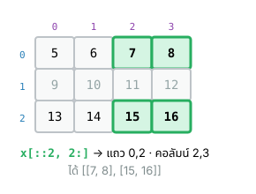
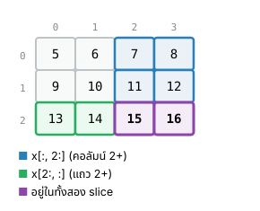
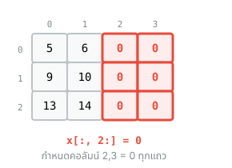
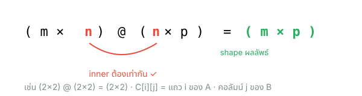
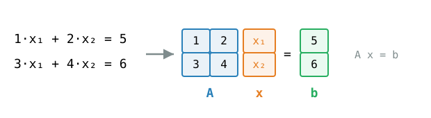
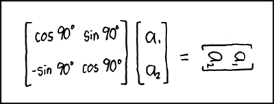

## {#topics-slide .center}

:::: {.columns}
::: {.column width="50%"}

### วันนี้เราจะเรียนรู้ 🔢

::: {.incremental}
1. การ**เข้าถึงข้อมูล** (index / slice / เงื่อนไข)
2. **View** และ **Copy**
3. การประมวลผลแบบ **Matrix** (`@`, `.T`, `np.linalg`)
:::

:::
::: {.column width="50%"}

```python
x = np.array([[5,6,7,8],
              [9,10,11,12],
              [13,14,15,16]])
print(x[::2, 2:])
```

```{.python .code-output}
[[ 7  8]
 [15 16]]
```

:::
::::

::: {.callout-note}
ต่อจาก [Module 12a — การสร้าง array & การคำนวณ](module12a.html) · Live Code ใช้ **NumPy** จริงใน browser (Pyodide) — กด **Run**
:::

# การเข้าถึงข้อมูลใน array 🎯 {background-color="#2c3e50" .white-text}

index · slice · การเลือกด้วยเงื่อนไข

## Index และ Slice (1 มิติ) {#m12-index .smaller}

เข้าถึงข้อมูลด้วย **`array[index]`** และ slice ด้วย **`array[start:stop:step]`** (เหมือน List)

:::: {.columns}
::: {.column width="50%"}
```python
x = np.array([5,6,7,8,9,10])
print(x[0])
print(x[1:3])
print(x[2:])
print(x[1:5:2])
print(x[::2])
print(x[::-1])   # reverse
```
```{.python .code-output}
5
[6 7]
[ 7  8  9 10]
[6 8]
[5 7 9]
[10  9  8  7  6  5]
```
:::
::: {.column width="50%"}
```python
# กำหนดค่าใหม่ผ่าน index/slice
x = np.array([5,6,7,8,9,10])
x[1] = 1
print(x)
x[2:] = 0
print(x)
```
```{.python .code-output}
[ 5  1  7  8  9 10]
[5 1 0 0 0 0]
```
:::
::::

::: {.callout-note}
ทบทวน: [List index & slice (Module 8)](module08.html#m8-list-index)
:::

## Index array หลายมิติ {#m12-index-2d}

array หลายมิติระบุ index แต่ละมิติได้ — `x[1,2]` หรือ `x[1][2]`

```python
x = np.array([[5,6,7],[8,9,10]])
print(x[1,2])
print(x[1][2])
```

```{.python .code-output}
10
10
```

## Slice 2 มิติ — `x[::2, 2:]` {#m12-slice-2d}

:::: {.columns}
::: {.column width="55%"}
```python
x = np.array([[ 5, 6, 7, 8],
              [ 9,10,11,12],
              [13,14,15,16]])
print(x[::2, 2:])
```
```{.python .code-output}
[[ 7  8]
 [15 16]]
```
:::
::: {.column width="45%"}
{width="400px" fig-align="center"}
:::
::::

## Slice 2 มิติ — row / column {#m12-slice-2d-2}

:::: {.columns}
::: {.column width="55%"}
```python
print(x[:, 2:])   # ทุก row, column 2 เป็นต้นไป
print(x[2:, :])   # row 2 เป็นต้นไป, ทุก column
```
```{.python .code-output}
[[ 7  8]
 [11 12]
 [15 16]]

[[13 14 15 16]]
```
:::
::: {.column width="45%"}
{width="340px" fig-align="center"}
:::
::::

## Slice 2 มิติ — กำหนดค่า {#m12-slice-assign}

:::: {.columns}
::: {.column width="55%"}
```python
x = np.array([[ 5, 6, 7, 8],
              [ 9,10,11,12],
              [13,14,15,16]])
x[:, 2:] = 0
print(x)
```
```{.python .code-output}
[[ 5  6  0  0]
 [ 9 10  0  0]
 [13 14  0  0]]
```
:::
::: {.column width="45%"}
{width="400px" fig-align="center"}
:::
::::

## เลือกข้อมูลด้วยเงื่อนไข {#m12-selector}

2 ขั้นตอน: (1) สร้าง **selector array** ด้วย **comparison operator** (ได้ array ของ `True`/`False`) — (2) นำไปใช้เป็น index

```python
x = np.array([[ 5, 6, 7, 8],
              [ 9,10,11,12],
              [13,14,15,16]])
y = (x > 10)      # selector array
print(y)
```

```{.python .code-output}
[[False False False False]
 [False False  True  True]
 [ True  True  True  True]]
```

::: {.callout-note}
ทบทวน: [Comparison operators (Module 3)](module03a.html#m3-comparison)
:::

## ใช้ selector array เลือก/แก้ข้อมูล {#m12-selector-use}

ใช้รูปแบบ **`array[selector_array]`** เลือกเฉพาะ item ที่ตรงเงื่อนไข (ผลลัพธ์เป็น 1D array)

:::: {.columns}
::: {.column width="50%"}
```python
print(x[y])           # item ที่ > 10
print(type(x[y]))
```
```{.python .code-output}
[11 12 13 14 15 16]
<class 'numpy.ndarray'>
```
:::
::: {.column width="50%"}
```python
x[y] = 100   # แก้เฉพาะที่ตรงเงื่อนไข
print(x)
```
```{.python .code-output}
[[  5   6   7   8]
 [  9  10 100 100]
 [100 100 100 100]]
```
:::
::::

## selector array — ตัวอย่างเพิ่มเติม {#m12-selector-more}

:::: {.columns}
::: {.column width="52%"}
```python
x2 = np.array([[1,2,3],[11,22,33],
               [10,20,30],[100,200,300]])
y = (x2 <= 10)       # selector

print(x2[y])
print(np.sum(x2[y]))    # ผลรวม
print(np.mean(x2[y]))   # ค่าเฉลี่ย
print(x2[y] * 3)        # คูณเฉพาะที่เลือก
```
:::
::: {.column width="48%"}
```{.python .code-output}
[ 1  2  3 10]
16
4.0
[ 3  6  9 30]
```
:::
::::

## เลือก row ตามเงื่อนไขของ column {#m12-row-selector}

**โจทย์:** row ใดที่ column แรก `== 1` ให้หาผลรวมของ column ที่ 2 และ 4

```python
x = np.array([[1,10,1,3,5],
              [1,15,2,3,5],
              [0,20,3,3,5],
              [1,25,4,3,5]])

row_selector = (x[:,0] == 1)      # [ True  True False  True]
sub_x = x[:, [2,4]]               # เลือก column 2 และ 4

total = np.sum(sub_x[row_selector, :], axis=0)
print(total)
```

```{.python .code-output}
[ 7 15]
```

# View และ Copy 🔗 {background-color="#2c3e50" .white-text}

การ slice สร้าง View — แก้ View กระทบต้นฉบับ

## View {#m12-view}

การเลือกข้อมูลด้วย **index / slice** คือการสร้าง **View** — แก้ค่า View แล้ว **array ต้นทางเปลี่ยนตาม**

:::: {.columns}
::: {.column width="55%"}
```python
x = np.ones((3,3))
y = x[:2, :2]     # สร้าง view จากการ slice

x[0,0] = 0        # แก้ต้นทาง
print(x)
print(y)          # view เปลี่ยนตาม
```
:::
::: {.column width="45%"}
```{.python .code-output}
[[0. 1. 1.]
 [1. 1. 1.]
 [1. 1. 1.]]
[[0. 1.]
 [1. 1.]]
```
:::
::::

## Copy {#m12-copy}

ใช้ **`.copy()`** สร้างสำเนาที่**แยกออกจากต้นทางเด็ดขาด**

:::: {.columns}
::: {.column width="55%"}
```python
x = np.ones((3,3))
y = x[:2, :2].copy()   # copy ใหม่

x[0,0] = 0             # แก้ต้นทาง
print(x)
print(y)               # copy ไม่เปลี่ยน
```
:::
::: {.column width="45%"}
```{.python .code-output}
[[0. 1. 1.]
 [1. 1. 1.]
 [1. 1. 1.]]
[[1. 1.]
 [1. 1.]]
```
:::
::::

# การคำนวณ Matrix 🧮 {background-color="#2c3e50" .white-text}

Matrix multiplication · Transpose · Linear Algebra

## Matrix Multiplication {#m12-matmul}

ใช้ **`@`** operator หรือ **`.dot()`** สำหรับการคูณแบบเมตริกซ์ (Python 3.5+) — shape ต้องสอดคล้องกัน

{width="760px" fig-align="center"}

:::: {.columns}
::: {.column width="55%"}
```python
x = np.array([[1,2],[3,4]])
y = np.array([[1,1],[1,1]])

print(x * y)      # item-wise
print(x @ y)      # matrix mult
print(np.dot(x,y))
```
:::
::: {.column width="45%"}
```{.python .code-output}
[[1 2]
 [3 4]]
[[3 3]
 [7 7]]
[[3 3]
 [7 7]]
```
:::
::::

## Matrix Transposition {#m12-transpose}

ทำ Transpose ด้วย property **`.T`**

:::: {.columns}
::: {.column width="50%"}
```python
x = np.array([[1,2,3],[4,5,6]])
print(x, x.shape)
y = x.T
print(y, y.shape)
```
```{.python .code-output}
[[1 2 3]
 [4 5 6]] (2, 3)
[[1 4]
 [2 5]
 [3 6]] (3, 2)
```
:::
::: {.column width="50%"}
::: {.callout-warning}
Transpose ของ **1D-array** ได้ 1D-array เหมือนเดิม
:::
```python
x = np.array([1,2,3])
print(x.T, x.T.shape)   # (3,)
```
::: {.callout-warning}
ผลของ Transpose เป็น **View** — แก้แล้วกระทบต้นทาง
:::
:::
::::

## Linear Algebra Module {#m12-linalg}

โมดูลย่อย **`np.linalg`** สำหรับพีชคณิตเชิงเส้น เช่น `np.linalg.det()`, `np.linalg.inv()`, `np.linalg.solve()`

:::: {.columns}
::: {.column width="55%"}
```python
x = np.array([[1,2],[3,4]])
print(np.linalg.det(x))   # determinant
print(np.linalg.inv(x))   # inverse
```
:::
::: {.column width="45%"}
```{.python .code-output}
-2.0000000000000004

[[-2.   1. ]
 [ 1.5 -0.5]]
```
:::
::::

## การแก้สมการหลายตัวแปร {#m12-solve}

แปลงระบบสมการเป็นรูปเมตริกซ์ $Ax = b$ แล้วแก้ด้วย `np.linalg.solve()`

{width="780px" fig-align="center"}

:::: {.columns}
::: {.column width="60%"}
```python
A = np.array([[1,2],[3,4]])   # 2D array
b = np.array([5,6])           # 1D array

x = np.linalg.solve(A, b)     # แก้สมการ
print(x)

x = np.linalg.inv(A) @ b      # หรือ A⁻¹ @ b
print(x)
```
:::
::: {.column width="40%"}
```{.python .code-output}
[-4.   4.5]
[-4.   4.5]
```
:::
::::

## พักสมอง 😄 {#m12-xkcd .center}

คูณด้วย **rotation matrix** มุม 90° แล้วเกิดอะไรขึ้น? 🔄

{height="300px" fig-align="center"}

::: {style="font-size:0.5em"}
ที่มา: [xkcd #184 — "Matrix Transform"](https://xkcd.com/184/) (CC BY-NC 2.5)
:::

# Summary 🎯 {background-color="#2c3e50" .white-text}

## สรุป Module 12b 🎉 {.smaller}

:::: {.columns}
::: {.column width="50%"}

**เข้าถึงข้อมูล**

- `array[index]` · `array[start:stop:step]`
- หลายมิติ: `x[i, j]` · slice: `x[::2, 2:]`
- เงื่อนไข: **selector array** → `x[x>10]`
- **View** (slice) vs **Copy** (`.copy()`)

:::
::: {.column width="50%"}

**Matrix**

- `@` / `.dot()` — matrix multiplication
- `.T` — transpose (ผลเป็น View)
- `np.linalg` — `det()` `inv()` `solve()`

::: {.callout-tip}
NumPy = เร็ว + โค้ดสั้น + ใกล้เคียงคณิตศาสตร์
:::

:::
::::

::: {.callout-note}
🎉 จบคอร์สแล้ว — กลับหน้าสารบัญรวมทุก Module: [🏠 259201](../index.html)
:::
